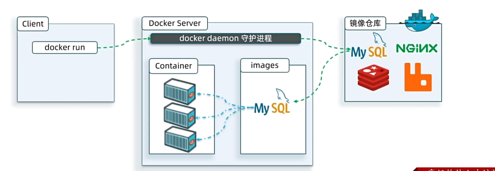
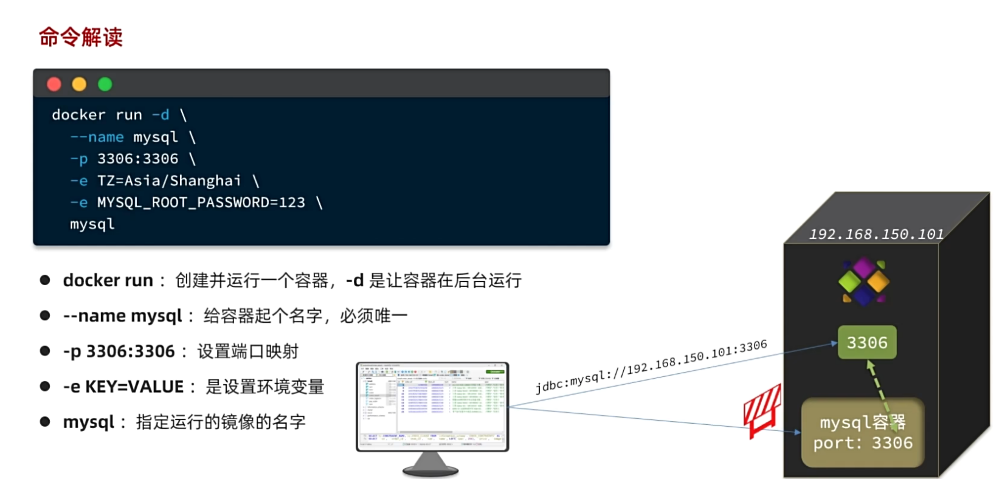
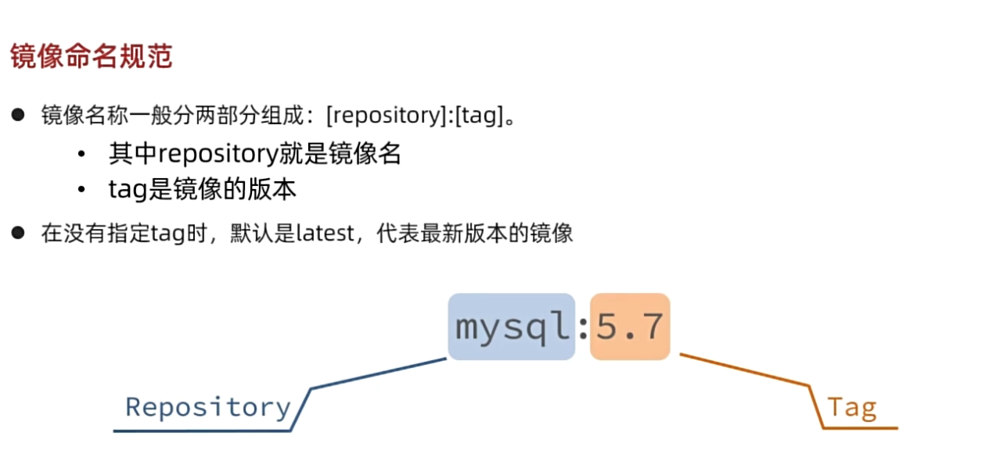
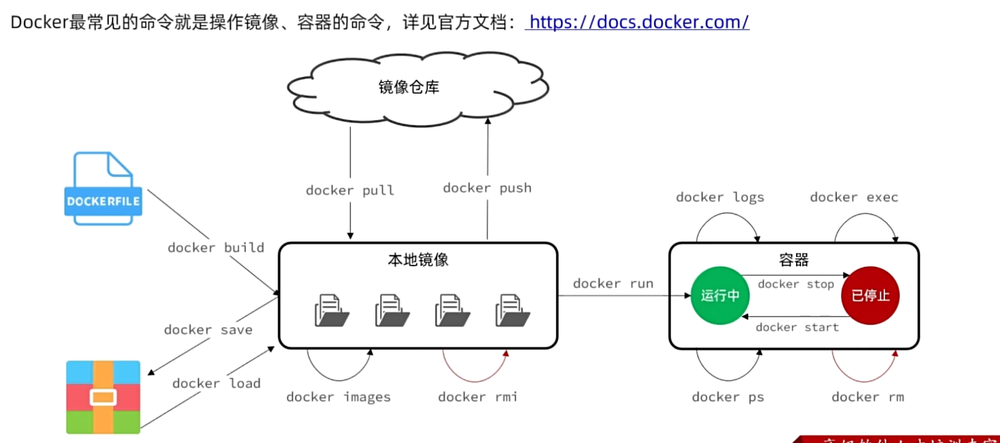
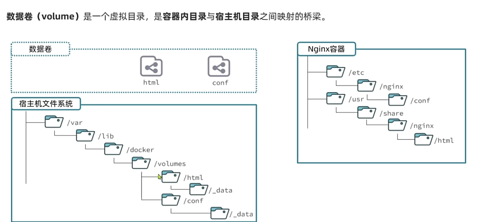
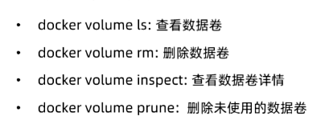

# 一、什么是Docker
Docker 是一款开源容器化引擎，基于 Linux 内核的 Namespace、Cgroups 技术实现应用隔离，能把程序、依赖、运行环境**打包成标准化容器**，实现「一次打包，到处运行」。
# 二、如何安装
可以在Linux虚拟机上安装，或者选择在wsl上安装。本篇采取后者，在wsl上安装，这里下载了可视化软件便于操作
>[!TIP]
以下的前提是要确保Windows 开启「适用于 Linux 的 Windows 子系统」「虚拟机平台」；
## step1-下载可视化软件
Docker Desktop 官网下载：https://www.docker.com/products/docker-desktop/

## step2-打开WSL集成
打开 Docker Desktop → Settings → Resources → WSL Integration 
打开 Ubuntu 对应的开关，点击 Apply & Restart 
重启后打开 WSL Ubuntu，直接使用 docker / docker compose 命令 

# 三、如何使用
## 3.1 Docker的内部原理
当我们安装应用时，会自动搜索并下载应用**镜像（image）**.镜像不仅包括本身，还有运行所需要的环境，配置，系统函数库。Docker会运行镜像时**创建一个隔离环境，成为容器（container）**
>[!TIP]
这里需要配置镜像，否则拉取速度会很慢，甚至失败
 

这里就有一个Docker Hub官方维护的镜像网站

## 3.2 mysql部署下载命令解读

>[!NOTE]
这里**端口前面指的是本机端口**，也就是虚拟机或者wsl，后者是docker创建的端口，通过映射到本机外界才能访问到 \代表换行 
若是第一次部署，则会自动拉取mysql的镜像

## 3.3 镜像命名规范

# 四、基础语法命令
## 4.1 常用命令

**这里docker 都简写为d了** 
d pull 拉取镜像到本地 
d push 推送镜像到仓库 
d run 创建镜像容器并运行 
d images 表示查看现在本地的镜像 
d rmi 删除本地镜像，后面直接跟镜像名字或者id  加-f可以强制删除不用停止容器 
d rm 删除容器 
d save 保存本地镜像，docker save -o mysql8.tar mysql:8.0这样就是将mysql：8.0保存为mysql8.tar这个文件 
d logs 输出日志 
d exec 后面接容器名，进入此容器 
d rm 删除容器 
d start   d stop  启动，停止容器
## 4.2 命令别名
alias rm='rm -i' 
alias cp='cp -i' 
alias mv='mv -i' 
alias dps='docker ps --format "table {{.ID}}\t{{.Image}}\t{{.Ports}}\t{{.Status}}\t{{.Names}}"' 
alias dis='docker images'
>[!TIP]
这里的**alias**是关键字，等号左边是别名，右边是原来的命令

# 五、数据卷
## 5.1 为什么需要
docker容器里很难修改某个文件，所以这个时候我们可以进行数据卷挂载，将主机与容器双向连接
## 5.2 什么是数据卷
是一个虚拟目录，它将宿**主机目录映射到容器内**目录，方便我们操作容器内的文件或者方便迁移容器产生的数据

## 5.3 如何挂载
在创建容器时，利用**-v数据卷名:容器内目录**完成挂载
 
>[!TIP]
docker run -d --name nginx -p 8080:80 -v 数据卷名字 :/usr/share/nginx/html nginx
## 5.4 数据卷常见命令

