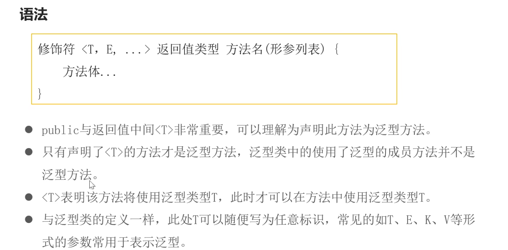
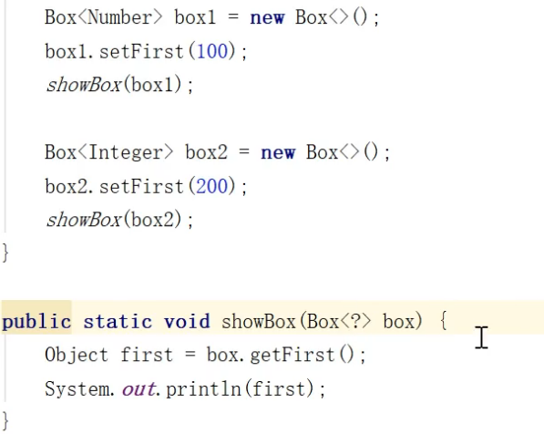

- [一、泛型基本概念](#一泛型基本概念)
  - [1.1 泛型的作用](#11-泛型的作用)
  - [1.2 什么是泛型](#12-什么是泛型)
- [二、泛型类](#二泛型类)
  - [2.1 泛型类语法](#21-泛型类语法)
  - [2.2 泛型类的使用](#22-泛型类的使用)
  - [2.3 从泛型类派生子类](#23-从泛型类派生子类)
    - [2.3.1 子类也是泛型类](#231-子类也是泛型类)
    - [2.3.2 子类不是泛型类](#232-子类不是泛型类)
- [三、泛型接口](#三泛型接口)
  - [3.1 泛型接口的使用](#31-泛型接口的使用)
    - [3.1.1 泛型实现类是泛型](#311-泛型实现类是泛型)
    - [3.1.2 泛型实现类不是泛型](#312-泛型实现类不是泛型)
- [四、泛型方法](#四泛型方法)
  - [4.1 语法](#41-语法)
    - [4.1.2 静态泛型方法](#412-静态泛型方法)
    - [4.1.3 泛型方法与可变参数](#413-泛型方法与可变参数)
- [五、类型通配符](#五类型通配符)
  - [5.1 什么是类型通配符](#51-什么是类型通配符)
  - [5.2 类型统配符的上限](#52-类型统配符的上限)
    - [5.2.1 定义](#521-定义)
  - [5.3 类型统配符的下限](#53-类型统配符的下限)
    - [5.3.1 定义](#531-定义)

# 一、泛型基本概念
## 1.1 泛型的作用
在没有泛型之前，一个数组定义成Object后对于每个元素的操作需要记忆对应的类型，极其不方便，所以在**JDK5**的时候推出了泛型。
## 1.2 什么是泛型
泛型是**JDK5**引入的一个新特性，提供了**编译时类型安全检测**的机制，该机制允许我们在编译时检测到**非法的类型数据结构**，本质就是**参数化数据类型**
~~~java
ArrayList<String>strList=new Arraylist<>();
//这里就是一个泛型，定义了是字符串类型，只能存储字符串，否则就会编译时报错
~~~
# 二、泛型类
## 2.1 泛型类语法
~~~java
    class 类名<T,E......>{
        private T a;
    }
    //泛型T，E
    //变量a

    public class Student<T>{
        private T a;
        private T b;
        public Student(T a){
            this.a = a;
        }
    }
~~~
## 2.2 泛型类的使用
类名<T>名字 = new 类名<可省略>(有参构造的话应该保持泛型一致T);
~~~java
借助上面的例子
Student<String>s1 = new Student<>("xiaoMing");
~~~ 
>[!NOTE]
>1.若创建对象时不指定T,默认是Object 
2.泛型只能用包装类，不能是基本数据类型 
3.同一泛型类对象，根据不同的数据类型创建的对象，本质上是同一类型

## 2.3 从泛型类派生子类
### 2.3.1 子类也是泛型类
此时子类和父类的泛型类需要**保持一致**,即便子类泛型扩展也需要父类与子类中对应的保持一致
~~~java
 class ChildGeneric<T> extends Generic<T>
~~~
### 2.3.2 子类不是泛型类
父类需要**明确指出类型**
~~~java
    class ChildGeneric extends Generic<String>
~~~
# 三、泛型接口
## 3.1 泛型接口的使用
### 3.1.1 泛型实现类是泛型
泛型实现类要跟接口的泛型保持一致
~~~java
public class Pair<T,E> implements Generics <T>{
    private T key;
    private E value;

    public Pair(T key,E value){
        this.key = key;
        this.value = value;
    }
}
~~~
### 3.1.2 泛型实现类不是泛型
要制定泛型接口的实现类，可参考泛型类

# 四、泛型方法
## 4.1 语法

>[!NOTE]
>这里前面的泛型列表决定了，方法里参数的类型，以及方法体内部的泛型使用，**泛型方法是独立与泛型类的**
### 4.1.2 静态泛型方法
区别于泛型类里的成员方法，成员方法不行，但泛型方法可以
### 4.1.3 泛型方法与可变参数
~~~java
public <E> void print(E... e){
    for(E e1 : e){
        System.out.println(e);
    }
}
~~~
>[!TIP]
>跟泛型方法唯一的区别就是这里的**参数数量不确定**，采用可变的形式，其他都是一致的

# 五、类型通配符
## 5.1 什么是类型通配符
是一般用"?"替代具体的类型实参

>[!NOTE]
这里的？就代表了上面的实参Integer,Number等

## 5.2 类型统配符的上限
### 5.2.1 定义
就是在类型统配符的基础上定义了上限
~~~java
类/接口<? extends 实参类>
public static void showAnimals(ArrayList<? extends Cats>){
    //再这样的上限里不能添加元素，因为无法保证添加的类型一样
}
~~~
>[!TIP]
这样定义后传入的泛型类型只能是实参的类型或者其的子类，遍历的话用父类

## 5.3 类型统配符的下限
### 5.3.1 定义
就是利用super定义下限，标识其实参类型及其父类
~~~java
类/接口<? super 实参类>
//可以添加元素，但无法保证类型一致，遍历时用Object遍历
~~~