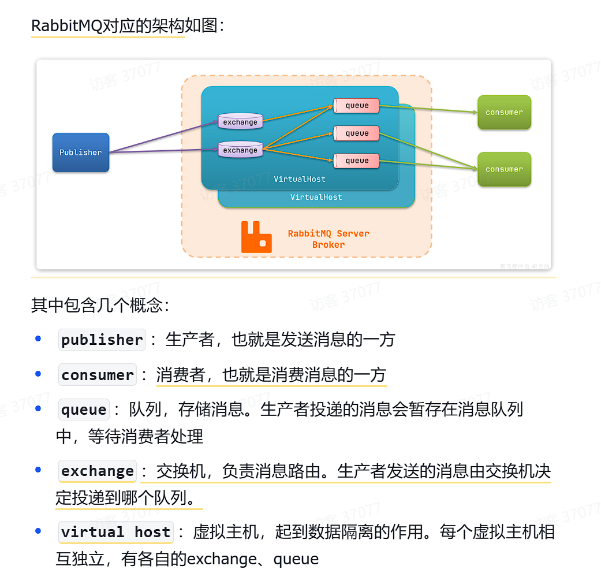
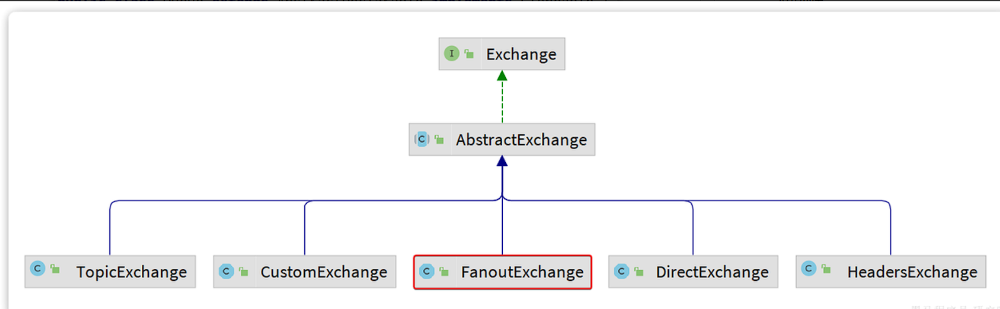
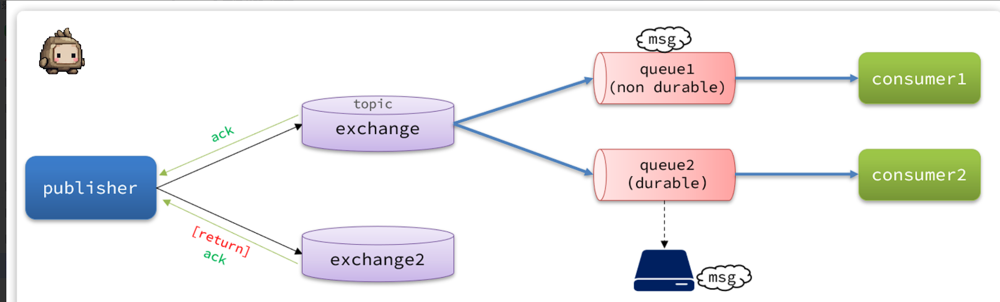

- [一、认识MQ](#一认识mq)
  - [1.1 同步调用](#11-同步调用)
  - [1.2 异步调用](#12-异步调用)
- [二、RabbitMQ](#二rabbitmq)
  - [2.1 基于MQ的技术](#21-基于mq的技术)
  - [2.2 RabbitMQ安装](#22-rabbitmq安装)
    - [docker部署](#docker部署)
  - [2.3 RabbitMQ介绍](#23-rabbitmq介绍)
- [三、SpringAMQP](#三springamqp)
  - [3.1 快速入门](#31-快速入门)
    - [依赖引入](#依赖引入)
    - [配置文件修改](#配置文件修改)
    - [创建监听类跟测试类发布信息](#创建监听类跟测试类发布信息)
  - [3.2 WorkQueue](#32-workqueue)
  - [3.3 交换机模型](#33-交换机模型)
    - [3.3.1 Fanout](#331-fanout)
    - [3.3.2 Direct](#332-direct)
    - [3.3.3 Topic](#333-topic)
      - [通配符规则：](#通配符规则)
  - [3.4 在项目中声明交换机跟队列](#34-在项目中声明交换机跟队列)
    - [direct示例](#direct示例)
  - [3.5 消息转换器](#35-消息转换器)
    - [引入依赖](#引入依赖)
    - [创建配置类](#创建配置类)
- [四、发送者的可靠性](#四发送者的可靠性)
  - [4.1 生产者重试机制](#41-生产者重试机制)
  - [4.2 生产者确认机制](#42-生产者确认机制)
  - [4.3 实现生产者确认机制](#43-实现生产者确认机制)
    - [开启生产者机制](#开启生产者机制)
    - [定义ReturnCallback](#定义returncallback)
    - [定义ConfirmCallback](#定义confirmcallback)
- [五、MQ可靠性](#五mq可靠性)
  - [5.1 数据持久化](#51-数据持久化)
    - [交换机持久化](#交换机持久化)
    - [队列持久化](#队列持久化)
    - [消息持久化](#消息持久化)
  - [4.4 LazyQueue](#44-lazyqueue)
    - [控制台设置队列Lazy](#控制台设置队列lazy)
    - [代码配置LazyQueue](#代码配置lazyqueue)
- [六、消费者可靠性（配置都在消费者中配置）](#六消费者可靠性配置都在消费者中配置)
  - [6.1 修改ACK处理方式](#61-修改ack处理方式)
  - [6.2 失败尝试机制](#62-失败尝试机制)
  - [6.3 失败处理机制](#63-失败处理机制)

# 一、认识MQ
## 1.1 同步调用
OpenFeign就是同步调用，一句话就是需要依次按照顺序执行，只有当上一个服务在完成后才能进行下一个。
 

这样就会有以下缺点:**拓展性差**跟**性能下降**，**级联失败**（有一个失败所有都会进行回滚）

## 1.2 异步调用
异步调用方式其实就是基于**消息通知**的方式，一般包含三个角色：
- 消息发送者：投递消息的人，就是原来的调用方
- 消息Broker：管理、暂存、转发消息，你可以把它理解成微信服务器
- 消息接收者：接收和处理消息的人，就是原来的服务提供方
  
在异步调用中，发送者不再直接同步调用接收者的业务接口，而是发送一条消息投递给消息Broker。然后接收者根据自己的需求从消息Broker那里订阅消息。每当发送方发送消息后，接受者都能获取消息并处理。
这样，发送消息的人和接收消息的人就完全解耦了。 

异步调用的优势包括：
- **耦合度更低**
- **性能更好**
- **业务拓展性强**
- **故障隔离，避免级联失败**

# 二、RabbitMQ
## 2.1 基于MQ的技术
| 对比维度     | RabbitMQ                  | ActiveMQ                              | RocketMQ   | Kafka         |
| ------------ | ------------------------- | ------------------------------------- | ---------- | ------------- |
| 公司/社区    | Rabbit                    | Apache                                | 阿里       | Apache        |
| 开发语言     | Erlang                    | Java                                  | Java       | Scala&Java    |
| 协议支持     | AMQP, XMPP, SMTP, STOMP   | OpenWire,STOMP,REST,XMPP,AMQP         | 自定义协议 | 自定义协议    |
| 可用性       | 高                        | 一般                                  | 高         | 高            |
| 单机吞吐量   | 一般                      | 差                                    | 高         | 非常高        |
| 消息延迟     | 微秒级                    | 毫秒级                                | 毫秒级     | 毫秒以内      |
| 消息可靠性   | 高                        | 一般                                  | 高         | 一般          |

## 2.2 RabbitMQ安装
### docker部署
~~~shell
docker run \
-e RABBITMQ_DEFAULT_USER=itheima \ #自定义账号
-e RABBITMQ_DEFAULT_PASS=123321 \ #自定义密码
-v mq-plugins:/plugins \ # 数据卷挂载
--name mq \ # 容器名命名
--hostname mq \ 
-p 15672:15672 \  # ip访问端口
-p 5672:5672 \  
--network hm-net \
-d \
rabbitmq:management # 最新版
~~~

## 2.3 RabbitMQ介绍

在mq的操作界面我们可以**创建交换机**，**创建队列**，并且将队列**绑定**交换机发送信息给虚拟机进而传递到队列，**创建虚机主机**

# 三、SpringAMQP
Spring的官方刚好基于RabbitMQ提供了这样一套消息收发的模板工具：SpringAMQP。并且还基于SpringBoot对其实现了自动装配，使用起来非常方便。
## 3.1 快速入门
### 依赖引入
~~~xml
 <!--AMQP依赖，包含RabbitMQ-->
        <dependency>
            <groupId>org.springframework.boot</groupId>
            <artifactId>spring-boot-starter-amqp</artifactId>
        </dependency>
~~~

### 配置文件修改
~~~yaml
spring:
  rabbitmq:
    host: 192.168.150.101 # 你的虚拟机IP
    port: 5672 # 端口
    virtual-host: /hmall # 虚拟主机
    username: hmall # 用户名
    password: 123 # 密码
~~~

### 创建监听类跟测试类发布信息
测试类：
~~~java

@SpringBootTest
public class SpringAmqpTest {

    @Autowired
    private RabbitTemplate rabbitTemplate;

    @Test
    public void testSimpleQueue() {
        // 队列名称
        String queueName = "simple.queue";
        // 消息
        String message = "hello, spring amqp!";
        // 发送消息
        rabbitTemplate.convertAndSend(queueName, message);
    }
}
~~~
>[!TIP]
rabbitTemplate.convertAndSend(queueName, message);发送消息
配置类监听类：

~~~java

@Component
public class SpringRabbitListener {
        // 利用RabbitListener来声明要监听的队列信息
    // 将来一旦监听的队列中有了消息，就会推送给当前服务，调用当前方法，处理消息。
    // 可以看到方法体中接收的就是消息体的内容
    @RabbitListener(queues = "simple.queue")
    public void listenSimpleQueueMessage(String msg) throws InterruptedException {
        System.out.println("spring 消费者接收到消息：【" + msg + "】");
    }
}
~~~

## 3.2 WorkQueue
Work queues，任务模型。简单来说就是让多个消费者绑定到一个队列，共同消费队列中的消息。默认的是平均分给每个队列，但是没有考虑到不同队列的处理速度
~~~yaml
spring:
  rabbitmq:
    listener:
      simple:
        prefetch: 1 # 每次只能获取一条消息，处理完成才能获取下一个消息
~~~
这样配置后就可以实现能者多劳

## 3.3 交换机模型
交换机的类型有四种：
- Fanout：广播，将消息交给所有绑定到交换机的队列。我们最早在控制台使用的正是Fanout交换机
- Direct：订阅，基于RoutingKey（路由key）发送给订阅了消息的队列
- Topic：通配符订阅，与Direct类似，只不过RoutingKey可以使用通配符
- Headers：头匹配，基于MQ的消息头匹配，用的较少。
  
### 3.3.1 Fanout
- 1）  可以有多个队列
- 2）  每个队列都要绑定到Exchange（交换机）
- 3）  生产者发送的消息，只能发送到交换机
- 4）  交换机把消息发送给绑定过的所有队列
- 5）  订阅队列的消费者都能拿到消息

### 3.3.2 Direct
- 队列与交换机的绑定，不能是任意绑定了，而是要指定一个**RoutingKey**（路由key）
- 消息的发送方在 向 Exchange发送消息时，也必须指定消息的 RoutingKey。
- Exchange不再把消息交给每一个绑定的队列，而是根据消息的Routing Key进行判断，只有**队列的Routingkey与消息的 Routing key完全一致**，才会接收到消息
### 3.3.3 Topic
Topic类型的Exchange与Direct相比，都是可以根据RoutingKey把消息路由到不同的队列。
只不过Topic类型Exchange可以让队列在绑定BindingKey 的时候使用通配符！

BindingKey 一般都是有一个或多个单词组成，**多个单词之间以.分割**，例如： item.insert

#### 通配符规则：
- **#**：匹配一个或多个词
- *：匹配不多不少恰好1个词

## 3.4 在项目中声明交换机跟队列
SpringAMQP提供了一个**Queue**类，用来创建队列 
SpringAMQP还提供了一个Exchange接口，来表示所有不同类型的交换机

SpringAMQP还提供了**ExchangeBuilder**来实现**创建队列跟交换机**，而在绑定队列和交换机时，则需要使用**BindingBuilder**方法来创建Binding对象

### direct示例
direct模式由于要绑定多个KEY，会非常麻烦，每一个Key都要编写一个binding：
~~~java
package com.example.consumer.config;

import org.springframework.amqp.core.*;
import org.springframework.context.annotation.Bean;
import org.springframework.context.annotation.Configuration;

@Configuration
public class DirectConfig {

    /**
     * 声明交换机
     * @return Direct类型交换机
     */
    @Bean
    public DirectExchange directExchange(){
        return ExchangeBuilder.directExchange("hmall.direct").build();
    }

    /**
     * 第1个队列
     */
    @Bean
    public Queue directQueue1(){
        return new Queue("direct.queue1");
    }

    /**
     * 绑定队列和交换机
     */
    @Bean
    public Binding bindingQueue1WithRed(Queue directQueue1, DirectExchange directExchange){
        return BindingBuilder.bind(directQueue1).to(directExchange).with("red");
    }
    /**
     * 绑定队列和交换机
     */
    @Bean
    public Binding bindingQueue1WithBlue(Queue directQueue1, DirectExchange directExchange){
        return BindingBuilder.bind(directQueue1).to(directExchange).with("blue");
    }

    /**
     * 第2个队列
     */
    @Bean
    public Queue directQueue2(){
        return new Queue("direct.queue2");
    }

    /**
     * 绑定队列和交换机
     */
    @Bean
    public Binding bindingQueue2WithRed(Queue directQueue2, DirectExchange directExchange){
        return BindingBuilder.bind(directQueue2).to(directExchange).with("red");
    }
    /**
     * 绑定队列和交换机
     */
    @Bean
    public Binding bindingQueue2WithYellow(Queue directQueue2, DirectExchange directExchange){
        return BindingBuilder.bind(directQueue2).to(directExchange).with("yellow");
    }
}
~~~

基于@Bean的方式声明队列和交换机比较麻烦，Spring还提供了基于注解方式来声明。直接在消费者监听上加上写
~~~java
//这里的key可以是数组也可以是字符串
@RabbitListener(bindings = @QueueBinding(
    value = @Queue(name = "direct.queue1"),
    exchange = @Exchange(name = "hmall.direct", type = ExchangeTypes.DIRECT),
    key = {"red", "blue"}
))
public void listenDirectQueue1(String msg){
    System.out.println("消费者1接收到direct.queue1的消息：【" + msg + "】");
}

@RabbitListener(bindings = @QueueBinding(
    value = @Queue(name = "direct.queue2"),
    exchange = @Exchange(name = "hmall.direct", type = ExchangeTypes.DIRECT),
    key = {"red", "yellow"}
))
public void listenDirectQueue2(String msg){
    System.out.println("消费者2接收到direct.queue2的消息：【" + msg + "】");
}
~~~

## 3.5 消息转换器
在消息以object对象传递时，默认会采取jdk简单序列化传递消息，就会出现字节，我们需要手动配置消息转化器转化成JSON

### 引入依赖
~~~xml
<dependency>
    <groupId>com.fasterxml.jackson.dataformat</groupId>
    <artifactId>jackson-dataformat-xml</artifactId>
    <version>2.9.10</version>
</dependency>
~~~

### 创建配置类

配置消息转换器，在publisher和consumer两个服务的启动类中添加一个Bean即可：
~~~java
@Bean
public MessageConverter messageConverter(){
    // 1.定义消息转换器
    Jackson2JsonMessageConverter jackson2JsonMessageConverter = new Jackson2JsonMessageConverter();
    // 2.配置自动创建消息id，用于识别不同消息，也可以在业务中基于ID判断是否是重复消息
    jackson2JsonMessageConverter.setCreateMessageIds(true);
    return jackson2JsonMessageConverter;
}
~~~
# 四、发送者的可靠性
在消息发送时候，会出现消息丢失： 
- 发送消息时丢失：
  - 生产者发送消息时连接MQ失败
  - 生产者发送消息到达MQ后未找到Exchange
  - 生产者发送消息到达MQ的Exchange后，未找到合适的Queue
  - 消息到达MQ后，处理消息的进程发生异常
- MQ导致消息丢失：
  - 消息到达MQ，保存到队列后，尚未消费就突然宕机
- 消费者处理消息时：
  - 消息接收后尚未处理突然宕机
  - 消息接收后处理过程中抛出异常
 

综上，我们要解决消息丢失问题，保证MQ的可靠性，就必须从3个方面入手：
- 确保生产者**一定把消息发送到MQ**
- 确保**MQ不会将消息弄丢**
- 确保消费者一定要**处理消息**

## 4.1 生产者重试机制
SpringAMQP提供的**消息发送时的重试机制**。即：当RabbitTemplate与MQ连接超时后，多次重试。

重试机制的yaml：
~~~yaml
spring:
  rabbitmq:
    connection-timeout: 1s # 设置MQ的连接超时时间
    template:
      retry:
        enabled: true # 开启超时重试机制
        initial-interval: 1000ms # 失败后的初始等待时间
        multiplier: 1 # 失败后下次的等待时长倍数，下次等待时长 = initial-interval * multiplier
        max-attempts: 3 # 最大重试次数
~~~

## 4.2 生产者确认机制
RabbitMQ提供了生产者**消息确认机制**，包括**Publisher Confirm**和**Publisher Return**两种。在开启确认机制的情况下，当生产者发送消息给MQ后，MQ会根据消息处理的情况返回不同的**回执**。

总结如下：
- 当**消息投递到MQ**，但是**路由失败**时，通过Publisher Return返回异常信息，同时返回**ack**的确认信息，代表投递成功
- **临时消息**投递到了MQ，并且**入队成功**，返回**ACK**，告知投递成功
- **持久消息**投递到了MQ，并且**入队完成持久化**，返回**ACK** ，告知投递成功
- 其它情况都会返回**NACK**，告知投递失败

>[!TIP]
NACK跟ACK都是Confim机制，Return是Return机制,默认都是关闭的，需要配置文件打开

## 4.3 实现生产者确认机制
### 开启生产者机制
~~~yaml
spring:
  rabbitmq:
    publisher-confirm-type: correlated # 开启publisher confirm机制，并设置confirm类型
    publisher-returns: true # 开启publisher return机制
~~~
>[!NOTE]
这里publisher-confirm-type有三种模式可选：
- **none**：关闭confirm机制
- **simple**：同步阻塞等待MQ的回执
- **correlated**：MQ异步回调返回回执

一般我们推荐使用correlated，回调机制。

### 定义ReturnCallback
每个RabbitTemplate只能**配置一个ReturnCallback**，因此我们可以在配置类中统一设置

~~~java

@Slf4j
@AllArgsConstructor
@Configuration
public class MqConfig {
    private final RabbitTemplate rabbitTemplate;

    @PostConstruct//代表在注入后，执行下面的方法
    public void init(){
        rabbitTemplate.setReturnsCallback(new RabbitTemplate.ReturnsCallback() {
            @Override
            public void returnedMessage(ReturnedMessage returned) {
                log.error("触发return callback,");
                log.debug("exchange: {}", returned.getExchange());
                log.debug("routingKey: {}", returned.getRoutingKey());
                log.debug("message: {}", returned.getMessage());
                log.debug("replyCode: {}", returned.getReplyCode());
                log.debug("replyText: {}", returned.getReplyText());
            }
        });
    }
}
~~~

### 定义ConfirmCallback
与return不同在于，这个因为不同的消息发送逻辑不同，所以confirm的返回也不一样，需要多次定义
>[!TIP]
因此ConfirmCallback需要在每次发消息时定义。具体来说，是在调用RabbitTemplate中的**convertAndSend方法时，多传递一个参数**,**CorrelationData类型**: 
1.id：消息的**唯一标示**，MQ对不同的消息的回执以此做判断，避免混淆 
2.SettableListenableFuture：回执结果的Future对象

~~~java
@Test
void testPublisherConfirm() {
    // 1.创建CorrelationData
    CorrelationData cd = new CorrelationData();
    // 2.给Future添加ConfirmCallback
    cd.getFuture().addCallback(new ListenableFutureCallback<CorrelationData.Confirm>() {
        @Override
        public void onFailure(Throwable ex) {
            // 2.1.Future发生异常时的处理逻辑，基本不会触发
            log.error("send message fail", ex);
        }
        @Override
        public void onSuccess(CorrelationData.Confirm result) {
            // 2.2.Future接收到回执的处理逻辑，参数中的result就是回执内容
            if(result.isAck()){ // result.isAck()，boolean类型，true代表ack回执，false 代表 nack回执
                log.debug("发送消息成功，收到 ack!");
            }else{ // result.getReason()，String类型，返回nack时的异常描述
                log.error("发送消息失败，收到 nack, reason : {}", result.getReason());
            }
        }
    });
    // 3.发送消息
    rabbitTemplate.convertAndSend("hmall.direct", "q", "hello", cd);
}
~~~
>[!WARNING]
开启生产者确认比较**消耗MQ性能**，一般不建议开启

# 五、MQ可靠性
## 5.1 数据持久化
需要从交换机，队列，消息持久化三个方面考虑
### 交换机持久化
设置为Durable就是持久化模式，Transient就是临时模式。
### 队列持久化
同理也是设置成Durable即可
### 消息持久化
消息的持久化是要配置一个properties：Persistent
>[!TIP]
非持久化的消息会存在内存中，持久化的内存则会优先放在缓存，以及内存中，当内存不足则写入磁盘中，要是充足，磁盘会有备份，但是下次读取优先从内存跟1缓存中读取，**但是写入磁盘的过程，以及读取都会降低性能**
## 4.4 LazyQueue
从RabbitMQ的3.6.0版本开始，就增加了Lazy Queues的模式，也就是惰性队列。惰性队列的特征如下：
- 接收到消息后**直接存入磁盘**而非内存
- 消费者要消费消息时才会从磁盘中读取并加载到内存（也就是**懒加载**）
- 支持**数百万条的消息**存储
>[!TIP]
3.8RabbitMQ后都是LazyQueue了

### 控制台设置队列Lazy
在添加队列的时候，添加x-queue-mod=lazy参数即可设置队列为Lazy模式

### 代码配置LazyQueue
**Bean的方式：**
~~~java
@Bean
public Queue lazyQueue(){
    return QueueBuilder
            .durable("lazy.queue")
            .lazy() // 开启Lazy模式
            .build();
}
~~~

**注解：**
~~~java
@RabbitListener(queuesToDeclare = @Queue(
        name = "lazy.queue",
        durable = "true",
        arguments = @Argument(name = "x-queue-mode", value = "lazy")
))
public void listenLazyQueue(String msg){
    log.info("接收到 lazy.queue的消息：{}", msg);
}
~~~

# 六、消费者可靠性（配置都在消费者中配置）

RabbitMQ提供了**消费者确认机制**（Consumer Acknowledgement）。即：当消费者处理消息结束后，应该向RabbitMQ发送一个回执，告知RabbitMQ自己消息处理状态。回执有三种可选值：
- ack：成功处理消息，RabbitMQ从队列中**删除该消息**
- nack：消息处理失败，RabbitMQ需要**再次投递**消息
- reject：消息处理失败并**拒绝该消息**，RabbitMQ从队列中**删除**该消息

**SpringAMQP**帮我们实现了消息确认。并允许我们通过**配置文件设置ACK**处理方式，有三种模式：
- **none**：不处理。即消息投递给消费者后立刻ack，消息会立刻从MQ删除。非常不安全，不建议使用
- **manual**：手动模式。需要自己在业务代码中调用api，发送ack或reject，存在业务入侵，但更灵活
- **auto**：自动模式。SpringAMQP利用AOP对我们的消息处理逻辑做了环绕增强，当业务正常执行时则自动返回ack.  当业务出现异常时，根据异常判断返回不同结果：
  - 如果是业务异常，会自动返回nack；
  - 如果是消息处理或校验异常，自动返回reject;

## 6.1 修改ACK处理方式
~~~yaml
spring:
  rabbitmq:
    listener:
      simple:
        acknowledge-mode: none # 不做处理
~~~

## 6.2 失败尝试机制
为了防止出现一直重试的情况给队列造成压力，我们可以规定重试次数
~~~yaml
spring:
  rabbitmq:
    listener:
      simple:
        retry:
          enabled: true # 开启消费者失败重试
          initial-interval: 1000ms # 初识的失败等待时长为1秒
          multiplier: 1 # 失败的等待时长倍数，下次等待时长 = multiplier * last-interval
          max-attempts: 3 # 最大重试次数
          stateless: true # true无状态；false有状态。如果业务中包含事务，这里改为false
~~~
>[!TIP]
- 开启本地重试时，消息处理过程中抛出异常，不会requeue到队列，而是在消费者本地重试
- 重试达到最大次数后，Spring会返回reject，消息会被丢弃

## 6.3 失败处理机制
Spring允许我们自定义重试次数耗尽后的消息处理策略，这个策略是由MessageRecovery接口来定义的，它有3个不同实现：
-  RejectAndDontRequeueRecoverer：重试耗尽后，**直接reject**，丢弃消息。**默认就是这种方式** 
-  ImmediateRequeueMessageRecoverer：重试耗尽后，返回nack，消息**重新入队 **
-  **RepublishMessageRecoverer**：重试耗尽后，将失败消息投递到指定的交换机 

比较优雅的一种处理方案是RepublishMessageRecoverer，失败后将消息投递到一个指定的，专门存放异常消息的队列，后续由人工集中处理。

在定义好失败的队列以及交换机后，并完成相关key绑定后，配置消息处理策略：
~~~java
@Bean//这里的RabbitTemplate可以以参数传入，也可以构造注入
public MessageRecoverer republishMessageRecoverer(RabbitTemplate rabbitTemplate){
    return new RepublishMessageRecoverer(rabbitTemplate, "error.direct", "error");
}
~~~