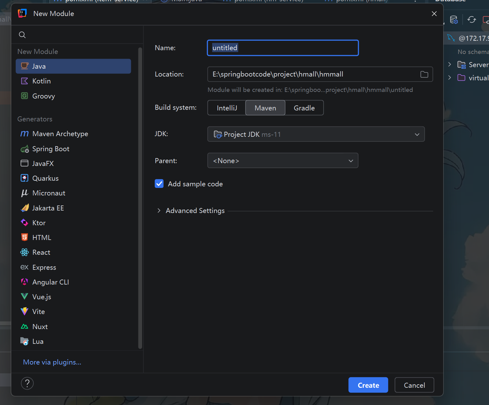
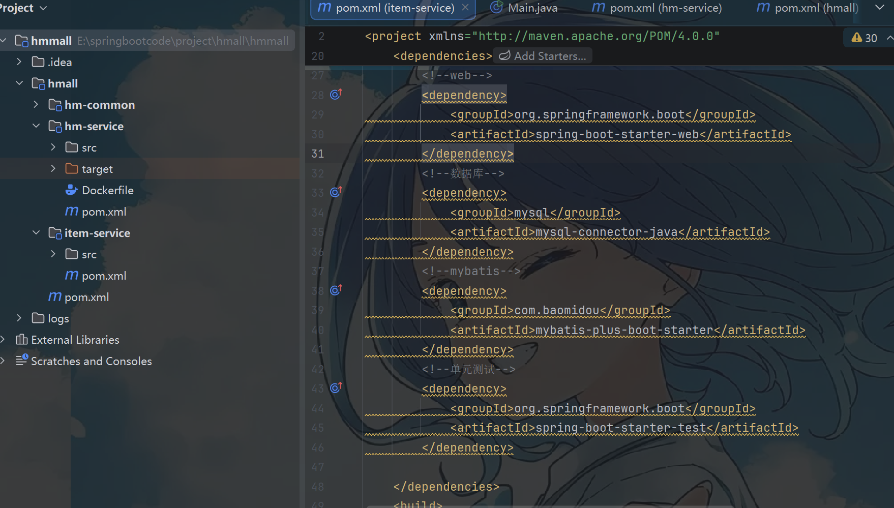
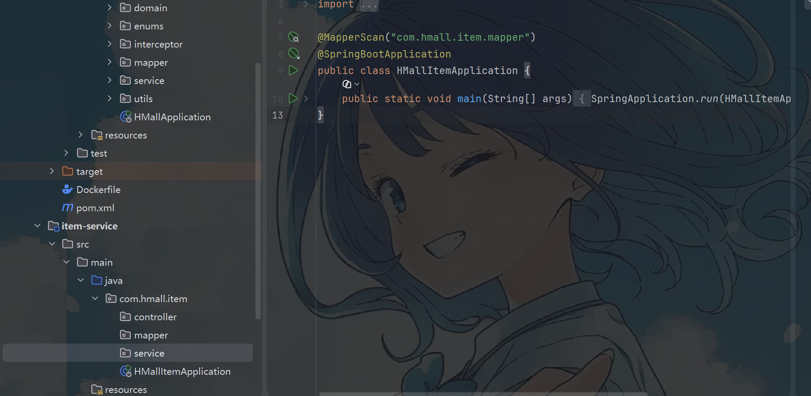

# 源代码位置
# 一、功能拆分
## 1.1 新建模块
这里是单体项目拆分成微服务的方式
在**父工程**下新建功能模块

>[!TIP]
maven工程要选择父模块的maven作为父工程，并且在该模块内部写入该模块所需要的相关依赖

## 1.2 依赖引入

>[!TIP]
这里是新建的这个modules里的pom文件

## 1.3 模块的结构

>[!TIP]
这里的文件夹，尽量跟其它模块保持一样的命名规则，并补全之后需要的其它层，以及启动类。 
注意yaml配置文件也需要写入resource中，注意配置的变化，比如数据库的端口要改变

这里需要注意各个配置路径，比如knife4j的     api-rule-resources，以及数据库的表是否需要更换，启动类的端口不能重复等
