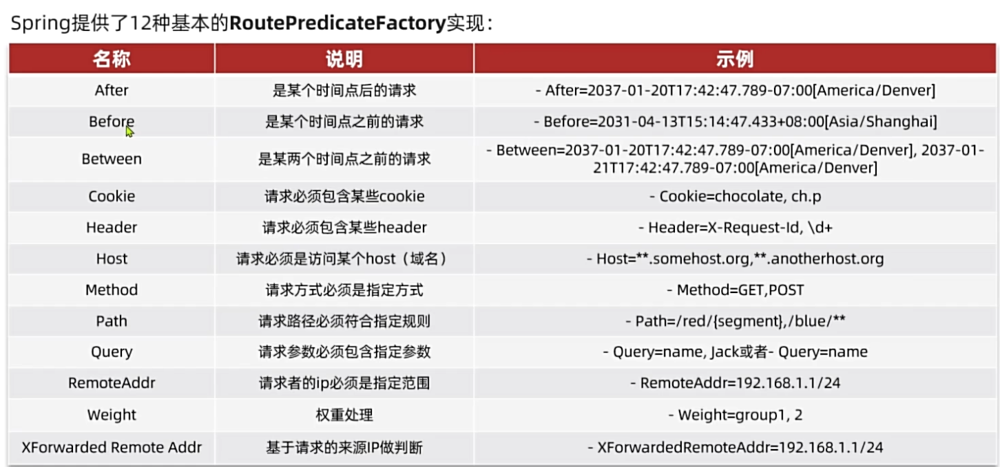
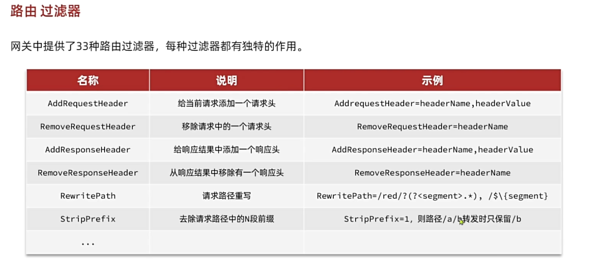
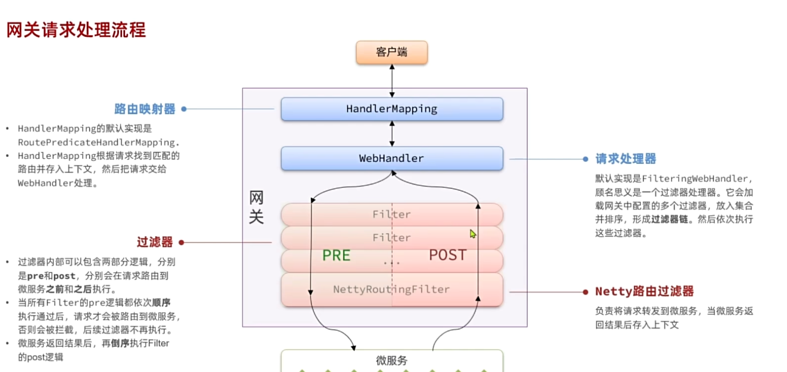
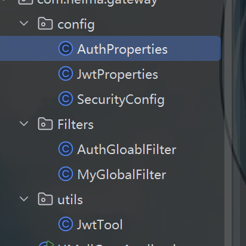

# 网关（SpringCloudGateway技术）
## 1.什么是网关
顾明思议，网关就是网络的关口。数据在网络间传输，从一个网络传输到另一网络时就需要经过网关来做数据的路由和转发以及数据安全的校验。
>[!TIP]
路由就是寻找请求所对应的哪个服务器，转发就是将请求传递过去

## 2.作用
现在，微服务网关就起到这样的作用。前端请求不能直接访问微服务，而是要请求网关：
- 网关可以做安全控制，也就是登录身份校验，校验通过才放行
- 通过认证后，网关再根据请求判断应该访问哪个微服务，将请求转发过去
## 3.快速入门
### 3.1 依赖配置
由于网关本身也是一个**独立的微服务**，因此也需要创建一个模块开发功能。
~~~xml
  <!--网关-->
        <dependency>
            <groupId>org.springframework.cloud</groupId>
            <artifactId>spring-cloud-starter-gateway</artifactId>
        </dependency>
        <!--nacos discovery-->
        <dependency>
            <groupId>com.alibaba.cloud</groupId>
            <artifactId>spring-cloud-starter-alibaba-nacos-discovery</artifactId>
        </dependency>
        <!--负载均衡-->
        <dependency>
            <groupId>org.springframework.cloud</groupId>
            <artifactId>spring-cloud-starter-loadbalancer</artifactId>
        </dependency>
    </dependencies>
~~~
### 3.2 创建启动类
~~~java
@SpringBootApplication
public class HMallGateApplication {
    public static void main(String[] args) {
        SpringApplication.run(HMallGateApplication.class, args);
    }
}
~~~

### 3.3 yaml文件配置路由
~~~yaml
server:
  port: 8080
spring:
  application:
    name: gateway
  cloud:
    nacos:
      server-addr: 192.168.150.101:8848
    gateway:
      routes:
        - id: item # 路由规则id，自定义，唯一
          uri: lb://item-service # 路由的目标服务，lb代表负载均衡，会从注册中心拉取服务列表
          predicates: # 路由断言，判断当前请求是否符合当前规则，符合则路由到目标服务
            - Path=/items/**,/search/** # 这里是以请求路径作为判断规则
        - id: cart
          uri: lb://cart-service
          predicates:
            - Path=/carts/**
        - id: user
          uri: lb://user-service
          predicates:
            - Path=/users/**,/addresses/**
        - id: trade
          uri: lb://trade-service
          predicates:
            - Path=/orders/**
        - id: pay
          uri: lb://pay-service
          predicates:
            - Path=/pay-orders/**

~~~

## 4.路由属性
分为路由断言跟过滤器
### 4.1 路由断言

### 4.2 过滤器

## 5.登陆校验
### 5.1 思路分析
有了网关之后，客户端就会发送请求先经过网关，再从网关转发到各个微服务，所以**登录校验就需要在网关处设置**这样才能减少代码重复量
### 5.2 如何设置

知道网关流程后，我们只需要编写一个**自定义的filter在pre阶段**，在Netty之前，我们就能达到登录校验的效果了 

同时想要传递用户信息，可以在请求中加入一个请求头，记录信息

### 5.3 全局过滤器
~~~java

public class MyGlobalFilter implements GlobalFilter, Ordered {
    //第一个参数是传递给每个过滤器中请求携带的内容，第二个是存储过滤器的容器的
    @Override
    public Mono<Void> filter(ServerWebExchange exchange, GatewayFilterChain chain) {
        HttpHeaders headers = exchange.getRequest().getHeaders();
        chain.filter(exchange);
        return null;
    }

    // 过滤器设置优先级，越小越先执行
    @Override
    public int getOrder() {
        return 0;
    }
}
~~~

## 6. 登陆检验以及用户信息传递
### 全局过滤器实现登陆检验

这里config中分别是拦截的路径，接受yaml配置的jwt的设置，token加密解密 
第一个过滤器生效
~~~java

@Component
@RequiredArgsConstructor
public class AuthGloablFilter implements GlobalFilter, Ordered {
    private final JwtTool jwtTool;
    private final AuthProperties authProperties;
    private final AntPathMatcher antPathMatcher = new AntPathMatcher();
    @Override
    public Mono<Void> filter(ServerWebExchange exchange, GatewayFilterChain chain) {
        //获取请求
        ServerHttpRequest request = exchange.getRequest();
        //判断是需要拦截
        if(isExclude(request.getPath().toString())){
            return chain.filter(exchange);
        }
        //获取token
        String token = null;
        Long userId = null;
        List<String> head = request.getHeaders().get("Authorization");
        try{
            if(head != null && !head.isEmpty()){
                token = head.get(0);
            }
            userId = jwtTool.parseToken(token);
        }catch (Exception e){
           exchange.getResponse().setStatusCode(HttpStatus.UNAUTHORIZED);//这是一个HTTP Status枚举类，401
           return exchange.getResponse().setComplete();//直接结束过滤setComplete()
        }
        //传递用户信息
        String userInfo = userId.toString();
        //新的请求
        ServerWebExchange swe = exchange.mutate()
                .request(builder -> builder.header("user-info", userInfo))
                .build();
        return chain.filter(swe);
    }

    @Override
    public int getOrder() {
        return 0;
    }

    private boolean isExclude(String path){
        List<String> excludePaths = authProperties.getExcludePaths();
        for (String excludePath : excludePaths) {
            if(antPathMatcher.match(excludePath, path)){
                return true;
            }
        }
        return false;
    }
}
~~~

### MVC拦截器传递用户信息
拦截器需要实现HandlerInterceptor，这里重写了前跟后的方法，分别用来写入id到线程池，以及清除id
~~~java
public class UserInfoInterceptor implements HandlerInterceptor {

    @Override
    public boolean preHandle(HttpServletRequest request, HttpServletResponse response, Object handler) throws Exception {
        String header = request.getHeader("user-info");
        if(StrUtil.isNotBlank(header)){
            UserContext.setUser(Long.parseLong(header));
        }
        return HandlerInterceptor.super.preHandle(request, response, handler);
    }

    @Override
    public void afterCompletion(HttpServletRequest request, HttpServletResponse response, Object handler, @Nullable Exception ex) throws Exception {
        UserContext.removeUser();
        HandlerInterceptor.super.afterCompletion(request, response, handler, ex);
    }
}
~~~
>[!TIP]
1.除此之外，还需要**定义一个config来添加该拦截器**才能生效 2.并且由于是微服务，每个模块的包都不一样，由于该拦截器是通过其它包**引入该拦截器所在包依赖实现**的，所以正常下无法被扫描，这里就需要添加此包名到springboot**自动装配**的路径

config:
~~~java
@Configuration
@ConditionalOnClass(DispatcherServlet.class)
public class MvcConfig implements WebMvcConfigurer {
    @Override
    public void addInterceptors(InterceptorRegistry registry) {
        registry.addInterceptor(new UserInfoInterceptor());
    }
}

~~~

自动装配（自己模块下的文件里）：
~~~
org.springframework.boot.autoconfigure.EnableAutoConfiguration=\
  com.hmall.common.config.MyBatisConfig,\
  com.hmall.common.config.JsonConfig,\
  com.hmall.common.config.MvcConfig
~~~