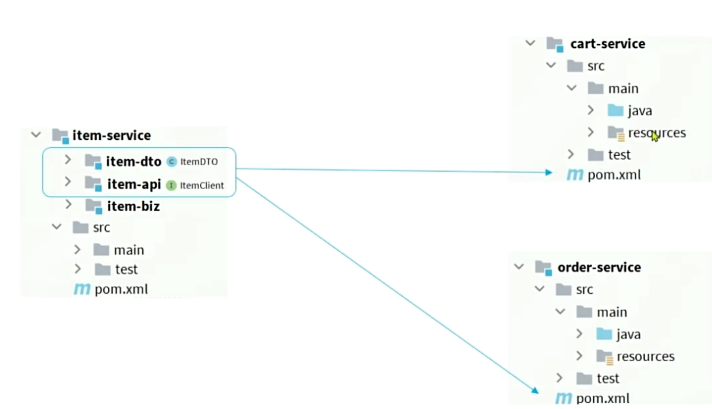
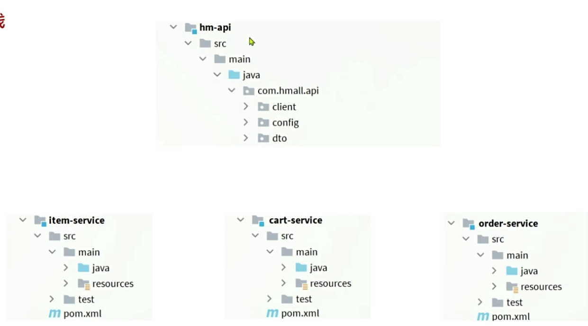
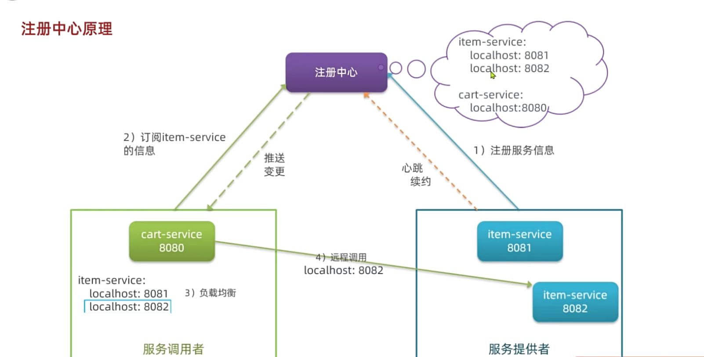

- [OpenFeign优化服务发现](#openfeign优化服务发现)
  - [依赖引入](#依赖引入)
  - [FeignClient配置](#feignclient配置)
  - [注入配置](#注入配置)
  - [okHttp优化](#okhttp优化)
    - [依赖引入](#依赖引入-1)
    - [配置修改](#配置修改)
  - [最佳实践](#最佳实践)
    - [第一种实例](#第一种实例)
  - [日志打印](#日志打印)

# OpenFeign优化服务发现
## 依赖引入
~~~xml
<!-- openfeign 核心依赖 -->
<dependency>
    <groupId>org.springframework.cloud</groupId>
    <artifactId>spring-cloud-starter-openfeign</artifactId>
</dependency>
负载均衡的依赖
<dependency>
    <groupId>org.springframework.cloud</groupId>
    <artifactId>spring-cloud-starter-loadbalancer</artifactId>
</dependency>
~~~
## FeignClient配置
**@EnableFeignClients**启动类加上这个配置才能被扫描
~~~java
//value表示提供服务的对象
@FeignClient(value = "item-service")
public interface ItemClient {

    //提供请求方式，以及请求url，以及请求参数
    @GetMapping("/items")
    List<ItemDTO> queryItemByIds(@RequestParam("ids")  Collection<Long> ids);
}
~~~

##  注入配置
 private final ItemClient itemClient;
 >[!TIP]
通过构造法进行依赖注入，@RequiredArgsConstructor注解必备

~~~java
 private void handleCartItems(List<CartVO> vos) {
        //获取商品id
        Set<Long> ids = vos.stream().map(CartVO::getId).collect(Collectors.toSet());
        //调用商品服务，获取商品信息
        List<ItemDTO> itemDTOS = itemClient.queryItemByIds(ids);

        //将商品信息存入map中
        Map<Long, ItemDTO> collect = itemDTOS.stream().collect(Collectors.toMap(ItemDTO::getId, Function.identity()));
        //这里的Function()的作用就是输入什么返回什么，所以这里就是ItemDTO
        //将商品信息写入vo中
        for (CartVO v : vos) {
            ItemDTO item = collect.get(v.getItemId());
            if (item == null) {
                continue;
            }
            v.setNewPrice(item.getPrice());
            v.setStatus(item.getStatus());
            v.setStock(item.getStock());
        }
    }
~~~

## okHttp优化
itemClient是一个**代理对象**，内部是基于JDK默认的**HttpURLConnection**实现的发送请求，这种方式**不支持连接池**，**效率也很低**，所以我们通常采取**OkHttp**或者**Apache HttpClient**
### 依赖引入
~~~xml
   <!--ok-http-->
        <dependency>
            <groupId>io.github.openfeign</groupId>
            <artifactId>feign-okhttp</artifactId>
        </dependency>
~~~

### 配置修改
~~~java
feign:
  okhttp:
    enabled: true
~~~

## 最佳实践
对于每一个需要服务的模块都需要进行feign依赖的引入以及配置，这样的话过于繁琐了，我们这时就可以选择抽离出一个单独的模块定义依赖跟配置，或者在提供服务的模块下，在单独设置模块定义。
>[!TIP]
第一种方式结构简单，但是耦合度高 

第二种方式结构复杂，但是耦合度低 

### 第一种实例
在其中引入公共的依赖
~~~xml
  <!-- openfeign 核心依赖 -->
        <dependency>
            <groupId>org.springframework.cloud</groupId>
            <artifactId>spring-cloud-starter-openfeign</artifactId>
        </dependency>

        <dependency>
            <groupId>org.springframework.cloud</groupId>
            <artifactId>spring-cloud-starter-loadbalancer</artifactId>
        </dependency>

        <dependency>
            <groupId>com.alibaba.cloud</groupId>
            <artifactId>spring-cloud-starter-alibaba-nacos-discovery</artifactId>
        </dependency>
~~~

接着创建dto以及client 
最后记得修改接受服务的模块的启动类上修改扫描包的位置，从原来的自己内部变成了单独的模块，否则无法找到client bean

## 日志打印
默认是五日志输出的，需要设置日志的等级
