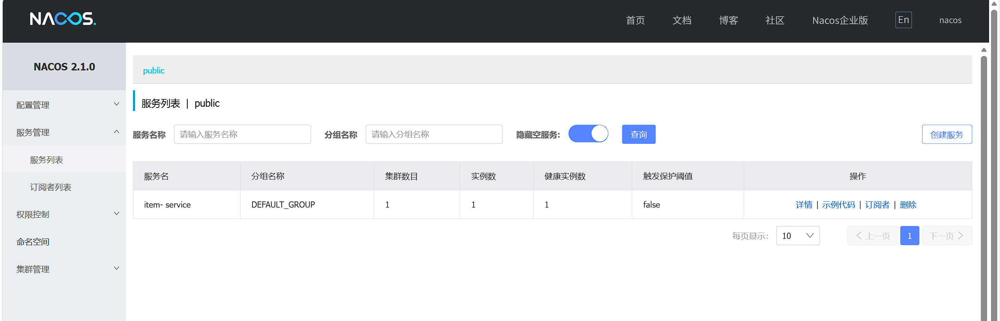
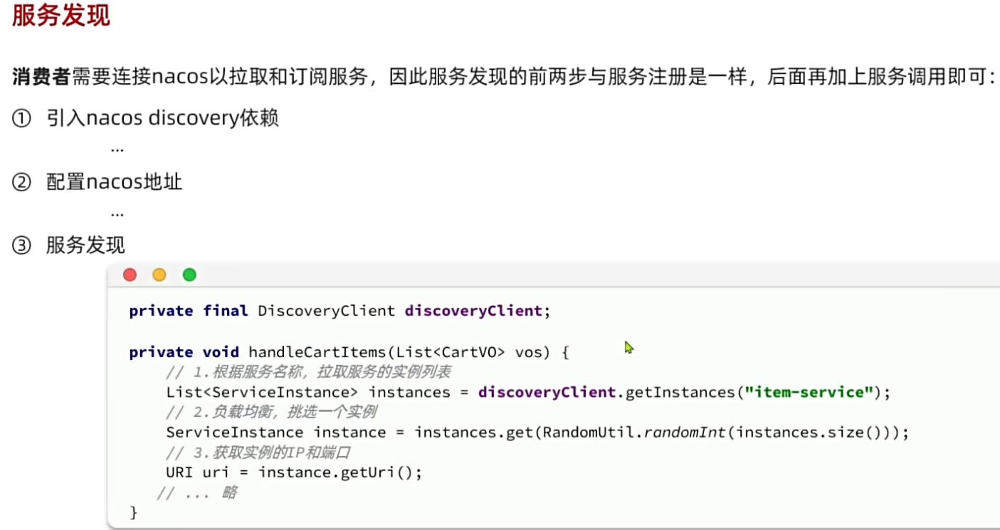

- [一、Nacos注册中心组件](#一nacos注册中心组件)
  - [1.1 定义](#11-定义)
  - [1.2 用处](#12-用处)
  - [1.3 原理](#13-原理)
  - [1.4 使用](#14-使用)
    - [1.4.1 服务注册](#141-服务注册)
      - [docker部署](#docker部署)
      - [代码依赖引入以及配置修改](#代码依赖引入以及配置修改)
    - [1.4.2 服务发现](#142-服务发现)
- [二、OpenFeign优化服务发现](#二openfeign优化服务发现)
  - [2.1 依赖引入](#21-依赖引入)
  - [2.2 FeignClient配置](#22-feignclient配置)
  - [2.3 注入配置](#23-注入配置)
  - [2.4 okHttp优化](#24-okhttp优化)
    - [2.4.1 依赖引入](#241-依赖引入)
    - [2.4.2 配置修改](#242-配置修改)
  - [2.5 最佳实践](#25-最佳实践)
    - [第一种实例](#第一种实例)
  - [2.6 日志打印](#26-日志打印)

# 一、Nacos注册中心组件
## 1.1 定义
是国内占比最多的注册中心组件，是阿里巴巴的产品
## 1.2 用处
当出现某个业务需要调用另一个业务时，这时候需要发送网络请求去调用里面的功能，**restTemple**就是这样的原理，但是不适合多台服务器部署被调用的业务，**Nacos注册中心组件**就适合这种情况。
## 1.3 原理

## 1.4 使用
### 1.4.1 服务注册
#### docker部署
~~~
docker run -d \
--name nacos \
--network nacos-net \
--env-file ./nacos/custom.env \ 配置文件
-p 8848:8848 \ 开放三个端口并映射
-p 9848:9848 \
-p 9849:9849 \
--restart=always \ 开机启动
nacos/nacos-server:v2.1.0-slim
~~~

#### 代码依赖引入以及配置修改
**依赖**：
~~~java
 <dependency>
            <groupId>com.alibaba.cloud</groupId>
            <artifactId>spring-cloud-starter-alibaba-nacos-discovery</artifactId>
        </dependency>
~~~

**yaml**：
~~~
spring:
  cloud:
    nacos:
      server-addr: 172.17.96.158 //自己的nacos的ip地址
~~~
这时在nacos（http://172.17.96.158:8848/nacos） 上我们就看到注册服务的模块

### 1.4.2 服务发现

# 二、OpenFeign优化服务发现
## 2.1 依赖引入
~~~java
<!-- openfeign 核心依赖 -->
<dependency>
    <groupId>org.springframework.cloud</groupId>
    <artifactId>spring-cloud-starter-openfeign</artifactId>
</dependency>
负载均衡的依赖
<dependency>
    <groupId>org.springframework.cloud</groupId>
    <artifactId>spring-cloud-starter-loadbalancer</artifactId>
</dependency>
~~~
## 2.2 FeignClient配置
**@EnableFeignClients**启动类加上这个配置才能被扫描
~~~java
//value表示提供服务的对象
@FeignClient(value = "item-service")
public interface ItemClient {

    //提供请求方式，以及请求url，以及请求参数
    @GetMapping("/items")
    List<ItemDTO> queryItemByIds(@RequestParam("ids")  Collection<Long> ids);
}
~~~

## 2.3 注入配置
 private final ItemClient itemClient;
 >[!TIP]
通过构造法进行依赖注入，@RequiredArgsConstructor注解必备

~~~java
 private void handleCartItems(List<CartVO> vos) {
        //获取商品id
        Set<Long> ids = vos.stream().map(CartVO::getId).collect(Collectors.toSet());
        //调用商品服务，获取商品信息
        List<ItemDTO> itemDTOS = itemClient.queryItemByIds(ids);

        //将商品信息存入map中
        Map<Long, ItemDTO> collect = itemDTOS.stream().collect(Collectors.toMap(ItemDTO::getId, Function.identity()));
        //这里的Function()的作用就是输入什么返回什么，所以这里就是ItemDTO
        //将商品信息写入vo中
        for (CartVO v : vos) {
            ItemDTO item = collect.get(v.getItemId());
            if (item == null) {
                continue;
            }
            v.setNewPrice(item.getPrice());
            v.setStatus(item.getStatus());
            v.setStock(item.getStock());
        }
    }
~~~

## 2.4 okHttp优化
itemClient是一个**代理对象**，内部是基于JDK默认的**HttpURLConnection**实现的发送请求，这种方式**不支持连接池**，**效率也很低**，所以我们通常采取**OkHttp**或者**Apache HttpClient**
### 2.4.1 依赖引入
~~~java
   <!--ok-http-->
        <dependency>
            <groupId>io.github.openfeign</groupId>
            <artifactId>feign-okhttp</artifactId>
        </dependency>
~~~

### 2.4.2 配置修改
~~~java
feign:
  okhttp:
    enabled: true
~~~

## 2.5 最佳实践
对于每一个需要服务的模块都需要进行feign依赖的引入以及配置，这样的话过于繁琐了，我们这时就可以选择抽离出一个单独的模块定义依赖跟配置，或者在提供服务的模块下，在单独设置模块定义。
>[!TIP]
第一种方式结构简单，但是耦合度高 

第二种方式结构复杂，但是耦合度低 

### 第一种实例
在其中引入公共的依赖
~~~java
  <!-- openfeign 核心依赖 -->
        <dependency>
            <groupId>org.springframework.cloud</groupId>
            <artifactId>spring-cloud-starter-openfeign</artifactId>
        </dependency>

        <dependency>
            <groupId>org.springframework.cloud</groupId>
            <artifactId>spring-cloud-starter-loadbalancer</artifactId>
        </dependency>

        <dependency>
            <groupId>com.alibaba.cloud</groupId>
            <artifactId>spring-cloud-starter-alibaba-nacos-discovery</artifactId>
        </dependency>
~~~

接着创建dto以及client 
最后记得修改接受服务的模块的启动类上修改扫描包的位置，从原来的自己内部变成了单独的模块，否则无法找到client bean

## 2.6 日志打印
默认是五日志输出的，需要设置日志的等级
