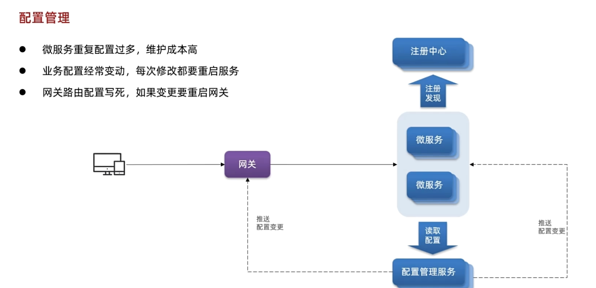
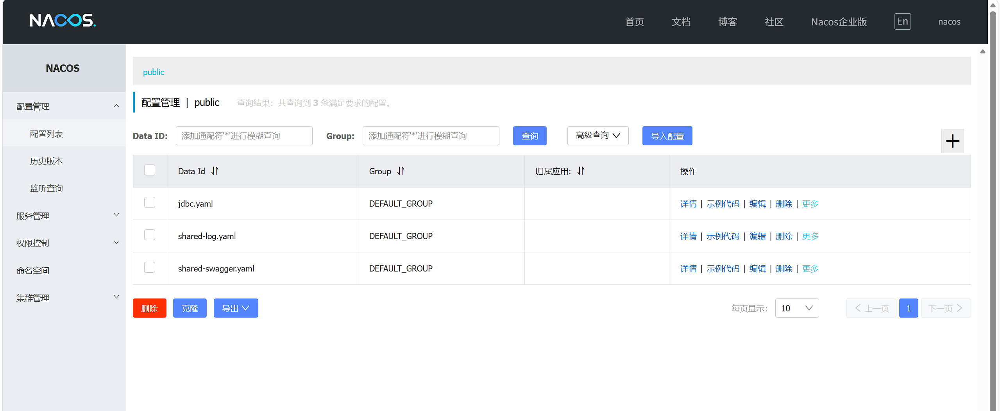
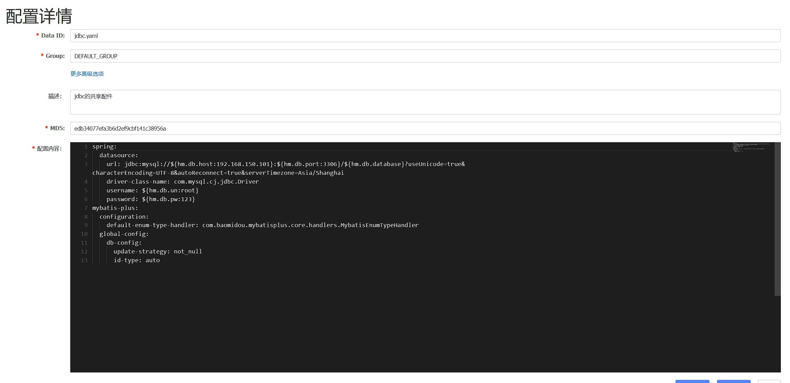
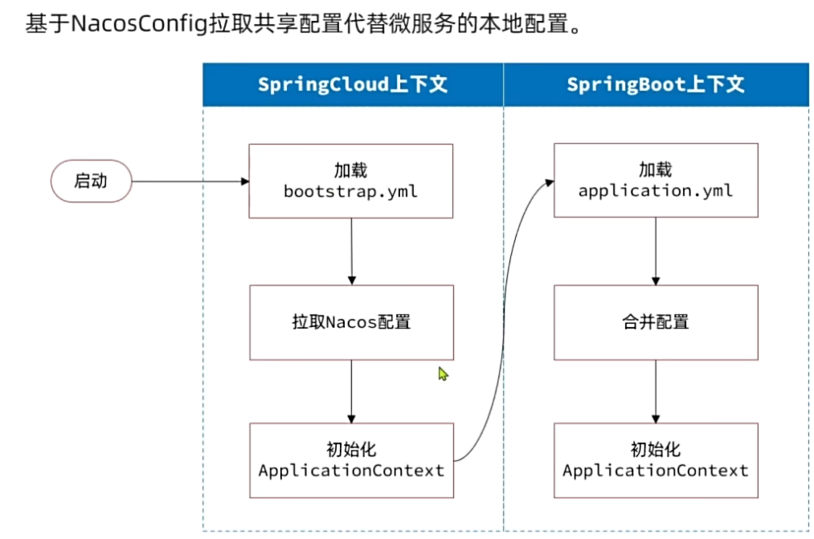

- [Nacos注册中心组件](#nacos注册中心组件)
  - [1.1 定义](#11-定义)
  - [1.2 用处](#12-用处)
  - [1.3 原理](#13-原理)
  - [1.4 使用](#14-使用)
    - [1.4.1 服务注册](#141-服务注册)
      - [docker部署](#docker部署)
      - [代码依赖引入以及配置修改](#代码依赖引入以及配置修改)
    - [1.4.2 服务发现](#142-服务发现)
- [实现配置管理](#实现配置管理)
  - [2.1 好处](#21-好处)
  - [2.2 功能一、共享配置](#22-功能一共享配置)
    - [2.2.1 添加共享配置](#221-添加共享配置)
    - [2.2.2 拉取共享配置](#222-拉取共享配置)
  - [2.3 功能二、配置热更新](#23-功能二配置热更新)
    - [2.3.1 添加配置到Nacos](#231-添加配置到nacos)
    - [2.3.2 配置热更新](#232-配置热更新)
- [动态路由管理](#动态路由管理)
  - [监听器配置](#监听器配置)
  - [更新路由](#更新路由)
  - [实现动态路由](#实现动态路由)

# Nacos注册中心组件
## 1.1 定义
是国内占比最多的注册中心组件，是阿里巴巴的产品
## 1.2 用处
当出现某个业务需要调用另一个业务时，这时候需要发送网络请求去调用里面的功能，**restTemple**就是这样的原理，但是不适合多台服务器部署被调用的业务，**Nacos注册中心组件**就适合这种情况。
## 1.3 原理

## 1.4 使用
### 1.4.1 服务注册
#### docker部署
~~~
docker run -d \
--name nacos \
--network nacos-net \
--env-file ./nacos/custom.env \ 配置文件
-p 8848:8848 \ 开放三个端口并映射
-p 9848:9848 \
-p 9849:9849 \
--restart=always \ 开机启动
nacos/nacos-server:v2.1.0-slim
~~~

#### 代码依赖引入以及配置修改
**依赖**：
~~~xml
 <dependency>
            <groupId>com.alibaba.cloud</groupId>
            <artifactId>spring-cloud-starter-alibaba-nacos-discovery</artifactId>
        </dependency>
~~~

**yaml**：
~~~yaml
spring:
  cloud:
    nacos:
      server-addr: 172.17.96.158 //自己的nacos的ip地址
~~~
这时在nacos（http://172.17.96.158:8848/nacos） 上我们就看到注册服务的模块

### 1.4.2 服务发现

# 实现配置管理
## 2.1 好处

## 2.2 功能一、共享配置
### 2.2.1 添加共享配置

在这里的配置列表里添加自己的配置文件

这里的有些地方比如数据库名字，不能写死，我们可以采取占位符&{}的方式获取

### 2.2.2 拉取共享配置
但是springcloud框架下，项目**先加载springcloud中的一个bootstrap.yaml**文件在加载其上下文，然后才是springboot中的yaml接着是其上下文，所以我们不能在springboot中的文件下定义nacos的地址，访问不到，我们需要在bootstrap中定义

~~~yaml
spring:
  application:
    name: cart-service # 服务名称
  profiles:
    active: dev
  cloud:
    nacos:
      server-addr: 172.17.96.158  # nacos地址
      config:
        file-extension: yaml # 文件后缀名
        shared-configs: # 共享配置
          - dataId: jdbc.yaml # 共享mybatis配置
          - dataId: shared-log.yaml # 共享日志配置
          - dataId: shared-swagger.yaml # 共享日志配置
~~~
>[!TIP]
这个文件定义在每一个需要共享管理的业务模块下的，这样原先的yaml文件就可以删除共享的以及在bootstrap中定义的，但是还需要添加占位的部分的配置
~~~yaml
server:
  port: 8082
feign:
  okhttp:
    enabled: true # 开启OKHttp连接池支持
hm:
  swagger:
    title: 购物车服务接口文档
    package: com.hmall.cart.controller
  db:
    database: hm-cart
~~~
我们还需要引入相关依赖
~~~xml
  <!--nacos配置管理-->
  <dependency>
      <groupId>com.alibaba.cloud</groupId>
      <artifactId>spring-cloud-starter-alibaba-nacos-config</artifactId>
  </dependency>
  <!--读取bootstrap文件-->
  <dependency>
      <groupId>org.springframework.cloud</groupId>
      <artifactId>spring-cloud-starter-bootstrap</artifactId>
  </dependency>
~~~
## 2.3 功能二、配置热更新
所谓的热更新就是修改配置后不需要重启就可以调用最新的配置
### 2.3.1 添加配置到Nacos
注意文件的dataId格式：
[服务名]-[spring.active.profile].[后缀名]
文件名称由三部分组成：
- 服务名：我们是购物车服务，所以是cart-service
- spring.active.profile：就是spring boot中的spring.active.profile，可以省略，则所有profile共享该配置
- 后缀名：例如yaml
### 2.3.2 配置热更新 
在相关模块下新建一个配置读取类
~~~java
package com.hmall.cart.config;

import lombok.Data;
import org.springframework.boot.context.properties.ConfigurationProperties;
import org.springframework.stereotype.Component;

@Data
@Component
@ConfigurationProperties(prefix = "hm.cart")//nacos中配置的是hm:cart:maxAmount:10
public class CartProperties {
    private Integer maxAmount;
}
~~~
然后注入该类并获取，就可以取出maxAmount了

# 动态路由管理
思路是抛弃之前在配置文件里写死路由配置，改为采取nacos监听，发生变化就读取nacos中的配置，拉取下来读入路由表中 
这里核心的步骤有3步：
- 创建**ConfigService**，目的是连接到**Nacos**
- 添加配置监听器，编写配置变更的通知处理逻辑
- 更新路由表

由于我们采用了spring-cloud-starter-alibaba-nacos-config自动装配，因此ConfigService已经在com.alibaba.cloud.nacos.NacosConfigAutoConfiguration中自动创建好了：我们拿到**NacosConfigManager**就等于拿到了**ConfigService**，第一步就实现了。
## 监听器配置
我们在第一次启用网关时，除了要添加监听器，还需要读取配置，添加到路由表中这样才能保证路由表中有配置，能正常调用
~~~java
String getConfigAndSignListener(
    String dataId, // 配置文件id
    String group, // 配置组，走默认
    long timeoutMs, // 读取配置的超时时间
    Listener listener // 监听器
) throws NacosException;
~~~

## 更新路由
我们采取这个接口更新
~~~java
package org.springframework.cloud.gateway.route;

import reactor.core.publisher.Mono;

/**
 * @author Spencer Gibb
 */
public interface RouteDefinitionWriter {
        /**
     * 更新路由到路由表，如果路由id重复，则会覆盖旧的路由
     */
        Mono<Void> save(Mono<RouteDefinition> route);
        /**
     * 根据路由id删除某个路由
     */
        Mono<Void> delete(Mono<String> routeId);

}
~~~
这里更新的路由，也就是**RouteDefinition**，之前我们见过，包含下列常见字段：
- id：路由id
- predicates：路由匹配规则
- filters：路由过滤器
- uri：路由目的地
将来我们保存到Nacos的配置也要符合这个**对象结构**，将来我们以**JSON**来保存
## 实现动态路由
依赖引入：
~~~xml
<!--统一配置管理-->
<dependency>
    <groupId>com.alibaba.cloud</groupId>
    <artifactId>spring-cloud-starter-alibaba-nacos-config</artifactId>
</dependency>
<!--加载bootstrap-->
<dependency>
    <groupId>org.springframework.cloud</groupId>
    <artifactId>spring-cloud-starter-bootstrap</artifactId>
</dependency>
~~~
同样的建议bootstrap.yaml
~~~yaml
spring:
  application:
    name: gateway
  cloud:
    nacos:
      server-addr: 192.168.150.101
      config:
        file-extension: yaml
        shared-configs:
          - dataId: shared-log.yaml # 共享日志配置
~~~
修改原先的yaml文件

定义配置监听器：
~~~java

@Slf4j
@RequiredArgsConstructor
public class DynamicRouteLoader {
    private final RouteDefinitionWriter routeDefinitionWriter;
    private final NacosConfigManager nacosConfigManager;
    // 路由配置文件的id和分组
    private final String dataId = "gateway-routes.json";
    private final String group = "DEFAULT_GROUP";
    private final Set<String> routeIds = new HashSet<>();
    @PostConstruct
    public void load() throws NacosException {
        ConfigService configService = nacosConfigManager.getConfigService();
        String configInfo = configService.getConfigAndSignListener(dataId, group, 5000, new Listener() {
            @Override
            public Executor getExecutor() {
                return null;
            }

            @Override
            public void receiveConfigInfo(String s) {
                updateConfigInfo(s);
            }
        });
        updateConfigInfo(configInfo);
    }
    private void updateConfigInfo(String configInfo) {
        log.debug("监听到路由配置变更，{}", configInfo);
        // 1.反序列化
        List<RouteDefinition> routeDefinitions = JSONUtil.toList(configInfo, RouteDefinition.class);
        // 2.更新前先清空旧路由
        // 2.1.清除旧路由
        for (String routeId : routeIds) {
            routeDefinitionWriter.delete(Mono.just(routeId)).subscribe();
        }
        routeIds.clear();
        // 2.2.判断是否有新的路由要更新
        if (CollUtils.isEmpty(routeDefinitions)) {
            // 无新路由配置，直接结束
            return;
        }
        // 3.更新路由
        routeDefinitions.forEach(routeDefinition -> {
            // 3.1.更新路由
            routeDefinitionWriter.save(Mono.just(routeDefinition)).subscribe();
            // 3.2.记录路由id，方便将来删除
            routeIds.add(routeDefinition.getId());
        });
    }
}
~~~
这样我们在nacos中修改路由配置，就可以自动的被监听修改加入到路由表中