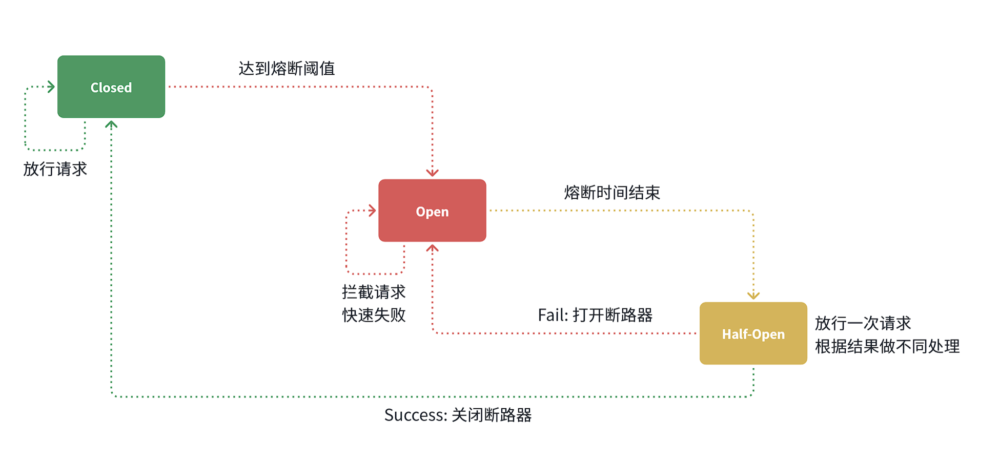
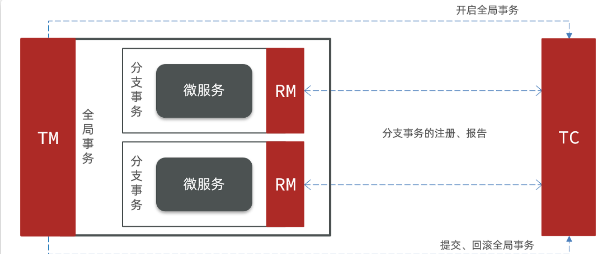
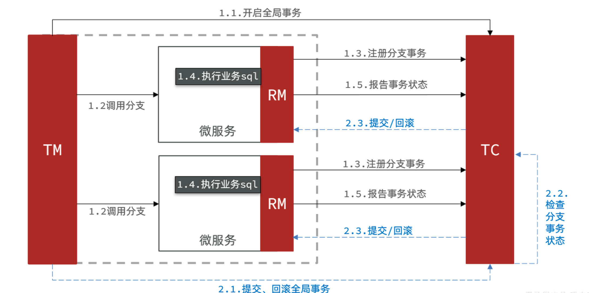
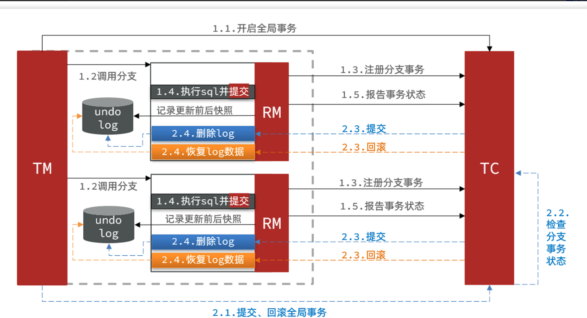

- [一、微服务保护](#一微服务保护)
  - [1.1 服务保护方案](#11-服务保护方案)
    - [1.1.1 请求限流](#111-请求限流)
    - [1.1.2.线程隔离](#112线程隔离)
    - [1.1.3.服务熔断](#113服务熔断)
  - [1.2 sentinel](#12-sentinel)
    - [1.2.1 介绍与使用](#121-介绍与使用)
    - [1.2.2 使用到微服务项目中](#122-使用到微服务项目中)
  - [1.3 请求限流](#13-请求限流)
  - [1.4 最大线程数](#14-最大线程数)
    - [1.4.1 openFeign整合线程隔离](#141-openfeign整合线程隔离)
    - [1.4.2 配置线程隔离](#142-配置线程隔离)
  - [1.5 服务熔断](#15-服务熔断)
    - [1.5.1 FallBack降级](#151-fallback降级)
    - [1.5.2 服务熔断](#152-服务熔断)
- [二、分布式事务](#二分布式事务)
  - [2.1 seata](#21-seata)
    - [2.1.1 认识seata](#211-认识seata)
    - [2.1.2 部署TC](#212-部署tc)
      - [部署数据库](#部署数据库)
      - [配置文件](#配置文件)
      - [docker部署](#docker部署)
    - [2.1.3 微服务集成](#213-微服务集成)
    - [2.1.4 改造配置](#214-改造配置)
    - [2.1.5 添加数据库表(AT)](#215-添加数据库表at)
  - [2.2 XA 模式](#22-xa-模式)
    - [2.2.1 两阶段提交](#221-两阶段提交)
    - [2.2.2 使用](#222-使用)
  - [2.3 AT模式](#23-at模式)
    - [2.3.1 seata中的原理](#231-seata中的原理)
  - [2.4 两者区别](#24-两者区别)

# 一、微服务保护
保证服务运行的健壮性，避免级联失败导致的雪崩问题，就属于微服务保护
## 1.1 服务保护方案
### 1.1.1 请求限流
服务故障最重要原因，就是**并发太高**！解决了这个问题，就能避免大部分故障。当然，接口的并发不是一直很高，而是突发的。因此请求限流，就是**限制或控制接口访问的并发流量**，避免服务因流量激增而出现故障。 

### 1.1.2.线程隔离
当一个业务接口响应时间长，而且**并发高时**，就可能**耗尽服务器的线程资源**，导致服务内的**其它接口受到影响**。所以我们必须把这种影响降低，或者缩减影响的范围。**线程隔离**正是解决这个问题的好办法。也就是规定了某个接口的最大线程数

### 1.1.3.服务熔断
线程隔离虽然避免了雪崩问题，但故障服务（商品服务）依然会拖慢购物车服务（服务调用方）的接口响应速度。而且商品查询的故障依然会导致查询购物车功能出现故障，购物车业务也变的不可用了。
 

这时我么就需要利用**服务熔断**的逻辑，将接口调用的功能阻断就像电闸一样，然后启用自己事先编写的**备用逻辑**可以是抛出异常，也可以是提示词，当然触发熔断需要我们统计异常比例，或者出现错误。

## 1.2 sentinel
### 1.2.1 介绍与使用
它是微服务保护技术，Sentinel是阿里巴巴开源的一款服务保护框架，目前已经加入springcloud中
 
Sentinel 的使用可以分为两个部分:
- 核心库（Jar包）：不依赖任何框架/库，能够运行于 Java 8 及以上的版本的运行时环境，同时对 Dubbo / Spring Cloud 等框架也有较好的支持。在项目中引入依赖即可实现服务限流、隔离、熔断等功能。
- 控制台（Dashboard）：Dashboard 主要负责管理推送规则、监控、管理机器信息等。
 
我们在官网下载完jar包后在目录下命令行中通过命令启动:
~~~shell
java -Dserver.port=8090 -Dcsp.sentinel.dashboard.server=localhost:8090 -Dproject.name=sentinel-dashboard -jar sentinel-dashboard.jar
~~~

这里是本机上的8090端口就可以访问控制面板了，端口跟ip都可以自己更改，需要输入账号和密码，默认都是：**sentinel**

### 1.2.2 使用到微服务项目中
依赖引入：
~~~xml
<!--sentinel-->
<dependency>
    <groupId>com.alibaba.cloud</groupId> 
    <artifactId>spring-cloud-starter-alibaba-sentinel</artifactId>
</dependency>
~~~

yaml文件配置：
~~~yaml
spring:
  cloud:
    sentinel:
      transport:
        dashboard: localhost:8090
      http-method-specify: true # 开启请求方式前缀，解决了相同路径无法被识别出来的问题
~~~
>[!NOTE]
这里有一个**簇点链路**的概念，就是**单机调用链路**，是**一次请求**进入服务后经过的每一个被Sentinel监控的资源。默认情况下，Sentinel会监控SpringMVC的每一个Endpoint（接口）。

## 1.3 请求限流

在这里配置**QPS**设置最大数量，就可以限制每秒最大的请求数量

## 1.4 最大线程数
### 1.4.1 openFeign整合线程隔离
修改cart-service模块的application.yml文件，开启Feign的sentinel功能这能为下面的fallback铺垫：
~~~yaml
feign:
  sentinel:
    enabled: true # 开启feign对sentinel的支持
~~~
然后重启cart-service服务，可以看到查询商品的FeignClient自动变成了一个簇点资源

### 1.4.2 配置线程隔离
就是流控中的并行线程数进行最大配置，代表最多拥有的最大并行线程数

## 1.5 服务熔断
### 1.5.1 FallBack降级
也就是当业务接口被限流或者熔断，启用的另外的备用逻辑
触发限流或熔断后的请求不一定要直接报错，也可以返回一些默认数据或者友好提示，用户体验会更好。
给FeignClient编写失败后的降级逻辑有两种方式：
- 方式一：**FallbackClass**，无法对远程调用的异常做处理
- 方式二：**FallbackFactory**，可以对远程调用的异常做处理，我们一般选择这种方式。

工厂类：
~~~java

public class ItemClientFallBack implements FallbackFactory<ItemClient> {
    @Override
    public ItemClient create(Throwable cause) {
        return new ItemClient() {
            @Override
            public List<ItemDTO> queryItemByIds(Collection<Long> ids) {
                //失败返回空
                return CollUtils.emptyList();
            }

            @Override
            public void deductStock(List<OrderDetailDTO> items) {
                // 库存扣减业务需要触发事务回滚，查询失败，抛出异常
                throw new BizIllegalException(cause);
            }
        };
    }
}
~~~
由于此类所在的模块下没有启动类，所以无法直接加入component注解，只能手动new，在一个配置类中加入configuration以及bean注解了

>[!TIP]
要在对应的client中加入fallbackFactory = ItemClientFallBack.class
### 1.5.2 服务熔断
这时候需要一个断路器进行服务熔断

状态机包括三个状态：
- **closed**：关闭状态，断路器放行所有请求，并开始统计异常比例、慢请求比例。超过阈值则切换到open状态
- **open**：打开状态，服务调用被熔断，访问被熔断服务的请求会被拒绝，快速失败，直接走降级逻辑。Open状态持续一段时间后会进入half-open状态
- **half-open**：半开状态，**放行一次请求**，根据执行结果来判断接下来的操作。 
  - 请求成功：则切换到closed状态
  - 请求失败：则切换到open状态
   
我们可以在控制台通过点击簇点后的**熔断按钮**来配置熔断策略：若是限流熔断就是慢调用比例，也可以配置异常时的方案

# 二、分布式事务
## 2.1 seata
### 2.1.1 认识seata
解决分布式事务的方案有很多，但实现起来都比较复杂，因此我们一般会使用**开源的框架**来解决分布式事务问题。在众多的开源分布式事务框架中，功能最完善、使用最多的就是阿里巴巴在2019年开源的Seata了。
 
在Seata的事务管理中有三个重要的角色：

-  **TC** (Transaction Coordinator) - 事务协调者：维护全局和分支事务的状态，**协调全局事务提交或回滚**。 
-  **TM** (Transaction Manager) - 事务管理器：定义**全局事务的范围**、开始全局事务、提交或回滚全局事务。 
-  **RM** (Resource Manager) - 资源管理器：管理分支事务，与TC交谈以注册分支事务和报告分支事务的状态，并驱动分支事务提交或回滚。 

工作原理:

>[!TIP]
TM和RM可以理解为Seata的客户端部分，引入到**参与事务的微服务依赖**中即可。将来TM和RM就会协助微服务，实现本地分支事务与TC之间交互，实现事务的提交或回滚。

### 2.1.2 部署TC
#### 部署数据库
Seata支持多种存储模式，但考虑到持久化的需要，我们一般选择基于数据库存储
#### 配置文件
将配置文件也加入虚拟机中，我们采用docker部署

#### docker部署
~~~shell
docker run --name seata \
-p 8099:8099 \
-p 7099:7099 \
-e SEATA_IP=192.168.150.101 \
-v ./seata:/seata-server/resources \
--privileged=true \
--network hm-net \
-d \
seataio/seata-server:1.5.2
~~~

### 2.1.3 微服务集成
在相关业务中引入依赖：
~~~xml
<!--统一配置管理-->
  <dependency>
      <groupId>com.alibaba.cloud</groupId>
      <artifactId>spring-cloud-starter-alibaba-nacos-config</artifactId>
  </dependency>
  <!--读取bootstrap文件-->
  <dependency>
      <groupId>org.springframework.cloud</groupId>
      <artifactId>spring-cloud-starter-bootstrap</artifactId>
  </dependency>
  <!--seata-->
  <dependency>
      <groupId>com.alibaba.cloud</groupId>
      <artifactId>spring-cloud-starter-alibaba-seata</artifactId>
  </dependency>
~~~

### 2.1.4 改造配置
在nacos上加入共享配置关于seata
~~~yaml
seata:
  registry: # TC服务注册中心的配置，微服务根据这些信息去注册中心获取tc服务地址
    type: nacos # 注册中心类型 nacos
    nacos:
      server-addr: 192.168.150.101:8848 # nacos地址
      namespace: "" # namespace，默认为空
      group: DEFAULT_GROUP # 分组，默认是DEFAULT_GROUP
      application: seata-server # seata服务名称
      username: nacos
      password: nacos
  tx-service-group: hmall # 事务组名称
  service:
    vgroup-mapping: # 事务组与tc集群的映射关系
      hmall: "default"
~~~
>[!TIP]
在加入后，记得添加bootstrap文件获取公共配置从nacos上，然后我们就可以修改原先的yaml文件了

### 2.1.5 添加数据库表(AT)
这是AT模式下事务回滚的必须条件，**undo_log**这样的一个表

>[!TIP]
**@GlobalTransactional注解**就是在标记事务的起点，将来**TM**就会基于这个方法判断全局事务范围，初始化全局事务。

## 2.2 XA 模式
Seata支持四种不同的分布式事务解决方案：
- XA
- TCC
- AT
- SAGA

### 2.2.1 两阶段提交
一阶段：
- 事务协调者通知每个事务参与者执行本地事务
- 本地事务执行完成后报告事务执行状态给事务协调者，此时事务不提交，继续持有数据库锁

二阶段：
- 事务协调者基于一阶段的报告来判断下一步操作
- 如果一阶段都成功，则通知所有事务参与者，提交事务
- 如果一阶段任意一个参与者失败，则通知所有事务参与者回滚事务

**XA模式的优点是什么？**
- 事务的强一致性，满足ACID原则
- 常用数据库都支持，实现简单，并且没有代码侵入

**XA模式的缺点是什么？**
- 因为一阶段需要锁定数据库资源，等待二阶段结束才释放，性能较差
- 依赖关系型数据库实现事务

### 2.2.2 使用
配置：
~~~yaml
seata:
  data-source-proxy-mode: XA
~~~
全局注解： 
@GlobalTransactional
## 2.3 AT模式
### 2.3.1 seata中的原理

阶段一RM的工作：
- 注册分支事务
- 记录undo-log（数据快照）
- 执行业务sql并提交
- 报告事务状态
阶段二提交时RM的工作：
- 删除undo-log即可
阶段二回滚时RM的工作：
- 根据undo-log恢复数据到更新前

>[!TIP]
这里需要在每个微服务中数据表加入一个undo-log作为快照

## 2.4 两者区别
- XA模式一阶段不提交事务，**锁定资源**；AT模式**一阶段直接提交**，不锁定资源。
- XA模式依赖**数据库机制实现回滚**；AT模式利用**数据快照**实现数据回滚。
- XA模式强一致；AT模式最终一致
