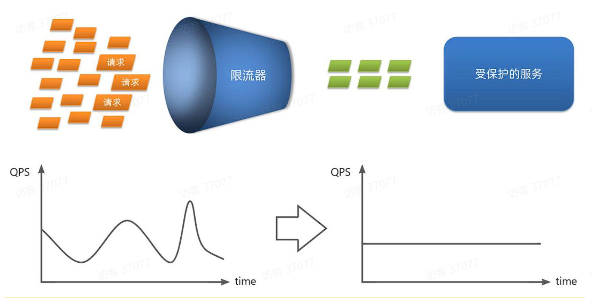
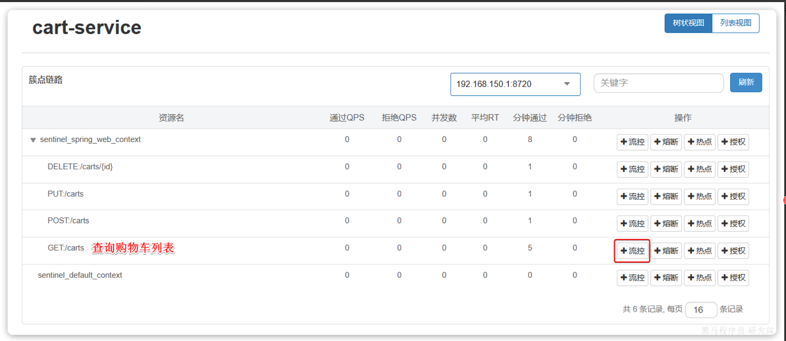
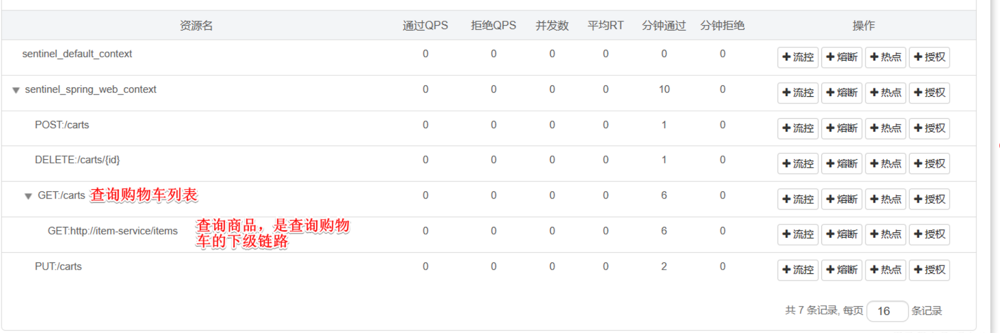

- [一、微服务保护](#一微服务保护)
  - [1.1 服务保护方案](#11-服务保护方案)
    - [1.1.1 请求限流](#111-请求限流)
    - [1.1.2.线程隔离](#112线程隔离)
    - [1.1.3.服务熔断](#113服务熔断)
  - [1.2 sentinel](#12-sentinel)
    - [1.2.1 介绍与使用](#121-介绍与使用)
    - [1.2.2 使用到微服务项目中](#122-使用到微服务项目中)
  - [1.3 请求限流](#13-请求限流)
  - [1.4 最大线程数](#14-最大线程数)
    - [1.4.1 openFeign整合线程隔离](#141-openfeign整合线程隔离)
    - [1.4.2 配置线程隔离](#142-配置线程隔离)
  - [1.5 服务熔断](#15-服务熔断)
    - [1.5.1 FallBack降级](#151-fallback降级)

# 一、微服务保护
保证服务运行的健壮性，避免级联失败导致的雪崩问题，就属于微服务保护
## 1.1 服务保护方案
### 1.1.1 请求限流
服务故障最重要原因，就是**并发太高**！解决了这个问题，就能避免大部分故障。当然，接口的并发不是一直很高，而是突发的。因此请求限流，就是**限制或控制接口访问的并发流量**，避免服务因流量激增而出现故障。 

### 1.1.2.线程隔离
当一个业务接口响应时间长，而且**并发高时**，就可能**耗尽服务器的线程资源**，导致服务内的**其它接口受到影响**。所以我们必须把这种影响降低，或者缩减影响的范围。**线程隔离**正是解决这个问题的好办法。也就是规定了某个接口的最大线程数

### 1.1.3.服务熔断
线程隔离虽然避免了雪崩问题，但故障服务（商品服务）依然会拖慢购物车服务（服务调用方）的接口响应速度。而且商品查询的故障依然会导致查询购物车功能出现故障，购物车业务也变的不可用了。
 

这时我么就需要利用**服务熔断**的逻辑，将接口调用的功能阻断就像电闸一样，然后启用自己事先编写的**备用逻辑**可以是抛出异常，也可以是提示词，当然触发熔断需要我们统计异常比例，或者出现错误。

## 1.2 sentinel
### 1.2.1 介绍与使用
它是微服务保护技术，Sentinel是阿里巴巴开源的一款服务保护框架，目前已经加入springcloud中
 
Sentinel 的使用可以分为两个部分:
- 核心库（Jar包）：不依赖任何框架/库，能够运行于 Java 8 及以上的版本的运行时环境，同时对 Dubbo / Spring Cloud 等框架也有较好的支持。在项目中引入依赖即可实现服务限流、隔离、熔断等功能。
- 控制台（Dashboard）：Dashboard 主要负责管理推送规则、监控、管理机器信息等。
 
我们在官网下载完jar包后在目录下命令行中通过命令启动:
~~~shell
java -Dserver.port=8090 -Dcsp.sentinel.dashboard.server=localhost:8090 -Dproject.name=sentinel-dashboard -jar sentinel-dashboard.jar
~~~

这里是本机上的8090端口就可以访问控制面板了，端口跟ip都可以自己更改，需要输入账号和密码，默认都是：**sentinel**

### 1.2.2 使用到微服务项目中
依赖引入：
~~~xml
<!--sentinel-->
<dependency>
    <groupId>com.alibaba.cloud</groupId> 
    <artifactId>spring-cloud-starter-alibaba-sentinel</artifactId>
</dependency>
~~~

yaml文件配置：
~~~yaml
spring:
  cloud:
    sentinel:
      transport:
        dashboard: localhost:8090
      http-method-specify: true # 开启请求方式前缀，解决了相同路径无法被识别出来的问题
~~~
>[!NOTE]
这里有一个**簇点链路**的概念，就是**单机调用链路**，是**一次请求**进入服务后经过的每一个被Sentinel监控的资源。默认情况下，Sentinel会监控SpringMVC的每一个Endpoint（接口）。

## 1.3 请求限流

在这里配置**QPS**设置最大数量，就可以限制每秒最大的请求数量

## 1.4 最大线程数
### 1.4.1 openFeign整合线程隔离
修改cart-service模块的application.yml文件，开启Feign的sentinel功能这能为下面的fallback铺垫：
~~~yaml
feign:
  sentinel:
    enabled: true # 开启feign对sentinel的支持
~~~
然后重启cart-service服务，可以看到查询商品的FeignClient自动变成了一个簇点资源

### 1.4.2 配置线程隔离
就是流控中的并行线程数进行最大配置，代表最多拥有的最大并行线程数

## 1.5 服务熔断
### 1.5.1 FallBack降级
也就是当业务接口被限流或者熔断，启用的另外的备用逻辑
触发限流或熔断后的请求不一定要直接报错，也可以返回一些默认数据或者友好提示，用户体验会更好。
给FeignClient编写失败后的降级逻辑有两种方式：
- 方式一：**FallbackClass**，无法对远程调用的异常做处理
- 方式二：**FallbackFactory**，可以对远程调用的异常做处理，我们一般选择这种方式。

工厂类：
~~~java

public class ItemClientFallBack implements FallbackFactory<ItemClient> {
    @Override
    public ItemClient create(Throwable cause) {
        return new ItemClient() {
            @Override
            public List<ItemDTO> queryItemByIds(Collection<Long> ids) {
                //失败返回空
                return CollUtils.emptyList();
            }

            @Override
            public void deductStock(List<OrderDetailDTO> items) {
                // 库存扣减业务需要触发事务回滚，查询失败，抛出异常
                throw new BizIllegalException(cause);
            }
        };
    }
}
~~~
由于此类所在的模块下没有启动类，所以无法直接加入component注解，只能手动new，在一个配置类中加入configuration以及bean注解了

>[!TIP]
要在对应的client中加入fallbackFactory = ItemClientFallBack.class
