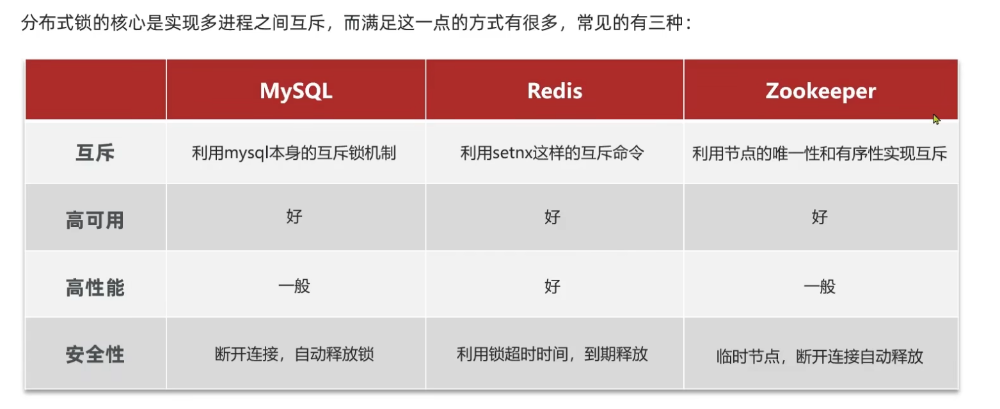
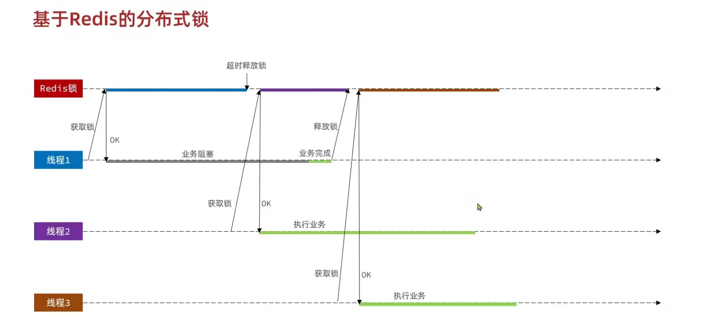
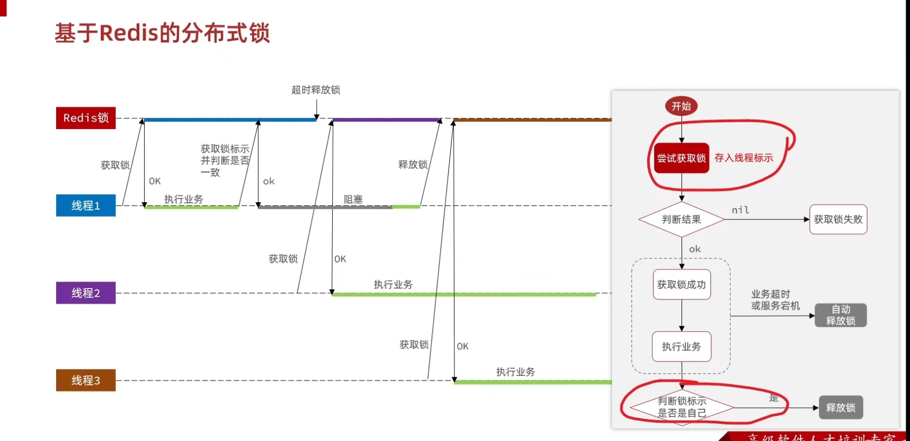
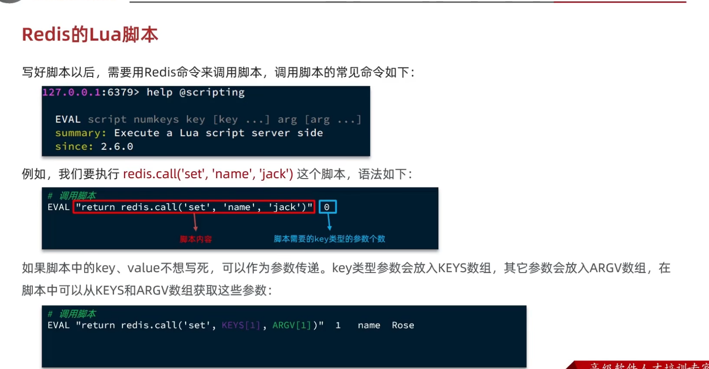
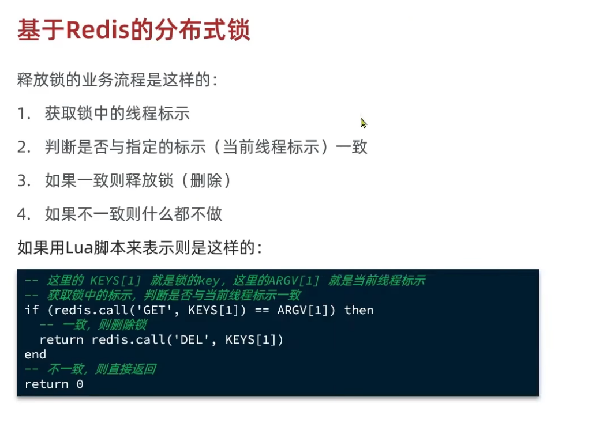
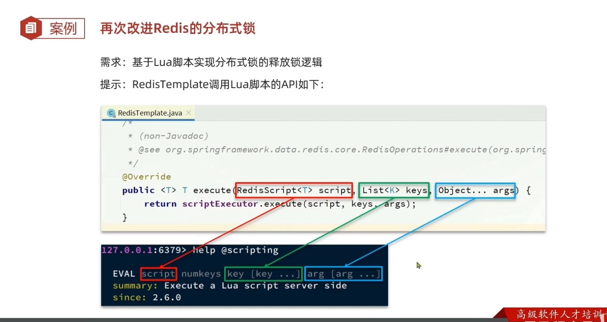

- [一、什么是分布式锁](#一什么是分布式锁)
  - [1.1 概念](#11-概念)
  - [1.2 特点](#12-特点)
- [二、实现方法](#二实现方法)
  - [2.1 redis核心操作](#21-redis核心操作)
  - [2.2 代码实现](#22-代码实现)
  - [2.3 遗留问题](#23-遗留问题)
  - [2.4 解决办法](#24-解决办法)
  - [2.5 实现方法](#25-实现方法)
  - [2.6 修改后的问题](#26-修改后的问题)
  - [2.7 lua语言](#27-lua语言)
    - [2.7.1 什么是lua语言](#271-什么是lua语言)
    - [2.7.2 如何调用](#272-如何调用)
    - [2.7.3 在redis中调用:](#273-在redis中调用)

# 一、什么是分布式锁
## 1.1 概念
定义：在分布式系统或者集群模式下都能**共用一个锁**，并且之间锁是互斥的，就叫做分布式锁。
## 1.2 特点
1.多线程可见
2.互斥
3.高可用
4.高性能
5.安全性

# 二、实现方法

>[!TIP]
这里采取redis的实现，setnx设置分布式互斥锁，ttl设置互斥时间，防止redis宕机无法删除互斥锁形成死锁。
## 2.1 redis核心操作
获取锁:
set KEY Value ex seconds nx
删除锁：
delete KEY
>[!TIP]
这里ex后设置时间 nx是唯一 setnx一样，这样写的好处就是原子性，同时设置锁与过期时间
## 2.2 代码实现
封装成工具类
~~~java
//接口
public interface ILOCK {

    boolean tryLock(Long timeoutSec);

    void unlock();
}
//实现类
public class SimpleRedisLock implements ILOCK{

    private StringRedisTemplate stringRedisTemplate;

    private String name;

    private String timeout;

    public SimpleRedisLock(StringRedisTemplate stringRedisTemplate, String name) {
        this.stringRedisTemplate = stringRedisTemplate;
        this.name = name;
    }

    private final String KEY_PREFIX = "lock:";

    @Override
    public boolean tryLock(Long timeoutSec) {
        long id = Thread.currentThread().getId();
        boolean iskey = stringRedisTemplate.opsForValue().setIfAbsent(KEY_PREFIX + name, id + "", timeoutSec, TimeUnit.SECONDS);
        return Boolean.TRUE.equals(iskey);
    }

    @Override
    public void unlock(){
        stringRedisTemplate.delete(KEY_PREFIX + name);
    }
}

//在抢购券中实现
/**
 * 

 *  服务实现类
 * 

 *
 * @author 虎哥
 * @since 2021-12-22
 */
@Service
public class VoucherOrderServiceImpl extends ServiceImpl<VoucherOrderMapper, VoucherOrder> implements IVoucherOrderService {

    @Resource
    private ISeckillVoucherService seckillVoucherService;

    @Resource
    private RedisIDWorker redisIDWorker;

    @Resource
    private StringRedisTemplate stringRedisTemplate;

    @Override
    public Result seckillVoucher(Long id) {
        //查询当前这个秒杀券的库存
        SeckillVoucher voucher = seckillVoucherService.getById(id);
        //判断是否开始，注意这里要是在当前之后会返回false
        if(voucher.getBeginTime().isAfter(LocalDateTime.now())){
            return Result.fail("秒杀尚未开始");
        }
        //判断是否结束
        if(voucher.getEndTime().isBefore(LocalDateTime.now())){
            return Result.fail("秒杀已经结束");
        }
        //查询库存是否剩余
        if(voucher.getStock() < 1){
            return Result.fail("库存见底");
        }
        //单系统锁
//        Long userid = UserHolder.getUser().getId();
//        synchronized (userid.toString().intern()){
//            IVoucherOrderService proxy =(IVoucherOrderService) AopContext.currentProxy();
//            return proxy.createVoucherOrder(id);
//        }
        //分布式锁
        Long userId = UserHolder.getUser().getId();
       SimpleRedisLock simplelock = new SimpleRedisLock(stringRedisTemplate,"Order:"+userId);
       boolean success = simplelock.tryLock(12000L);
       if(!success){
           return Result.fail("一人只能下一单");
       }

        try {
            IVoucherOrderService proxy =(IVoucherOrderService) AopContext.currentProxy();
            return proxy.createVoucherOrder(id);
        } catch (IllegalStateException e) {
            throw new RuntimeException(e);
        } finally {
            simplelock.unlock();
        }
    }
    @Transactional
    public Result createVoucherOrder(Long id){
        //剩余调用mp修改数据库
        boolean success = seckillVoucherService
                .update().setSql("stock = stock - 1")
                .eq("voucher_id",id)
                .gt("stock",0)//判断是否大于0，乐观锁
                .update();
        if(!success){
            return Result.fail("修改失败");
        }
        //生成订单，返回订单号
        VoucherOrder voucherOrder = new VoucherOrder();
        //获取用户id
        Long userId = UserHolder.getUser().getId();
        //设置用户id
        voucherOrder.setUserId(userId);
        //设置秒杀券id
        voucherOrder.setVoucherId(id);
        //获取订单id
        Long orderId = redisIDWorker.nextId("order");
        //设置订单id
        voucherOrder.setId(orderId);
        save(voucherOrder);
        return Result.ok(orderId);
    }
}
~~~
>[!NOTE]
这里的锁的实现类不是bean所以无法直接注入redisTemplate需要通过构造函数进行赋值
## 2.3 遗留问题

>[!NOTE]
问题在于当我的锁设置的ttl**过期时间过短**，**业务执行逻辑过长**，当一个线程进来获取后，还没执行完毕，**锁就自己删除了**，那么下一个线程进来又可以获取一个锁，第一个线程此时执行完后，由于没有任何的判断就删除了新来的线程的锁，这个时候线程三同理获取新的锁这样就出现了线程安全的问题。 
对应到客户端就是一个用户连续发送多条请求，结果明明一个用户只能抢购一次优惠券，现在出现了**抢购多次**的漏洞。 
本质原因在于删除锁unlock时没有任何的判断直接就根据用户id删除了锁，就会出现删除了别的线程但是都是以用户id作为前缀的锁

## 2.4 解决办法
1.思路就是我在删除时，判断一下**当前的锁是不是我自己的**，那我们可以考虑定义一个线程的标识把**线程的标识存入redis锁中**，每次删除前判断一下是不是我这个线程的锁，是我在删除不是就不删除。

2.那么这线程标识是什么，我们知道在jvm中**线程的id是递增**的，所以我们可以考虑用id用来表示，但是不同的jvm是不一样的，会出现重复，所以我们在**使用uuid拼接id**这样就可以了。

## 2.5 实现方法
~~~java
public class SimpleRedisLock implements ILOCK{

    private StringRedisTemplate stringRedisTemplate;

    private String name;

    public SimpleRedisLock(StringRedisTemplate stringRedisTemplate, String name) {
        this.stringRedisTemplate = stringRedisTemplate;
        this.name = name;
    }

    private final static String KEY_PREFIX = "lock:";
    private final static String ID_PREFIX = UUID.randomUUID().toString(true) +"-";

    @Override
    public boolean tryLock(Long timeoutSec) {
        String id = ID_PREFIX + Thread.currentThread().getId();
        boolean iskey = stringRedisTemplate.opsForValue().setIfAbsent(KEY_PREFIX + name, id + "", timeoutSec, TimeUnit.SECONDS);
        return Boolean.TRUE.equals(iskey);
    }

    @Override
    public void unlock(){
        String threadId = ID_PREFIX + Thread.currentThread().getId();
        String id = stringRedisTemplate.opsForValue().get(KEY_PREFIX + name);
        if(threadId.equals(id)){
            stringRedisTemplate.delete(KEY_PREFIX + name);
        }
    }
}
~~~
>[!TIP]
这里用uuid加拼接线程id的方式，生成一个前缀然后，充当value;

## 2.6 修改后的问题

我们发现，因为我们在删除跟获取键值对时不是原子性的，所以会出现问题就是当我们判断完确实是对应的锁时，我们在删除之前，锁过期了，然后突然进入第二个线程，线程就会获取新的锁，但是我之前的线程此时执行了删除（根据lock前缀）所以就会删掉这个线程二的锁，那么我们线程三在进来，就会出现线程安全。

## 2.7 lua语言
### 2.7.1 什么是lua语言
redis提供了其脚本功能，是一种编程语言,而且lua语言保证了**一个语句内的原子性**，完美的解决了上述由于**两条语句出现的原子性的问题**
[lua语言](https://www.runoob.com/lua/lua-tutorial.html)

### 2.7.2 如何调用
在这里我们只需要知道其中的调用函数语法就行
redis.call('set','KEYS[1]','ARGV[1]')name JACK

1.表示设置name 为 JACK，这里**KEYS跟ARGV是存入参数的数组**，**从1开始**，前者存入的是**redis中的键**，后者存的是其它的参数。
2.set换成get就是获取name的value值

### 2.7.3 在redis中调用:
EVAL "脚本内容"
对应分布式锁的逻辑应该是:

以下代码的常量跟之前的含义是一样的，未作改动
~~~java
//为了便于更改我们设置了一个lua文件专门写脚本
if(redis.call('get',KEY[1]) == ARGV[1])then
    return redis.call('del',KEYS[1])
end
return 0

//然后再lock删除方法中引用
//需要redisTemplate中的excute方法
 private static final DefaultRedisScript<Long>UNLOCK_SCRIPT;
    static{
        UNLOCK_SCRIPT = new DefaultRedisScript<>();
        UNLOCK_SCRIPT.setLocation(new ClassPathResource("Lock.lua"));
        UNLOCK_SCRIPT.setResultType(Long.class);
    }

  @Override
    public void unlock(){
        stringRedisTemplate.execute(UNLOCK_SCRIPT,
                Collections.singletonList(KEY_PREFIX + name),//将其放入数组中
                ID_PREFIX + Thread.currentThread().getId());

    }
//DefaultRedisScript是实现类RedisScript来应用脚本，初始化采取静态代码块，设置读取文件内容路径，以及返回值类型
//在excute方法中，参数分别是RedisScript实现类，KEYS数组，以及ARGVS参数
~~~
>[!TIP]
1.这里的路径**ClassPath指的就是resource根目录**，由于lua文件直接在其下创建所以可以直接引用，也可以采取注入**ResourceLoader调用getResource（）**获取任意路径 
2.这里的**KEYS必须要封装成数组**，**而ARGV不需要**，可以直接传入多个参数，在底层就会自动封装成数组