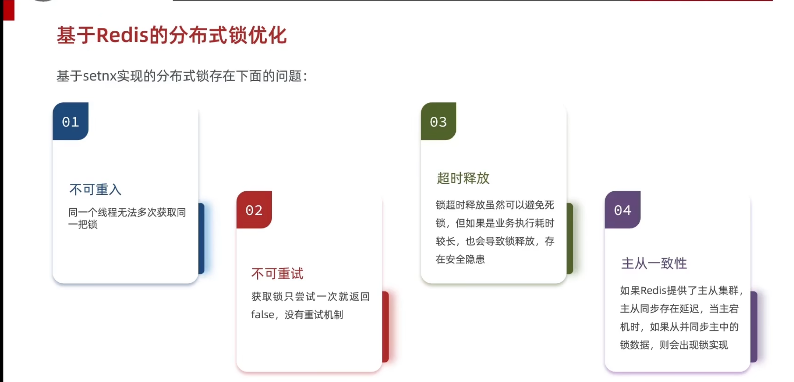
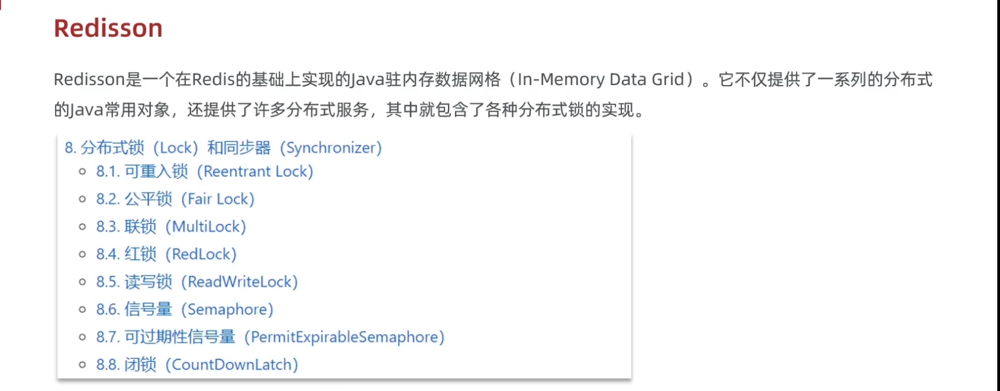
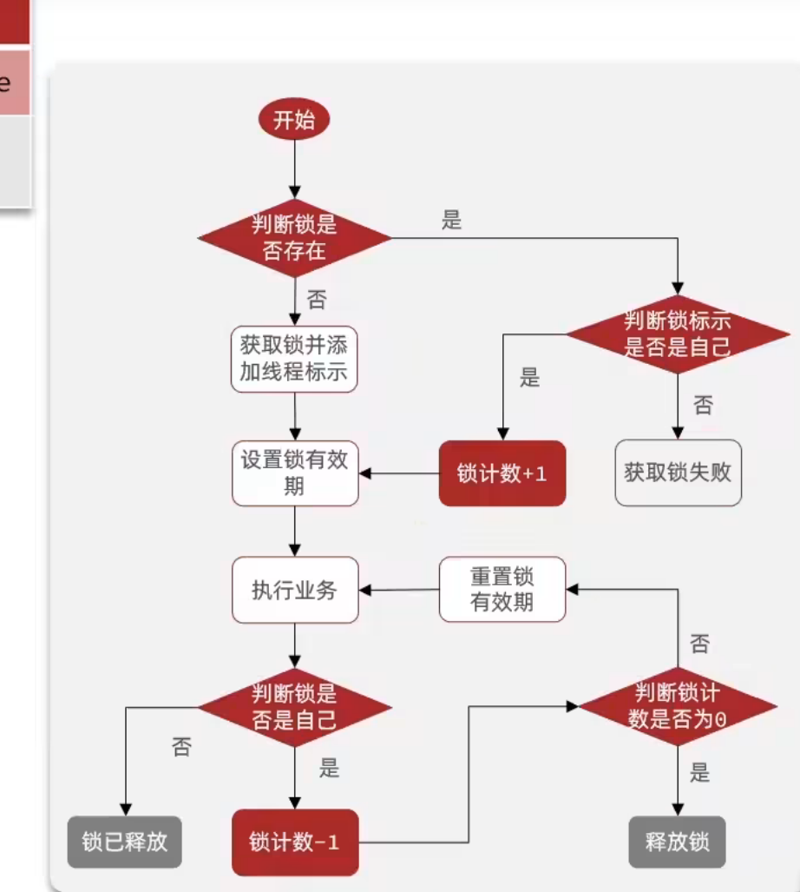
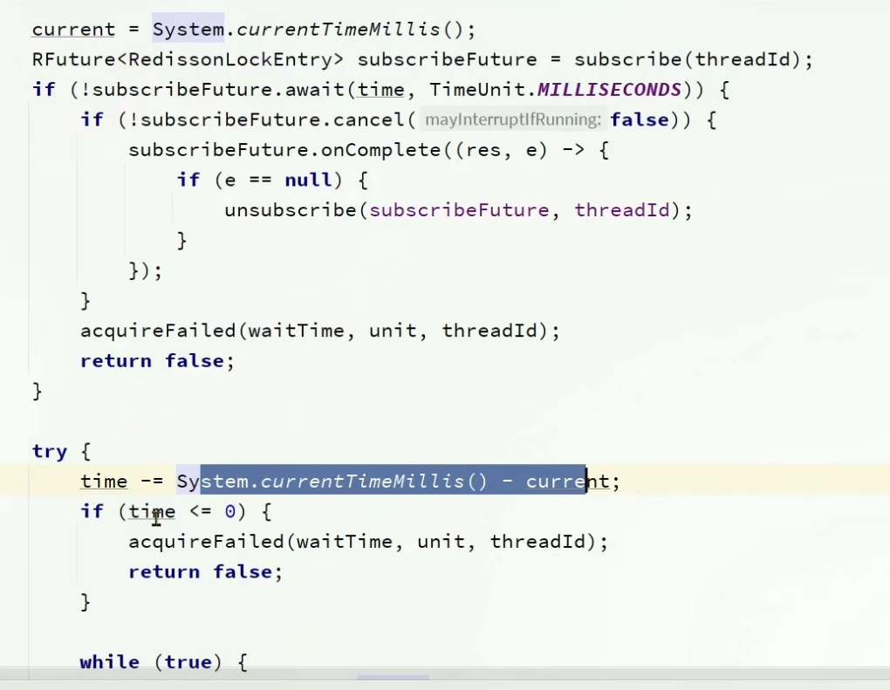
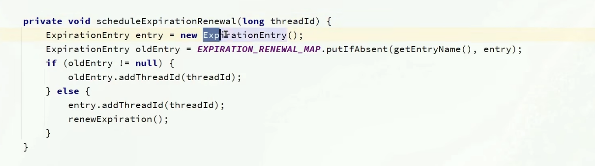

- [一、什么是分布式锁](#一什么是分布式锁)
  - [1.1 概念](#11-概念)
  - [1.2 特点](#12-特点)
- [二、基于redis实现方法](#二基于redis实现方法)
  - [2.1 redis核心操作](#21-redis核心操作)
  - [2.2 代码实现](#22-代码实现)
  - [2.3 遗留问题](#23-遗留问题)
  - [2.4 解决办法](#24-解决办法)
  - [2.5 实现方法](#25-实现方法)
  - [2.6 修改后的问题](#26-修改后的问题)
  - [2.7 lua语言](#27-lua语言)
    - [2.7.1 什么是lua语言](#271-什么是lua语言)
    - [2.7.2 如何调用](#272-如何调用)
    - [2.7.3 在redis中调用:](#273-在redis中调用)
- [三、基于Redission实现](#三基于redission实现)
  - [3.1 rediss的问题](#31-rediss的问题)
  - [3.2 什么是Redission](#32-什么是redission)
    - [3.2.1 Redission的简介](#321-redission的简介)
    - [3.2.2 Redisson的使用方法](#322-redisson的使用方法)
  - [3.3 Redisson中可重入锁的原理](#33-redisson中可重入锁的原理)
  - [3.4 Redisson中锁的可重式机制](#34-redisson中锁的可重式机制)
    - [3.4.1 核心机制--订阅发布消息/超时兜底重试机制](#341-核心机制--订阅发布消息超时兜底重试机制)
      - [1. 有参等待时间情况，ttl参数](#1-有参等待时间情况ttl参数)
      - [2.没有释放时间的参数，只有等待时间](#2没有释放时间的参数只有等待时间)
      - [3.无参的情况](#3无参的情况)
  - [3.5 redisson解决主从一致性问题](#35-redisson解决主从一致性问题)
    - [3.5.1 什么是主从一致性问题](#351-什么是主从一致性问题)
    - [3.5.2 MultiLock解决](#352-multilock解决)
      - [内部的原理](#内部的原理)

# 一、什么是分布式锁
## 1.1 概念
定义：在分布式系统或者集群模式下都能**共用一个锁**，并且之间锁是互斥的，就叫做分布式锁。
## 1.2 特点
1.多线程可见
2.互斥
3.高可用
4.高性能
5.安全性

# 二、基于redis实现方法

>[!TIP]
这里采取redis的实现，setnx设置分布式互斥锁，ttl设置互斥时间，防止redis宕机无法删除互斥锁形成死锁。
## 2.1 redis核心操作
获取锁:
set KEY Value ex seconds nx
删除锁：
delete KEY
>[!TIP]
这里ex后设置时间 nx是唯一 setnx一样，这样写的好处就是原子性，同时设置锁与过期时间
## 2.2 代码实现
封装成工具类
~~~java
//接口
public interface ILOCK {

    boolean tryLock(Long timeoutSec);

    void unlock();
}
//实现类
public class SimpleRedisLock implements ILOCK{

    private StringRedisTemplate stringRedisTemplate;

    private String name;

    private String timeout;

    public SimpleRedisLock(StringRedisTemplate stringRedisTemplate, String name) {
        this.stringRedisTemplate = stringRedisTemplate;
        this.name = name;
    }

    private final String KEY_PREFIX = "lock:";

    @Override
    public boolean tryLock(Long timeoutSec) {
        long id = Thread.currentThread().getId();
        boolean iskey = stringRedisTemplate.opsForValue().setIfAbsent(KEY_PREFIX + name, id + "", timeoutSec, TimeUnit.SECONDS);
        return Boolean.TRUE.equals(iskey);
    }

    @Override
    public void unlock(){
        stringRedisTemplate.delete(KEY_PREFIX + name);
    }
}

//在抢购券中实现
/**
 * 

 *  服务实现类
 * 

 *
 * @author 虎哥
 * @since 2021-12-22
 */
@Service
public class VoucherOrderServiceImpl extends ServiceImpl<VoucherOrderMapper, VoucherOrder> implements IVoucherOrderService {

    @Resource
    private ISeckillVoucherService seckillVoucherService;

    @Resource
    private RedisIDWorker redisIDWorker;

    @Resource
    private StringRedisTemplate stringRedisTemplate;

    @Override
    public Result seckillVoucher(Long id) {
        //查询当前这个秒杀券的库存
        SeckillVoucher voucher = seckillVoucherService.getById(id);
        //判断是否开始，注意这里要是在当前之后会返回false
        if(voucher.getBeginTime().isAfter(LocalDateTime.now())){
            return Result.fail("秒杀尚未开始");
        }
        //判断是否结束
        if(voucher.getEndTime().isBefore(LocalDateTime.now())){
            return Result.fail("秒杀已经结束");
        }
        //查询库存是否剩余
        if(voucher.getStock() < 1){
            return Result.fail("库存见底");
        }
        //单系统锁
//        Long userid = UserHolder.getUser().getId();
//        synchronized (userid.toString().intern()){
//            IVoucherOrderService proxy =(IVoucherOrderService) AopContext.currentProxy();
//            return proxy.createVoucherOrder(id);
//        }
        //分布式锁
        Long userId = UserHolder.getUser().getId();
       SimpleRedisLock simplelock = new SimpleRedisLock(stringRedisTemplate,"Order:"+userId);
       boolean success = simplelock.tryLock(12000L);
       if(!success){
           return Result.fail("一人只能下一单");
       }

        try {
            IVoucherOrderService proxy =(IVoucherOrderService) AopContext.currentProxy();
            return proxy.createVoucherOrder(id);
        } catch (IllegalStateException e) {
            throw new RuntimeException(e);
        } finally {
            simplelock.unlock();
        }
    }
    @Transactional
    public Result createVoucherOrder(Long id){
        //剩余调用mp修改数据库
        boolean success = seckillVoucherService
                .update().setSql("stock = stock - 1")
                .eq("voucher_id",id)
                .gt("stock",0)//判断是否大于0，乐观锁
                .update();
        if(!success){
            return Result.fail("修改失败");
        }
        //生成订单，返回订单号
        VoucherOrder voucherOrder = new VoucherOrder();
        //获取用户id
        Long userId = UserHolder.getUser().getId();
        //设置用户id
        voucherOrder.setUserId(userId);
        //设置秒杀券id
        voucherOrder.setVoucherId(id);
        //获取订单id
        Long orderId = redisIDWorker.nextId("order");
        //设置订单id
        voucherOrder.setId(orderId);
        save(voucherOrder);
        return Result.ok(orderId);
    }
}
~~~
>[!NOTE]
这里的锁的实现类不是bean所以无法直接注入redisTemplate需要通过构造函数进行赋值
## 2.3 遗留问题

>[!NOTE]
问题在于当我的锁设置的ttl**过期时间过短**，**业务执行逻辑过长**，当一个线程进来获取后，还没执行完毕，**锁就自己删除了**，那么下一个线程进来又可以获取一个锁，第一个线程此时执行完后，由于没有任何的判断就删除了新来的线程的锁，这个时候线程三同理获取新的锁这样就出现了线程安全的问题。 
对应到客户端就是一个用户连续发送多条请求，结果明明一个用户只能抢购一次优惠券，现在出现了**抢购多次**的漏洞。 
本质原因在于删除锁unlock时没有任何的判断直接就根据用户id删除了锁，就会出现删除了别的线程但是都是以用户id作为前缀的锁

## 2.4 解决办法
1.思路就是我在删除时，判断一下**当前的锁是不是我自己的**，那我们可以考虑定义一个线程的标识把**线程的标识存入redis锁中**，每次删除前判断一下是不是我这个线程的锁，是我在删除不是就不删除。

2.那么这线程标识是什么，我们知道在jvm中**线程的id是递增**的，所以我们可以考虑用id用来表示，但是不同的jvm是不一样的，会出现重复，所以我们在**使用uuid拼接id**这样就可以了。

## 2.5 实现方法
~~~java
public class SimpleRedisLock implements ILOCK{

    private StringRedisTemplate stringRedisTemplate;

    private String name;

    public SimpleRedisLock(StringRedisTemplate stringRedisTemplate, String name) {
        this.stringRedisTemplate = stringRedisTemplate;
        this.name = name;
    }

    private final static String KEY_PREFIX = "lock:";
    private final static String ID_PREFIX = UUID.randomUUID().toString(true) +"-";

    @Override
    public boolean tryLock(Long timeoutSec) {
        String id = ID_PREFIX + Thread.currentThread().getId();
        boolean iskey = stringRedisTemplate.opsForValue().setIfAbsent(KEY_PREFIX + name, id + "", timeoutSec, TimeUnit.SECONDS);
        return Boolean.TRUE.equals(iskey);
    }

    @Override
    public void unlock(){
        String threadId = ID_PREFIX + Thread.currentThread().getId();
        String id = stringRedisTemplate.opsForValue().get(KEY_PREFIX + name);
        if(threadId.equals(id)){
            stringRedisTemplate.delete(KEY_PREFIX + name);
        }
    }
}
~~~
>[!TIP]
这里用uuid加拼接线程id的方式，生成一个前缀然后，充当value;

## 2.6 修改后的问题

我们发现，因为我们在删除跟获取键值对时不是原子性的，所以会出现问题就是当我们判断完确实是对应的锁时，我们在删除之前，锁过期了，然后突然进入第二个线程，线程就会获取新的锁，但是我之前的线程此时执行了删除（根据lock前缀）所以就会删掉这个线程二的锁，那么我们线程三在进来，就会出现线程安全。

## 2.7 lua语言
### 2.7.1 什么是lua语言
redis提供了其脚本功能，是一种编程语言,而且lua语言保证了**一个语句内的原子性**，完美的解决了上述由于**两条语句出现的原子性的问题**
[lua语言](https://www.runoob.com/lua/lua-tutorial.html)

### 2.7.2 如何调用
在这里我们只需要知道其中的调用函数语法就行
redis.call('set','KEYS[1]','ARGV[1]')name JACK

1.表示设置name 为 JACK，这里**KEYS跟ARGV是存入参数的数组**，**从1开始**，前者存入的是**redis中的键**，后者存的是其它的参数。
2.set换成get就是获取name的value值

### 2.7.3 在redis中调用:
EVAL "脚本内容"
对应分布式锁的逻辑应该是:

以下代码的常量跟之前的含义是一样的，未作改动
~~~java
//为了便于更改我们设置了一个lua文件专门写脚本
if(redis.call('get',KEY[1]) == ARGV[1])then
    return redis.call('del',KEYS[1])
end
return 0

//然后再lock删除方法中引用
//需要redisTemplate中的excute方法
 private static final DefaultRedisScript<Long>UNLOCK_SCRIPT;
    static{
        UNLOCK_SCRIPT = new DefaultRedisScript<>();
        UNLOCK_SCRIPT.setLocation(new ClassPathResource("Lock.lua"));
        UNLOCK_SCRIPT.setResultType(Long.class);
    }

  @Override
    public void unlock(){
        stringRedisTemplate.execute(UNLOCK_SCRIPT,
                Collections.singletonList(KEY_PREFIX + name),//将其放入数组中
                ID_PREFIX + Thread.currentThread().getId());

    }
//DefaultRedisScript是实现类RedisScript来应用脚本，初始化采取静态代码块，设置读取文件内容路径，以及返回值类型
//在excute方法中，参数分别是RedisScript实现类，KEYS数组，以及ARGVS参数
~~~
>[!TIP]
1.这里的路径**ClassPath指的就是resource根目录**，由于lua文件直接在其下创建所以可以直接引用，也可以采取注入**ResourceLoader调用getResource（）**获取任意路径 
2.这里的**KEYS必须要封装成数组**，**而ARGV不需要**，可以直接传入多个参数，在底层就会自动封装成数组
# 三、基于Redission实现
## 3.1 rediss的问题

## 3.2 什么是Redission
### 3.2.1 Redission的简介

**可参考:**
::github{repo="redisson/redisson"}

### 3.2.2 Redisson的使用方法
**1.** 先引入redisson的依赖在pom文件里
~~~java
 <dependency>
            <groupId>org.redisson</groupId>
            <artifactId>redisson</artifactId>
            <version>3.13.6</version>
        </dependency>
~~~

**2.** 创建一个配置类用来配置Redisson,返回值类型是RedissonClient
~~~java
@Configuration
public class RedissonConfig {

    @Bean
    public RedissonClient redissonClient(){
        Config config = new Config();
        config.useSingleServer().setAddress("localhost:6379");//这里的地址是redis的地址，可以是虚拟机也可以是本机等，有密码在后面加上setPassword的方法设置密码
        return Redisson.create(config);
    }
}
~~~
>[!TIP]
注意这里的是**单节点**

**3.**在Service层中注入bean，调用相关方法
~~~java
    //注入
    @Resource
    private RedissonClient redissonClient;
    //调用
     Long userId = UserHolder.getUser().getId();
     RLock simplelock = redissonClient.getLock("Order:"+userId);//注意返回值类型，这里get的是最普通的锁，直接传入锁的名字作为参数
       boolean success = simplelock.tryLock();//这里也可以传入重试时间，过期时间，时间单位等参数
       if(!success){
           return Result.fail("一人只能下一单");
       }

        try {
            IVoucherOrderService proxy =(IVoucherOrderService) AopContext.currentProxy();
            return proxy.createVoucherOrder(id);
        } catch (IllegalStateException e) {
            throw new RuntimeException(e);
        } finally {
            simplelock.unlock();
        }
~~~

## 3.3 Redisson中可重入锁的原理

本质上是通过hash结构存储，以lua脚本实现，每次获取一次锁就加一，释放一次就减一，判断是否为0，是就释放锁

获取锁的脚本：
~~~lua
local key = KEYS[1];--锁的key
local threadId = ARGV[1];--线程唯一标识
local releaseTime = ARGV[2];--锁的自动释放时间

--判断是否存在
if(redis.call('exists',key)==0)then 
    --不存在，获取锁
    redis.call('hset',key,threadId,'1');
    --设置有效期
    redis.call('pexpire',key,releaseTime);
    return 1;--返回结果
end;
--锁已经存在
if(redis.call('hexist',key,threadId)==1)then
--是自己的锁，重入次数加一
redis.call('hincrby',key,threadId,'1');
--重新设置有效时间
redis.call('pexpire',key,releaseTime);
    return 1; --返回结果

end;
return 0; --标识锁不是自己的，获取失败
~~~
>[!TIP]
这里如果获取锁失败，也就是存在自己的锁就会有这样一行return redis.call('pttl',KEYS[1]);

释放锁的脚本：
~~~lua
local key = KEYS[1];--锁的key
local threadId = ARGV[1]; -- 线程唯一标识
local releaseTime =ARGV[2];--锁的自动释放时间

-- 判断当前锁是否被自己持有,是不是自己的
if(redis.call('HEXISTS',key,threadId) == 0)then
end;

--锁是自己的，重入次数减一
local count = redis.call('HINCRBY',key,threadId,-1);
--判断重入1次数是否为0，是就删除
if(count > 0)then
--大于0，继续执行业务，刷新更新时间
    redis.call('PEXPIRE',key,releaseTime);
    return nil;

else -- 删除锁
    redis.call('DEL',key);
    return nil;
end;
~~~
>[!TIP]
这里的**nil是null**的意思，这里**hash结构filed中key代表线程标识(UUID+id)，value代表重入次数**，每次**获取+1**，**释放-1**，当为**0**时代表正好可以删除锁从redis中

## 3.4 Redisson中锁的可重式机制
### 3.4.1 核心机制--订阅发布消息/超时兜底重试机制
#### 1. 有参等待时间情况，ttl参数
tryLock逻辑:
1.会**先进行获取锁尝试**，并且记录整个过程的时间，失败后，如果当前的剩余时间（ttl减去耗费时间）还存在就会调用**sunsrcibe**方法，接收的是以下lua中**锁释放时pulish的信号。**
2.这里的等待是一个**异步**请求，并同时获取当前时间，如果等到了就直接再次尝试获取锁，如果没有再次获取当前时间，判断剩余时间是否够，大于0，则进入while循环尝试获取锁，同理要再次算这次尝试消耗时间，如果失败要判断是否有剩余时间，有就接着进行等待下一次的消息发出，当进行获取锁时要判断**剩余时间跟等待时间**的**最小值**，防止锁在获取时过期
3.当**获取成功，或者剩余时间为0**，就会结束

~~~lua
  "if (redis.call('hexists', KEYS[1], ARGV[3]) == 0) then " +
        "return nil;" +
        "end; " +
        "local counter = redis.call('hincrby', KEYS[1], ARGV[3], -1); " +
        "if (counter > 0) then " +
        "redis.call('pexpire', KEYS[1], ARGV[2]); " +
        "return 0; " +
        "else " +
        "redis.call('del', KEYS[1]); " +
        // ==================== 核心publish ====================
        "redis.call('publish', KEYS[2], ARGV[1]); " +
        // ======================================================
        "return 1; " +
        "end; " +
        "return nil;",
~~~

#### 2.没有释放时间的参数，只有等待时间
1.这里如果没有等待时间，在尝试获取锁时，会调用**看门狗（WatchDog）机制**，设置**默认时间为30s**，调用以下方法：

这里的**renewExpirtion**就是通过定时任务不断**每过10s**就执行一个lua脚本，里面会更新锁的过期时间，这样就达到了续期的效果。一直到获取锁成功才会结束。
>[!NOTE]
这里的entry存储的是**线程id，定时任务**，重入的话会返回之前的entry，第一次就是null，需要加入定时任务更新续期。
 
释放锁就需要根据entryName也就是锁的名字，删除线程id，取消定时任务，最后移除这个entry锁。

#### 3.无参的情况
等待时间为0，剩余时间为0，只会获取一次，剩余时间为0直接就结束了

## 3.5 redisson解决主从一致性问题
### 3.5.1 什么是主从一致性问题
主从一致性就是redis分成**主节点**跟**从节点**，主节点负责核心业务，从节点负责其他业务，**数据之间需要共享**，当主节点获取新的数据，传送给从节点时，发生了宕机，这样从节点就无法获取，此时从节点就会成为新的主节点，这样就出现了问题。数据丢失了
### 3.5.2 MultiLock解决
Redisson中的可重入锁，采用hash结构存入的是存在以上问题的
而MultiLock则近似于其集合，采用多个redis节点，并且要全部都获取锁才能生效，否则无法获取。

#### 内部的原理
本质还是tryLock核心逻辑，不同之处是是锁的一个集合，需要一个个遍历这些锁，在开始遍历获取锁之前，会先判断是否传入等待时间，传入就会后在后续采用新的锁过期时间，防止在拿到锁后就直接过期了（由于业务的网络等问题时间变长）

>[!NOTE]
如果没有传入等待时间，就是无限等待，那么就不会修改释放时间，按照传入的来，如果无参，就会直接走看门狗机制，所以一般都是无参的

然后开始一个个遍历利用**集合迭代器**，每一次遍历都计算剩余的时间，这里**过期时间跟剩余等待时间**是一样的，如果超时则失败。如果获取失败就会**清空所有的获取的锁**重新尝试获取。

最后全部获取成功，如果传入了锁的过期时间，lua会统一给所有的锁设置过期时间（按照上面修改后的），此时开始计时过期时间，否则就不会，直接走看门狗机制。

