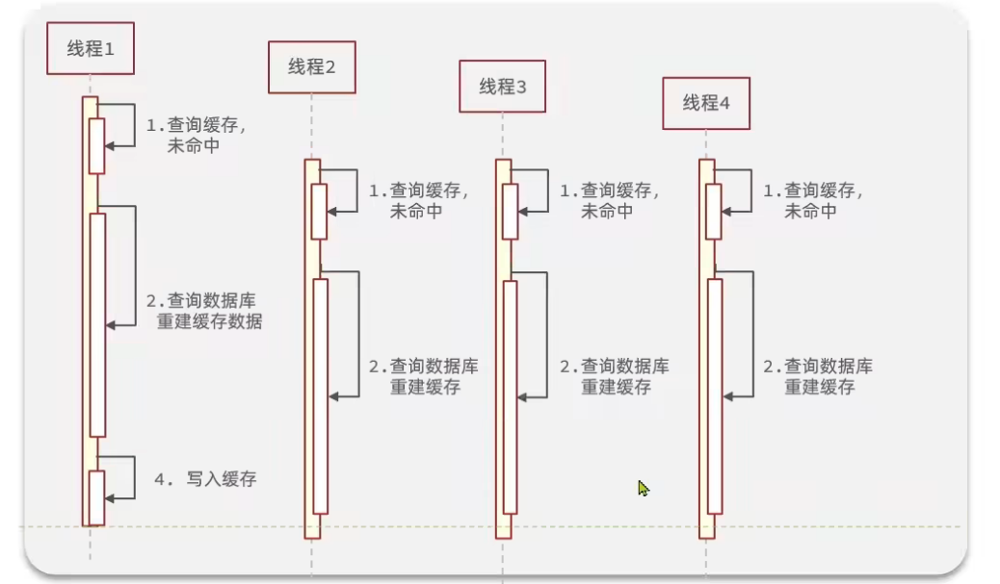
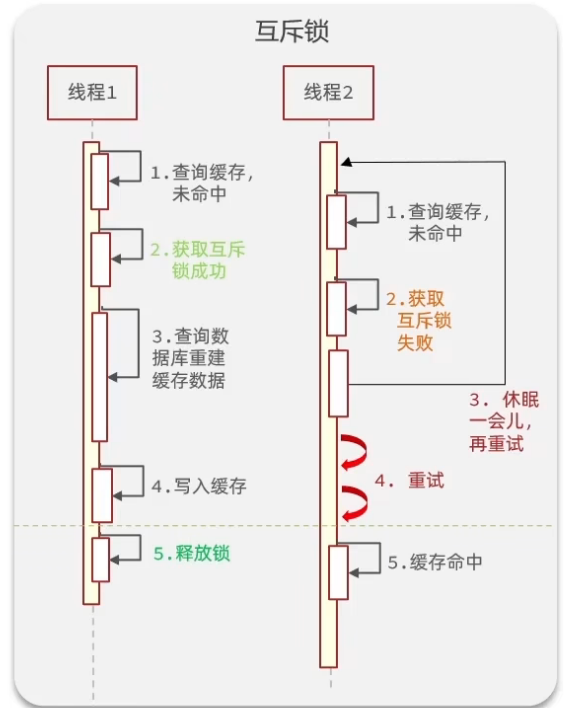
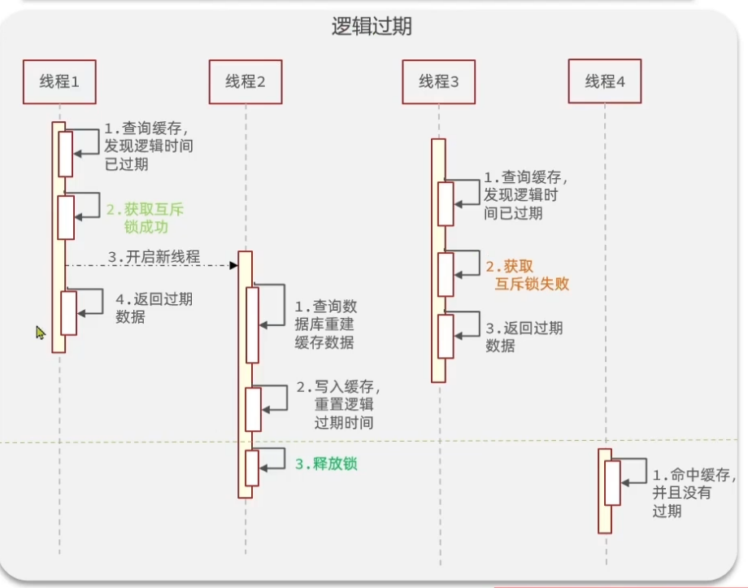
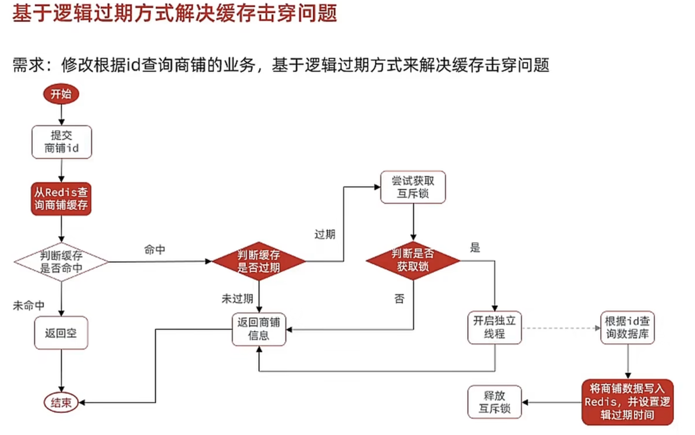

- [一、缓存基础概念（cache）](#一缓存基础概念cache)
  - [1.1什么是缓存](#11什么是缓存)
    - [缓存的优缺点](#缓存的优缺点)
- [二、商户缓存实现](#二商户缓存实现)
  - [2.1 添加商户缓存原理](#21-添加商户缓存原理)
  - [2.2 代码实现](#22-代码实现)
- [三、商品分类查询缓存](#三商品分类查询缓存)
  - [3.1 Redis String存储结构](#31-redis-string存储结构)
- [四、缓存更新机制](#四缓存更新机制)
  - [4.1 缓存更新的三种方案](#41-缓存更新的三种方案)
  - [4.2 缓存主动更新策略](#42-缓存主动更新策略)
  - [4.3 缓存主动更新三个问题](#43-缓存主动更新三个问题)
    - [4.3.1 是删除缓存还是覆盖缓存？](#431-是删除缓存还是覆盖缓存)
    - [4.3.2 如何保证对于数据库跟缓存的更新一致呢？](#432-如何保证对于数据库跟缓存的更新一致呢)
    - [4.3.3 是先操作数据库还是缓存呢？](#433-是先操作数据库还是缓存呢)
      - [方案一：先删除缓存](#方案一先删除缓存)
      - [方案二：先修改数据库](#方案二先修改数据库)
    - [4.4 实现商品更新缓存](#44-实现商品更新缓存)
- [五、缓存穿透](#五缓存穿透)
  - [5.1 什么是缓存穿透](#51-什么是缓存穿透)
  - [5.2 通用思路](#52-通用思路)
    - [方案一：缓存空对象](#方案一缓存空对象)
    - [方案二：布隆过滤](#方案二布隆过滤)
  - [5.3 解决项目中商品查询缓存穿透问题](#53-解决项目中商品查询缓存穿透问题)
    - [实现思路](#实现思路)
    - [代码实现](#代码实现)
- [六、缓存雪崩](#六缓存雪崩)
  - [6.1 什么是缓存雪崩](#61-什么是缓存雪崩)
  - [6.2 解决的方案](#62-解决的方案)
- [七、缓存击穿](#七缓存击穿)
  - [7.1 什么是缓存击穿](#71-什么是缓存击穿)
  - [7.2 解决方案](#72-解决方案)
    - [方案一：互斥锁](#方案一互斥锁)
    - [方案二：逻辑过期](#方案二逻辑过期)
  - [7.3 优缺对比](#73-优缺对比)
  - [7.4 利用互斥锁解决](#74-利用互斥锁解决)
  - [7.5 利用逻辑过期解决](#75-利用逻辑过期解决)
    - [7.5.1 思路](#751-思路)
- [八、封装成工具类](#八封装成工具类)

# 一、缓存基础概念（cache）
## 1.1什么是缓存
缓存就是数据交换的缓冲区，是存储数据的临时地方，一般读写性较高。

### 缓存的优缺点
—优点：降低后端负载，提高读写效率，降低响应时间
—缺点：数据不一致，代码维护成本，运营成本

# 二、商户缓存实现
## 2.1 添加商户缓存原理

>[!TIP]
>相比较于之前的逻辑，这里先会查询redis，没有在查数据库，再加入redis中

## 2.2 代码实现
~~~java
//controller层：
 @GetMapping("/{id}")
    public Result queryShopById(@PathVariable("id") Long id) {
        return shopService.queryById(id);
    }//这里新定义一个方法，先查redis
//Service层：
@Service
public class ShopServiceImpl extends ServiceImpl<ShopMapper, Shop> implements IShopService {
    @Resource
    private StringRedisTemplate stringRedisTemplate;

    @Override
    public Object quertById(Long id) {
        String key = CACHE_SHOP_KEY + id;
        //从redis里查询
        String shopJson = stringRedisTemplate.opsForValue().get(key);

        //查到了，转成bean返回
        if(!StrUtil.isNotBlank(shopJson)){
            Shop shop = JSONUtil.toBean(shopJson,Shop.class);
            return Result.ok(shop);
        }
        //不存在，根据id查询数据库
        Shop shop = getById(id);

        //不存在数据库返回错误
        if(shop == null){
            return Result.fail("店铺不存在！");
        }

        //存在，写入redis
        stringRedisTemplate.opsForValue().set(key,JSONUtil.toJsonStr(shop));
        return Result.ok(shop);
    }
}
~~~
>[!NOTE]
>这里用了很多Hutool里的方法: 
1.StrUtil.isNotBlank():传入的是字符串，判断是否为空，即便是"  "也算作空，不为空返回true; 
>2.JSONUtil.toBean():作用是将字符串转化成bean对象，传入的参数，一个是转化的对象，另一个是要转化的对象类. 
>3.JSONUtil.toJsonStr():就是将一个对象转化为JSON字符串

# 三、商品分类查询缓存
思路一致，但是查询的结果是list集合，因为有很多分类，这里采用两种方式分别是string,hash,list的redis查询
## 3.1 Redis String存储结构
~~~java
//controller:
 @GetMapping("list")
    public Result queryTypeList() {
        return typeService.queryList();
    }
//Service层:
 Result queryList();

@Service
public class ShopTypeServiceImpl extends ServiceImpl<ShopTypeMapper, ShopType> implements IShopTypeService {

    @Resource
    private StringRedisTemplate stringRedisTemplate;
    @Override
    public Result queryList() {
        String shopsort=stringRedisTemplate.opsForValue().get(SHOP_SORT_KEY);

        if(StrUtil.isNotBlank(shopsort)){
            List<ShopType>list= JSONUtil.toList(shopsort,ShopType.class);
            return Result.ok(list);
        }

        //redis中没有，查询数据库,这里的意思是查询然后按照sort进行排序升序 ASC，最后返回list的类型
        List<ShopType> typeList = query().orderByAsc("sort").list();
        //数据库中没有，报错
        if (CollectionUtil.isEmpty(typeList)) {
            return Result.fail("列表信息不存在");
        }
       stringRedisTemplate.opsForValue().set(SHOP_SORT_KEY,JSONUtil.toJsonStr(typeList)); 
       return Result.ok(typeList);

    }
}

//存list
 @Override
    public Result queryList() {
        //使用list取 [0 -1] 代表全部
        //从redis中查询所有分类
        List<String> shopTypeList = redisTemplate.opsForList().range(SHOP_LIST_KEY, 0, -1);
        if (CollectionUtil.isNotEmpty(shopTypeList)) {
            //shopTypeList.get(0) 其实是获取了整个List集合里的元素,0是第0个key
            //查询到，直接返回
            List<ShopType> types = JSONUtil.toList(shopTypeList.get(0), ShopType.class);
            return Result.ok(types);
        }
 
        //redis中没有，查询数据库
        List<ShopType> typeList = query().orderByAsc("sort").list();
        //数据库中没有，报错
        if (CollectionUtil.isEmpty(typeList)) {
            return Result.fail("列表信息不存在");
        }
 
        //list 存
        //数据库中有，存到redis，注意存的位置和上面取的位置一致。
        String jsonStr = JSONUtil.toJsonStr(typeList);
        redisTemplate.opsForList().leftPushAll(SHOP_LIST_KEY, jsonStr);
        return Result.ok(typeList);
 
    }
~~~
# 四、缓存更新机制
## 4.1 缓存更新的三种方案
1. 方案一：Cache Aside 删除缓存（业界主流）
2. 方案二：写库同步 SET 更新缓存
3. 方案三：仅依赖 TTL 过期自动淘汰

| 对比维度 | 方案一：写库后删除缓存 | 方案二：写库后直接更新缓存 | 方案三：TTL 自动过期失效 |
| :--- | :--- | :--- | :--- |
| 核心执行流程 | 1. 更新数据库 2. DEL 删除缓存 Key 3. 查询时回源数据库，自动回填新缓存 | 1. 更新数据库 2. SET 覆盖 Redis 旧数据 | 1. 仅更新数据库，不操作缓存 2. 等待 Key 超时自动清除 |
| 数据一致性 | 高，极小概率瞬时脏读，延迟双删可解决 | 低，并发写会出现新旧缓存覆盖错乱 | 极低，TTL 周期内全是脏数据 |
| Redis 性能开销 | 单次 DEL 指令，大对象节省网络流量 | 单次 SET 指令，大数据传输开销高 | 无写缓存开销，读取命中性能最好 |
| 并发安全风险 | 极低，可通过延迟双删兜底 | 高，多线程并发写易缓存错乱 | 全程存在脏数据窗口 |
| 适用业务场景 | 用户、订单、商品等频繁更新的核心业务 | 静态字典、常量、几乎不变的基础配置 | 统计报表、临时热点、允许短暂不一致的非核心数据 |
| 优点 | 1. 一致性可控，生产通用标准方案 2. 删除大对象比更新更省带宽 3. 不会缓存冗余旧数据 | 1. 查询永久命中缓存，无 DB 回源压力 2. 业务逻辑简单直观 | 1. 代码极简，无需手动维护缓存 2. 无缓存写入耗时 |
| 缺点 | 极端并发存在瞬时脏读，需额外延迟删除逻辑 | 并发写场景极易出现缓存数据错乱 | TTL 窗口数据不一致，禁止用于交易类核心数据 |
| 兜底优化方案 | 延迟双删、分布式锁 | 分布式锁串行更新缓存 | 缩短 TTL + 定时全量刷新兜底 |
## 4.2 缓存主动更新策略
1.调用者先进行更新数据库，再更新缓存
2.缓存与数据库和为一体，调用者无需关心一致性问题
3.只关心缓存，通过另外的线程异步更新数据库
>[!WARNING]
>第二个的开发**难度大**，比较复杂，第三个很容易造成**数据库与缓存不一致**的情况，所以第一种方案最优
## 4.3 缓存主动更新三个问题
### 4.3.1 是删除缓存还是覆盖缓存？
删除更方便，覆盖缓存的话次数多，并且没有必要的操作偏多
### 4.3.2 如何保证对于数据库跟缓存的更新一致呢？
对于单体系统，利用事务即可，对于分布式系统，就要用TTC

### 4.3.3 是先操作数据库还是缓存呢？
####  方案一：先删除缓存
正常逻辑：

>[!TIP]
>这里当需要更改数据是，先删除了缓存，然后再更换数据库，这是当下一次查询时发现缓存没有，就会查数据库，此时已经更新了，那么写入缓存，数据统一；

线程安全：

>[!TIP]
>当数据要更新时，先删除缓存，然后在进行数据库更换的过程中，突然第二个线程进入，查询了缓存没有，去查询数据库，但此时数据库数据没更新，此时缓存跟数据库不一致了。

#### 方案二：先修改数据库
正常逻辑：

>[!TIP]
>当数据需要更新，我先进行数据库更新，再删除缓存，当下一次操作时，缓存没有查到，就去数据库查询，然后写入缓存

线程安全

>[!TIP]
>此时当我的缓存恰好失效时，我查询缓存，未命中去查询数据库，查到后在我写入缓存时，突然要更新数据库，并且删除缓存，数据库更新完后，在执行之前的写入缓存，这时候不一致了。但是概率极小，因为**缓存写入很快**，并且**缓存恰好失效时查询概率也小**。

所以采用第二种更好
###  4.4 实现商品更新缓存
>[!IMPORTANT]
>基于上面分析的数据更新时**要先更新数据库，再更新缓存**，那么我们一定要再缓存内部加入有效期，所以在查询商品缓存时，**未命中要加入有效时间**。
~~~java
   stringRedisTemplate.opsForValue().set(key,JSONUtil.toJsonStr(shop),CAHE_SHOP_TTL, TimeUnit.MINUTES);
~~~
下面是更新数据的功能代码实现
~~~java
//Controller
 @PutMapping
    public Result updateShop(@RequestBody Shop shop) {
        // 写入数据库
        return  shopService.update(shop);
    }
//Service
Result update(Shop shop);
//ServiceImpl
 @Override
    @Transactional
    public Result update(Shop shop){
        //1.更新数据库
        updateById(shop);
        //2.更新缓存
        Long id=shop.getId();
        if(id == null){
            return Result.fail("店铺的id不能为空");
        }
        stringRedisTemplate.delete(CACHE_SHOP_KEY+id);
        return Result.ok();
    }    
~~~
>[!TIP]
>这里记得加**事务**保持原子一致性

# 五、缓存穿透
## 5.1 什么是缓存穿透
缓存穿透是客户请求时，数据在缓存以及数据库都不存在，这样请求就会直接打在数据库上，请求次数一朵就会对数据库造成损害
## 5.2 通用思路
### 方案一：缓存空对象
缓存空对象就是在数据库为空时，将redis里存入空数据，这样下次就可以命中了
>[!WARNING]
>缺点是会存入**大量的垃圾数据**，空数据会很多，**占用空间**，所以我们再存入redis数据时要加入限制的时间。可能造成**短期的不一致**。
### 方案二：布隆过滤
布隆过滤是一个过滤器，当发送请求时会先经过这个过滤器，然后判断是不是存在，如果存在就执行，不存在直接返回，不在往下执行。
>[!WARNING]
>缺点： 1.本质是通过**hash**判断的所以它只能在**不存在上确保正确性**，也可能存在为空数据但hash值相同的情况，出现误判。 
2.实现过滤器的**难度很大**，很复杂。
## 5.3 解决项目中商品查询缓存穿透问题
### 实现思路
大体思路与之前查询商铺缓存一致，当查询时缓存未命中查询数据库时未查到，我们在返回错误信息的同时，**加入空值进入redis**，那么这样当下次我们**命中缓存的时候就需要判断是不是写入的空值这一步**。
### 代码实现
~~~java
 public Result queryById(Long id) {
        String key = CACHE_SHOP_KEY + id;
        //从redis里查询
        String shopJson = stringRedisTemplate.opsForValue().get(key);

        //查到了，转成bean返回
        if(StrUtil.isNotBlank(shopJson)){
            Shop shop = JSONUtil.toBean(shopJson,Shop.class);
            return Result.ok(shop);
        }
        //判断是不是空值
        if(shopJson != null){
            return Result.fail("店铺不存在");
        }
        //不存在，根据id查询数据库
        Shop shop = getById(id);

        //不存在数据库返回错误
        if(shop == null){
            //插入空值
            stringRedisTemplate.opsForValue().set(ket,"",CACHE_NULL_TTL,TimeUnit.MINUTES);
            return Result.fail("店铺不存在！");
        }

        //存在，写入redis
        stringRedisTemplate.opsForValue().set(key,JSONUtil.toJsonStr(shop),CAHE_SHOP_TTL, TimeUnit.MINUTES);
        return Result.ok(shop);
    }
~~~
这里就加入了两个代码一个是加入空值缓存，一个是判断缓存是否命中的空值

# 六、缓存雪崩
## 6.1 什么是缓存雪崩
缓存雪崩就是当缓存的key**同一时间大部分失效**，或者**redis宕机**导致的，请求全部指向数据库，带来巨大的压力。
## 6.2 解决的方案
1.给key的**TTL加上随机值**，减少同一时间全部失效的概率。
2.利用Redis的**集群提高服务**可用性（解决宕机）
3.给缓存业务添加**降级限流**（这里不在详细解释，详细部分在后面的高级篇）
4.给业务添加**多级缓存**

# 七、缓存击穿
## 7.1 什么是缓存击穿
缓存击穿也叫热点key问题，一个**高并发**的key并且**缓存重建业务较为复杂**失效了，那么此时无数的请求访问给数据库带来的巨大压力

## 7.2 解决方案
### 方案一：互斥锁

>[!NOTE]
这里就是在一个线程**未命中缓存时获取一个锁**，等到写入成功后在释放锁，这样的话再未释放前，其它线程未命中也要获取锁，但是失败后就**休眠然后重新判断是否命中缓存**，直到锁被释放。
### 方案二：逻辑过期

>[!NOTE]
逻辑过期就是**不在定义key的过期时间**，或者设置时间尽可能长，这样就能保证key不会失效，在发现需要更新缓存是，也加入**互斥锁**，并且同时为了保持性能，会再开一个**新的线程去执行redis的更新**，在更新完成前都会**去返回原来的旧缓存**。
## 7.3 优缺对比
| 解决方案 | 优点 | 缺点 |
| ---- | ---- | ---- |
| 互斥锁 | - 没有额外的内存消耗 - **保证一致性** - **实现简单** | - 线程需要等待，**性能受影响** - 可能有**死锁**风险 |
| 逻辑过期 | - 线程无需等待，**性能较好** | - **不保证一致性** - 有额外内存消耗 - **实现复杂** |

## 7.4 利用互斥锁解决
~~~java

    @Override
    public Result queryById(Long id) {
     //缓存穿透
      //  Shop shop=queryWithPassThrough(id);

        //互斥锁解决缓存穿透
        Shop shop = queryWithMutex(id);
        return Result.ok(shop);
    }
    //定义了获取互斥锁的方法
    private boolean tryLock(String key){
        Boolean flag=stringRedisTemplate.opsForValue().setIfAbsent(key,"1",10,TimeUnit.SECONDS);
        return BooleanUtil.isTrue(flag);
    }
    //定义了释放互斥锁的方法
    private void unlock(String key){
        stringRedisTemplate.delete(key);
    }

    //缓存穿透互斥锁
    public Shop queryWithMutex(Long id){
        String key = CACHE_SHOP_KEY + id;
        // 第一层缓存检查
        String shopJson = stringRedisTemplate.opsForValue().get(key);
        if(StrUtil.isNotBlank(shopJson)){
            return JSONUtil.toBean(shopJson, Shop.class);
        }
        // 缓存空值，防止穿透,比如“”
        if(shopJson != null){
            return null;
        }

        String lockkey = "lock:shop:" + id;
        Shop shop = null;
        try {
            boolean isLock = tryLock(lockkey);
            if(!isLock){
                Thread.sleep(50);
                return queryWithMutex(id);
            }

            // 第二层DoubleCheck核心
            String cacheShop = stringRedisTemplate.opsForValue().get(key);
            //这里是因为如果上个线程解锁后，会被很多的线程同时抢锁，那么就会再次查库，给数据库添加压力
            if(StrUtil.isNotBlank(cacheShop)){
                unlock(lockkey); // 手动解锁
                return JSONUtil.toBean(cacheShop, Shop.class);
            }

            // 查库
            shop = getById(id);
            //防止缓存穿透，传入空值
            if(shop == null){
                stringRedisTemplate.opsForValue().set(key,"",CACHE_NULL_TTL,TimeUnit.MINUTES);
                unlock(lockkey); // 手动解锁
                return null;
            }
            // 回填缓存
            stringRedisTemplate.opsForValue().set(key,JSONUtil.toJsonStr(shop),CACHE_SHOP_TTL, TimeUnit.MINUTES);
        } catch (InterruptedException e) {
            throw new RuntimeException(e);
        } finally {
            unlock(lockkey);
        }
        return shop;
    }

~~~
>[!NOTE]
这里的互斥锁就是根据redis里的那条判断key是否存在，在创建实现的，**获取锁就是创建这样的一个key，释放就删除**

## 7.5 利用逻辑过期解决
### 7.5.1 思路

>[!TIP]
>这里未命中缓存时就代表没有，这里是指的**热点key**所以未命中就认为不存在，命中就去检验是否过期，过期了另开一个线程更新，然后更新结束前都返回旧的数据。

# 八、封装成工具类
这里封装的是一个是存入redis无需只能传入string类value,以及设置逻辑过期时间存入redis，以及解决缓存穿透，和通过逻辑过期解决缓存击穿的方法
~~~java
public class CacheClient {
    private static final ExecutorService CACHE_REBUILD_EXECUTOR = Executors.newFixedThreadPool(10);

    private final StringRedisTemplate stringRedisTemplate;

    public CacheClient(StringRedisTemplate stringRedisTemplate) {
        this.stringRedisTemplate = stringRedisTemplate;
    }

    //定义传入任何的数据类型都能以字符串写入redis
    public void set(String key, Object value, Long time, TimeUnit unit) {
        stringRedisTemplate.opsForValue().set(key, JSONUtil.toJsonStr(value), time, unit);
    }

    //定义逻辑过期时间
    public void setWithLogicExpire(String key, Object value, Long time, TimeUnit unit) {
        RedisData redisData = new RedisData();
        redisData.setData(value);
        redisData.setExpireTime(LocalDateTime.now().plusSeconds(unit.toSeconds(time)));
        //所谓的逻辑过期时间就是再当前时间加上设置的固定时间，存入数据中
        stringRedisTemplate.opsForValue().set(key, JSONUtil.toJsonStr(redisData));
    }

    //解决缓存穿透
    public <T, ID> T queryWithPassThrough(
            String keyPrefix, ID id, Class<T> type, Function<ID, T> dbcallBack, Long time, TimeUnit unit) {
        String key = keyPrefix + id;
        //从redis里查询
        String Json = stringRedisTemplate.opsForValue().get(key);

        //查到了，转成bean返回
        if (StrUtil.isNotBlank(Json)) {
            T t = JSONUtil.toBean(Json, type);
            return t;
        }
        //判断是不是空值，Redis 存在这个 key，代表数据库确实没有这条数据，不用再去查库，挡住穿透。
        if (Json != null) {
            return null;
        }
        //不存在，根据id查询数据库
        T t = dbcallBack.apply(id);

        //不存在数据库返回错误
        if (t == null) {
            //插入空值
            stringRedisTemplate.opsForValue().set(key, "", CACHE_NULL_TTL, TimeUnit.MINUTES);
            return null;
        }
        //存在，写入redis
        stringRedisTemplate.opsForValue().set(key, JSONUtil.toJsonStr(t), time, unit);
        return t;
    }

    
    //解决缓存击穿-逻辑过期
    public <T, ID> T queryWithLogicExpire(
            String keyPrefix,
            String lockKeyPrefix,
            ID id,
            Class<T> type,
            Function<ID, T> dbCallback,
            Long time,
            TimeUnit unit) {
        String key = keyPrefix + id;
        String json = stringRedisTemplate.opsForValue().get(key);

        //没查到就代表数据不合法，直接返回null
        if (StrUtil.isBlank(json)) {
            return null;
        }

        //将查到的字符串反序列化
        RedisData redisData = JSONUtil.toBean(json, RedisData.class);
        //这里先利用parseObj转成JsonObject再转成bean
        T t = JSONUtil.toBean(JSONUtil.parseObj(redisData.getData()), type);
        //判断是否过期
        if (redisData.getExpireTime().isAfter(LocalDateTime.now())) {
            //不过期直接返回查询的数据
            return t;
        }

        //过期了，那就获取互斥锁
        String lockKey = lockKeyPrefix + id;
        //判断是否获取成功
        if (tryLock(lockKey)) {
            //成功了，利用线程池开启新的线程
            CACHE_REBUILD_EXECUTOR.submit(() -> {
                try {
                    //查询数据库
                    T freshData = dbCallback.apply(id);
                    //这里简化了逻辑，不考虑数据库查不到的情况，认为缓存中没有的数据库也没有
                    setWithLogicExpire(key, freshData, time, unit);
                } catch (Exception e) {
                    log.error("rebuild cache failed, key={}", key, e);
                } finally {
                    unlock(lockKey);
                }
            });
        }
        return t;
    }

    private boolean tryLock(String key) {
        Boolean success = stringRedisTemplate.opsForValue()
                .setIfAbsent(key, "1", LOCK_SHOP_TTL, TimeUnit.SECONDS);
        return BooleanUtil.isTrue(success);
    }

    private void unlock(String key) {
        stringRedisTemplate.delete(key);
    }
}
~~~
>[!TIP]
在缓存穿透里用逻辑过期要先预热，热点key，在启动方案
~~~java
   @Test
    public void testSaveShop() {
        Shop shop = shopService.getById(1L);
        cacheClient.setWithLogicExpire(CACHE_SHOP_KEY + 1L, shop, 10L, TimeUnit.MINUTES);
    }
~~~