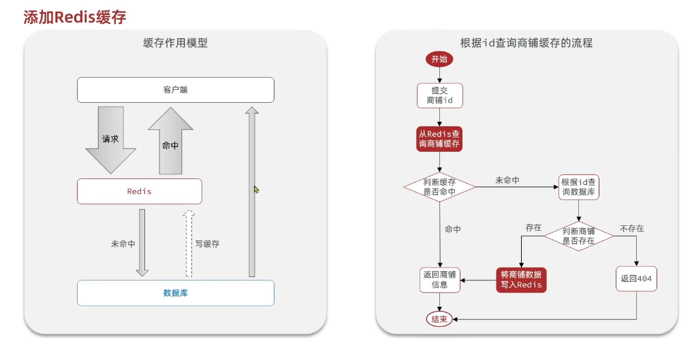
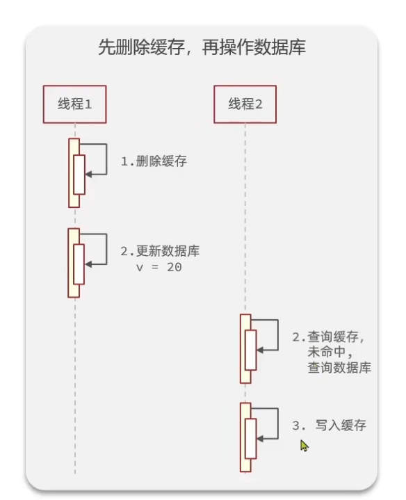
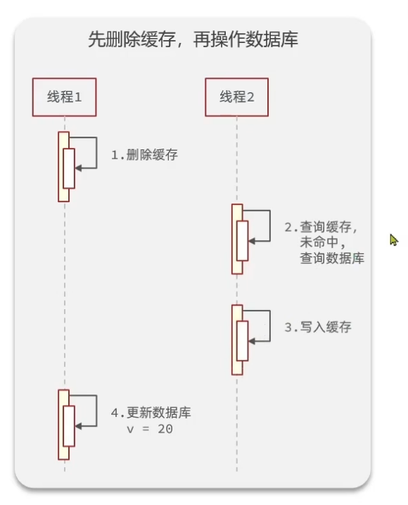
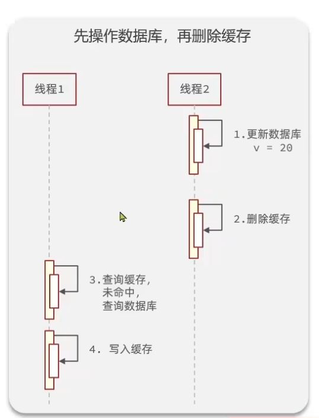
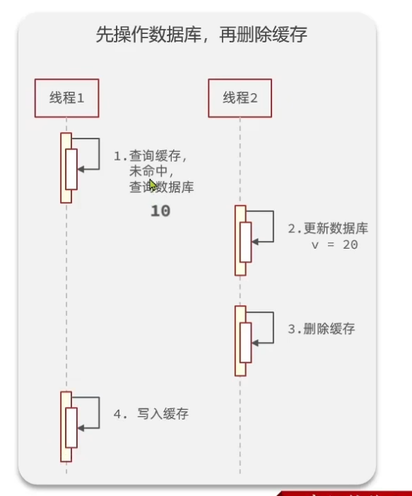

- [商品查询缓存](#商品查询缓存)
  - [什么是缓存（cache）](#什么是缓存cache)
    - [缓存的优缺点](#缓存的优缺点)
  - [添加商户缓存原理](#添加商户缓存原理)
    - [代码实现](#代码实现)
  - [商品分类查询缓存](#商品分类查询缓存)
    - [String形式存入redis](#string形式存入redis)
  - [缓存更新机制](#缓存更新机制)
    - [缓存更新的三种方法](#缓存更新的三种方法)
      - [方案简介](#方案简介)
      - [缓存主动更新的策略](#缓存主动更新的策略)
      - [缓存主动更新三个问题](#缓存主动更新三个问题)
        - [1.是删除缓存还是覆盖缓存？](#1是删除缓存还是覆盖缓存)
        - [2.如何保证对于数据库跟缓存的更新一致呢？](#2如何保证对于数据库跟缓存的更新一致呢)
        - [3.是先操作数据库还是缓存呢？](#3是先操作数据库还是缓存呢)
          - [先删除缓存](#先删除缓存)
          - [先修改数据库](#先修改数据库)
- [商品更新缓存](#商品更新缓存)

# 商品查询缓存
## 什么是缓存（cache）
缓存就是数据交换的缓冲区，是存储数据的临时地方，一般读写性较高。

### 缓存的优缺点
—优点：降低后端负载，提高读写效率，降低响应时间
—缺点：数据不一致，代码维护成本，运营成本

## 添加商户缓存原理

>[!TIP]
>相比较于之前的逻辑，这里先会查询redis，没有在查数据库，再加入redis中

### 代码实现
~~~java
//controller层：
 @GetMapping("/{id}")
    public Result queryShopById(@PathVariable("id") Long id) {
        return shopService.queryById(id);
    }//这里新定义一个方法，先查redis
//Service层：
@Service
public class ShopServiceImpl extends ServiceImpl<ShopMapper, Shop> implements IShopService {
    @Resource
    private StringRedisTemplate stringRedisTemplate;

    @Override
    public Object quertById(Long id) {
        String key = CACHE_SHOP_KEY + id;
        //从redis里查询
        String shopJson = stringRedisTemplate.opsForValue().get(key);

        //查到了，转成bean返回
        if(!StrUtil.isNotBlank(shopJson)){
            Shop shop = JSONUtil.toBean(shopJson,Shop.class);
            return Result.ok(shop);
        }
        //不存在，根据id查询数据库
        Shop shop = getById(id);

        //不存在数据库返回错误
        if(shop == null){
            return Result.fail("店铺不存在！");
        }

        //存在，写入redis
        stringRedisTemplate.opsForValue().set(key,JSONUtil.toJsonStr(shop));
        return Result.ok(shop);
    }
}
~~~
>[!NOTE]
>这里用了很多Hutool里的方法: 
1.StrUtil.isNotBlank():传入的是字符串，判断是否为空，即便是"  "也算作空，不为空返回true; 
>2.JSONUtil.toBean():作用是将字符串转化成bean对象，传入的参数，一个是转化的对象，另一个是要转化的对象类. 
>3.JSONUtil.toJsonStr():就是将一个对象转化为JSON字符串

## 商品分类查询缓存
思路一致，但是查询的结果是list集合，因为有很多分类，这里采用两种方式分别是string,hash,list的redis查询
### String形式存入redis
~~~java
//controller:
 @GetMapping("list")
    public Result queryTypeList() {
        return typeService.queryList();
    }
//Service层:
 Result queryList();

@Service
public class ShopTypeServiceImpl extends ServiceImpl<ShopTypeMapper, ShopType> implements IShopTypeService {

    @Resource
    private StringRedisTemplate stringRedisTemplate;
    @Override
    public Result queryList() {
        String shopsort=stringRedisTemplate.opsForValue().get(SHOP_SORT_KEY);

        if(StrUtil.isNotBlank(shopsort)){
            List<ShopType>list= JSONUtil.toList(shopsort,ShopType.class);
            return Result.ok(list);
        }

        //redis中没有，查询数据库,这里的意思是查询然后按照sort进行排序升序 ASC，最后返回list的类型
        List<ShopType> typeList = query().orderByAsc("sort").list();
        //数据库中没有，报错
        if (CollectionUtil.isEmpty(typeList)) {
            return Result.fail("列表信息不存在");
        }
       stringRedisTemplate.opsForValue().set(SHOP_SORT_KEY,JSONUtil.toJsonStr(typeList)); 
       return Result.ok(typeList);

    }
}

//存list
 @Override
    public Result queryList() {
        //使用list取 [0 -1] 代表全部
        //从redis中查询所有分类
        List<String> shopTypeList = redisTemplate.opsForList().range(SHOP_LIST_KEY, 0, -1);
        if (CollectionUtil.isNotEmpty(shopTypeList)) {
            //shopTypeList.get(0) 其实是获取了整个List集合里的元素,0是第0个key
            //查询到，直接返回
            List<ShopType> types = JSONUtil.toList(shopTypeList.get(0), ShopType.class);
            return Result.ok(types);
        }
 
        //redis中没有，查询数据库
        List<ShopType> typeList = query().orderByAsc("sort").list();
        //数据库中没有，报错
        if (CollectionUtil.isEmpty(typeList)) {
            return Result.fail("列表信息不存在");
        }
 
        //list 存
        //数据库中有，存到redis，注意存的位置和上面取的位置一致。
        String jsonStr = JSONUtil.toJsonStr(typeList);
        redisTemplate.opsForList().leftPushAll(SHOP_LIST_KEY, jsonStr);
        return Result.ok(typeList);
 
    }
~~~
## 缓存更新机制
### 缓存更新的三种方法
#### 方案简介
1. 方案一：Cache Aside 删除缓存（业界主流）
2. 方案二：写库同步 SET 更新缓存
3. 方案三：仅依赖 TTL 过期自动淘汰

| 对比维度 | 方案一：写库后删除缓存 | 方案二：写库后直接更新缓存 | 方案三：TTL 自动过期失效 |
| :--- | :--- | :--- | :--- |
| 核心执行流程 | 1. 更新数据库 2. DEL 删除缓存 Key 3. 查询时回源数据库，自动回填新缓存 | 1. 更新数据库 2. SET 覆盖 Redis 旧数据 | 1. 仅更新数据库，不操作缓存 2. 等待 Key 超时自动清除 |
| 数据一致性 | 高，极小概率瞬时脏读，延迟双删可解决 | 低，并发写会出现新旧缓存覆盖错乱 | 极低，TTL 周期内全是脏数据 |
| Redis 性能开销 | 单次 DEL 指令，大对象节省网络流量 | 单次 SET 指令，大数据传输开销高 | 无写缓存开销，读取命中性能最好 |
| 并发安全风险 | 极低，可通过延迟双删兜底 | 高，多线程并发写易缓存错乱 | 全程存在脏数据窗口 |
| 适用业务场景 | 用户、订单、商品等频繁更新的核心业务 | 静态字典、常量、几乎不变的基础配置 | 统计报表、临时热点、允许短暂不一致的非核心数据 |
| 优点 | 1. 一致性可控，生产通用标准方案 2. 删除大对象比更新更省带宽 3. 不会缓存冗余旧数据 | 1. 查询永久命中缓存，无 DB 回源压力 2. 业务逻辑简单直观 | 1. 代码极简，无需手动维护缓存 2. 无缓存写入耗时 |
| 缺点 | 极端并发存在瞬时脏读，需额外延迟删除逻辑 | 并发写场景极易出现缓存数据错乱 | TTL 窗口数据不一致，禁止用于交易类核心数据 |
| 兜底优化方案 | 延迟双删、分布式锁 | 分布式锁串行更新缓存 | 缩短 TTL + 定时全量刷新兜底 |
#### 缓存主动更新的策略
1.调用者先进行更新数据库，再更新缓存
2.缓存与数据库和为一体，调用者无需关心一致性问题
3.只关心缓存，通过另外的线程异步更新数据库
>[!WARNING]
>第二个的开发**难度大**，比较复杂，第三个很容易造成**数据库与缓存不一致**的情况，所以第一种方案最优
#### 缓存主动更新三个问题
##### 1.是删除缓存还是覆盖缓存？
删除更方便，覆盖缓存的话次数多，并且没有必要的操作偏多
##### 2.如何保证对于数据库跟缓存的更新一致呢？
对于单体系统，利用事务即可，对于分布式系统，就要用TTC

##### 3.是先操作数据库还是缓存呢？
###### 先删除缓存
正常逻辑：

>[!TIP]
>这里当需要更改数据是，先删除了缓存，然后再更换数据库，这是当下一次查询时发现缓存没有，就会查数据库，此时已经更新了，那么写入缓存，数据统一；

线程安全：

>[!TIP]
>当数据要更新时，先删除缓存，然后在进行数据库更换的过程中，突然第二个线程进入，查询了缓存没有，去查询数据库，但此时数据库数据没更新，此时缓存跟数据库不一致了。

###### 先修改数据库
正常逻辑：

>[!TIP]
>当数据需要更新，我先进行数据库更新，再删除缓存，当下一次操作时，缓存没有查到，就去数据库查询，然后写入缓存

线程安全

>[!TIP]
>此时当我的缓存恰好失效时，我查询缓存，未命中去查询数据库，查到后在我写入缓存时，突然要更新数据库，并且删除缓存，数据库更新完后，在执行之前的写入缓存，这时候不一致了。但是概率极小，因为**缓存写入很快**，并且**缓存恰好失效时查询概率也小**。

所以采用第二种更好
# 商品更新缓存
>[!IMPORTANT]
>基于上面分析的数据更新时**要先更新数据库，再更新缓存**，那么我们一定要再缓存内部加入有效期，所以在查询商品缓存时，**未命中要加入有效时间**。
~~~java
   stringRedisTemplate.opsForValue().set(key,JSONUtil.toJsonStr(shop),CAHE_SHOP_TTL, TimeUnit.MINUTES);
~~~
下面是更新数据的功能代码实现
~~~java
//Controller
 @PutMapping
    public Result updateShop(@RequestBody Shop shop) {
        // 写入数据库
        return  shopService.update(shop);
    }
//Service
Result update(Shop shop);
//ServiceImpl
 @Override
    @Transactional
    public Result update(Shop shop){
        //1.更新数据库
        updateById(shop);
        //2.更新缓存
        Long id=shop.getId();
        if(id == null){
            return Result.fail("店铺的id不能为空");
        }
        stringRedisTemplate.delete(CACHE_SHOP_KEY+id);
        return Result.ok();
    }    
~~~
>[!TIP]
>这里记得加**事务**保持原子一致性