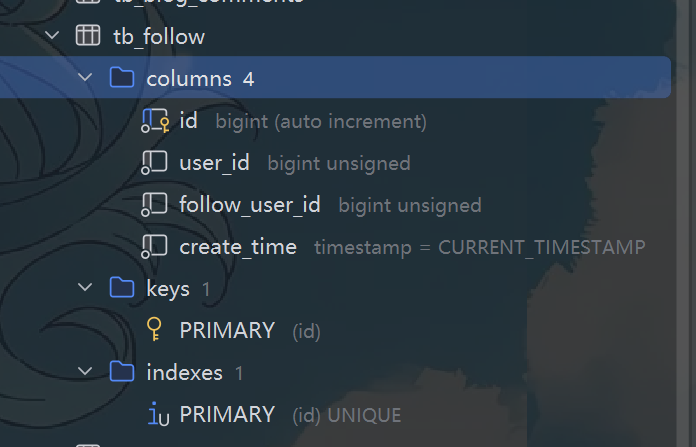
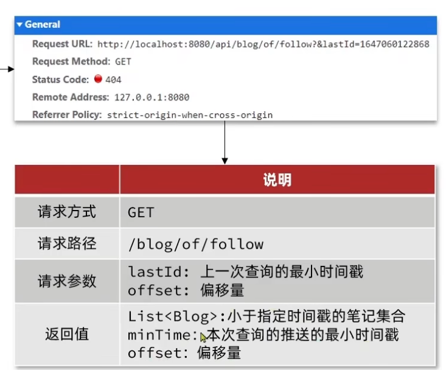

- [一、关注跟取关功能](#一关注跟取关功能)
  - [1.1 数据库建表](#11-数据库建表)
  - [1.2 逻辑思路](#12-逻辑思路)
  - [1.3 代码实现](#13-代码实现)
- [二、共同关注](#二共同关注)
  - [2.1 共同关注，笔记查询](#21-共同关注笔记查询)
  - [2.2 逻辑思路](#22-逻辑思路)
  - [2.3 代码实现](#23-代码实现)
- [三、文章推送](#三文章推送)
  - [3.1 推送至粉丝收件箱](#31-推送至粉丝收件箱)
  - [3.2 feed流滚动查询收件箱](#32-feed流滚动查询收件箱)
    - [3.2.1 什么是feed流](#321-什么是feed流)
    - [3.2.2 优点以及实现思路](#322-优点以及实现思路)
    - [3.2.3 代码实现](#323-代码实现)

# 一、关注跟取关功能
## 1.1 数据库建表

>[!NOTE]
这里id是自增的，user_id指的是粉丝id，follow_user_id是要关注的博主id

## 1.2 逻辑思路
我们想要实现用户可以看哪些人关注了，哪些没有，并且可以点击关注而关注，那我们需要一个**boolean值来标记**哪些关注了，哪些没有。关注的动作是一个简单的crud，我们**直接操作数据库，关注就增加，取关就删除即可**，这里的数据都封装在**Follow中**去写入数据库
>[!TIP]
Follow中又userId，FollowUserId是需要我们写入的。

## 1.3 代码实现
controller:
~~~java
@RestController
@RequestMapping("/follow")
public class FollowController {
    @Resource
    private IFollowService followService;
    @PutMapping("/{followUserId}/{isFollow}")
    public Result follow(@PathVariable Long followUserId, @PathVariable Boolean isFollow){
        return followService.follow(followUserId,isFollow);
    }

    @GetMapping("/or/not/{followUserId}")
    public Result follow(@PathVariable Long followUserId){
        return followService.isFollow(followUserId);
    }
}
~~~
Service
~~~java
@Service
public class FollowServiceImpl extends ServiceImpl<FollowMapper, Follow> implements IFollowService {
    @Override
    public Result follow(Long followId,Boolean isFollow){
        //获取用户id
        Long userId = UserHolder.getUser().getId();
        //判断是取关还是关注
        if(isFollow){
            //关注
            Follow follow = new Follow();
            follow.setUserId(userId);
            follow.setFollowUserId(followId);
            save(follow);
        }
        else{//取关
            remove(new QueryWrapper<Follow>()
                    .eq("user_id", userId).eq("follow_user_id", followId));
        }
        return Result.ok();
    }

    @Override
    public Result isFollow(Long followUserId){
        //获取用户id
        Long userId = UserHolder.getUser().getId();

        //查询是否关注
        Integer count = query().eq("user_id", userId).eq("follow_user_id", followUserId).count();

        return Result.ok(count > 0);
    }
}
~~~
# 二、共同关注

## 2.1 共同关注，笔记查询
传给前端，便于展示博主信息
~~~java
// UserController 根据id查询用户
    @GetMapping("/{id}")
    public Result queryUserById(@PathVariable("id") Long userId){
        // 查询详情
        User user = userService.getById(userId);
        if (user == null) {
            return Result.ok();
        }
        UserDTO userDTO = BeanUtil.copyProperties(user, UserDTO.class);
        // 返回
        return Result.ok(userDTO);
    }

    // BlogController
    @GetMapping("/of/user")
    public Result queryBlogByUserId(
            @RequestParam(value = "current", defaultValue = "1") Integer current,
            @RequestParam("id") Long id) {
        // 根据用户查询
        Page<Blog> page = blogService.query()
                .eq("user_id", id).page(new Page<>(current, SystemConstants.MAX_PAGE_SIZE));
        // 获取当前页数据
        List<Blog> records = page.getRecords();
        return Result.ok(records);
    }
~~~
## 2.2 逻辑思路
就是通过redis中的set集合中的交集实现的，所以在上面我们要加入将关注者存入set中，然后再进行比较两个用户id的集合之间的交集

## 2.3 代码实现
加入redis
~~~java
  //存入redis中
            if(save){
                stringRedisTemplate.opsForSet().add(key,followId.toString());
            }
       //移除redis
            if(remove) {
                stringRedisTemplate.opsForSet().remove(key, followId.toString());
            }

~~~
核心逻辑
~~~java
 @Override
    public Result followCommons(Long id){
        //1.获取当前用户
        UserDTO user = UserHolder.getUser();
        if(user == null){
            return Result.fail("失败");
        }
        Long userId = user.getId();
        String key = "follows:" + userId;

        //2.求交集
        String key2 = "follows:" + id;
        Set<String> intersect = stringRedisTemplate.opsForSet().intersect(key,key2);

        //3.解析集合
        List<Long >ids = intersect.stream().map(Long::valueOf).collect(Collectors.toList());
        //4.查询用户
        List<UserDTO> users = userService.listByIds(ids)
                .stream()
                .map(use -> BeanUtil.copyProperties(use, UserDTO.class)).collect(Collectors.toList());
        return Result.ok(users);
    }
~~~

# 三、文章推送
## 3.1 推送至粉丝收件箱
思路很简单就是在博主发布新的blog时在存入数据库的同时，在**额外的先查询关注的粉丝**，在写入到**redis**中，每个粉丝的收件箱都是一个**set**，以便于后面分页查询时更高效
~~~java
  @Override
    public Result saveBlog(Blog blog) {
        //获取当前博主用户
        UserDTO user = UserHolder.getUser();
        blog.setUserId(user.getId());
        //存入数据库blog表
        boolean isSuccess = save(blog);
        if(!isSuccess){
            return Result.fail("笔记上传失败");
        }
        //查询粉丝
        List<Follow> userId = followService.query().eq("follow_user_id", user.getId()).list();
        //推送给粉丝
        for(Follow follow : userId){
            //获取粉丝id
            Long followId = follow.getId();
            //将文章id放入粉丝的set收件箱中
            String key = "feed:" + followId;
            stringRedisTemplate.opsForZSet()
                .add(key, blog.getId().toString(), System.currentTimeMillis());
        }
        return Result.ok(blog.getId());
    }
~~~

## 3.2 feed流滚动查询收件箱

### 3.2.1 什么是feed流
Feed 流（信息流）是持续滚动、按算法 / 时间排序、不断加载新内容的垂直内容列表，用户上下滑动就能不间断浏览图文、视频、动态，是现在绝大多数 App 的核心内容形式。
### 3.2.2 优点以及实现思路
>[!TIP]
采取传统的分页查询（PageSize,PageNum）在**数据不断更新**插入时容易出现**重复或者遗漏**的情况，所以这里是滚动查询，就是利用**SortedSet**用**时间戳**作为**scores**作为排序的依据，然后每次查询都需要知道**上一次查询的最小值，跳过重复的** 

### 3.2.3 代码实现
新建一个类便于传给前端
~~~java
@Data
public class ScrollResult {
    private List<?>list;
    private Long mintime;
    private Integer offset;
}

~~~
controller:
~~~java
  @GetMapping("/of/follow")
    public Result queryBlogOfFollow(@RequestParam("lastId")Long max,@RequestParam(value = "offset",defaultValue = "0")Integer offset){
        return blogService.queryBlogOfFollow(max,offset);
    }
~~~
Service:
~~~java
    public Result queryBlogOfFollow(Long max,Integer offset){
        //获取当前用户
        Long userId = UserHolder.getUser().getId();
        //查询收件箱
        String key = "feed:" + userId;
        Set<ZSetOperations.TypedTuple<String>> typedTuples = stringRedisTemplate.opsForZSet()
                .reverseRangeByScoreWithScores(key, 0, max, offset, 2);
        //3.非空判断
        if(typedTuples == null || typedTuples.isEmpty()){
            return Result.ok();
        }
        //4.解析数据
        List<Long> ids = new ArrayList<>(typedTuples.size());
        long minTime = 0;
        //表示跳过的查询数据
        int os = 1;
        for(ZSetOperations.TypedTuple<String> tuple:typedTuples){
            //获取id
            ids.add(Long.valueOf(tuple.getValue()));
            //获取分数（时间戳），转成long
            long time = tuple.getScore().longValue();
            //查到相同的就跳过，更新下一次跳过时间
            if(time == minTime){
                os++;
            }
            else{
                //因为是按照顺序取出
                minTime = time;
                //跳过当前
                os = 1;
            }
            if (ids.size() < typedTuples.size()) {
                continue;
            }
            //根据id查询blog,直接listByIds(ids)查询的顺序不对。与上面共同关注一样
            Map<Long, Blog> blogs = listByIds(ids).stream()
                    .collect(Collectors.toMap(Blog::getId, Function.identity()));
            
            //返回
            List<Blog> blogList = ids.stream()
                    .map(blogs::get)
                    .filter(Objects::nonNull)
                    .collect(Collectors.toList());
            blogList.forEach(blog -> {
                //查询博主，展示出来
                queryBlogUser(blog);
                //查询是否关注
                isBlogLiked(blog);
            });

            //封装返回
            ScrollResult result = new ScrollResult();
            result.setList(blogList);
            result.setMinTime(minTime);
            result.setOffset(os);
            return Result.ok(result);
        }
        return Result.ok();
    }
~~~
