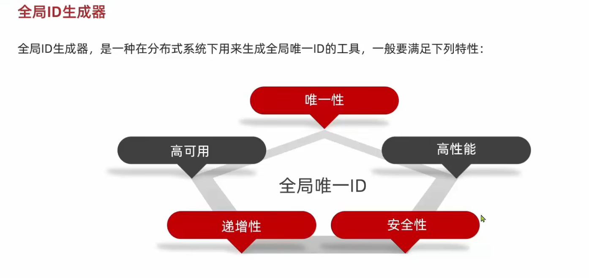
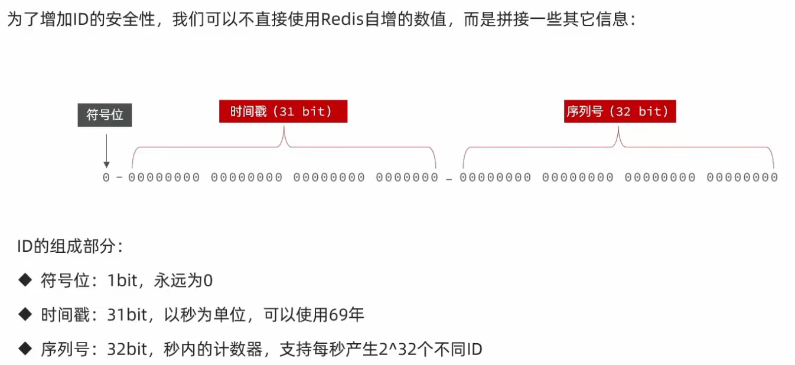
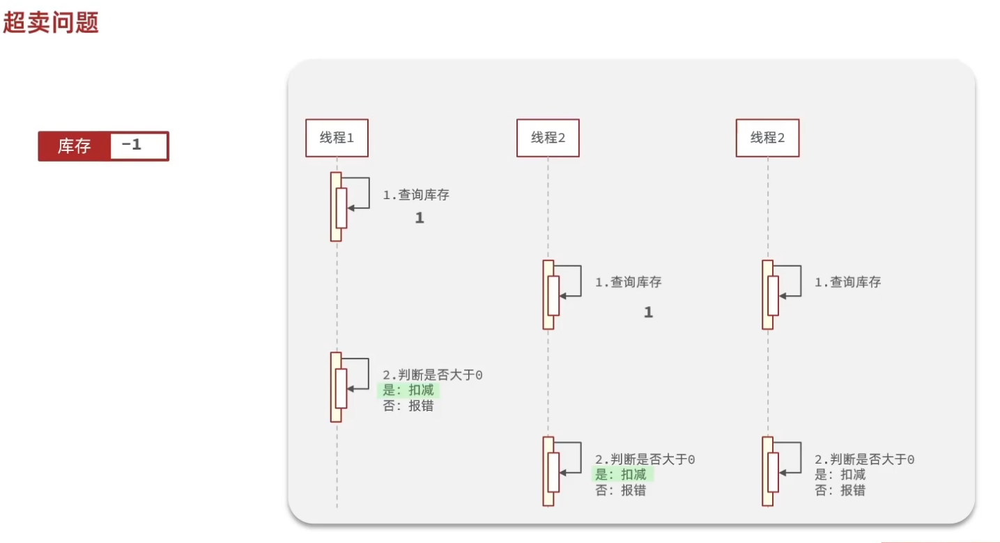
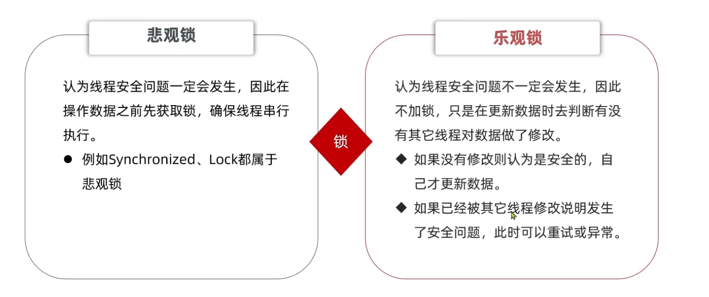

- [一、优惠券全局唯一ID](#一优惠券全局唯一id)
  - [1.1 为什么需要唯一id](#11-为什么需要唯一id)
  - [1.2 全局ID生成器的特性](#12-全局id生成器的特性)
  - [1.3 如何设置唯一ID](#13-如何设置唯一id)
  - [1.4 代码实现](#14-代码实现)
- [二、秒杀券的实现](#二秒杀券的实现)
  - [2.1 实现流程](#21-实现流程)
  - [2.2 代码实现](#22-代码实现)
  - [2.3 超卖问题](#23-超卖问题)
    - [2.3.1 超卖问题的原因](#231-超卖问题的原因)
    - [2.3.2 如何解决](#232-如何解决)
      - [3.2.1 乐观锁的实现](#321-乐观锁的实现)
        - [1.版本号法](#1版本号法)
        - [2.CAS(compare and set)](#2cascompare-and-set)
      - [3.2.2 乐观锁CAS代码实现](#322-乐观锁cas代码实现)
  - [2.4 一人一单](#24-一人一单)
    - [2.4.1 实现思路](#241-实现思路)
    - [2.4.2 悲观锁的应用](#242-悲观锁的应用)
    - [2.4.3 实现代码](#243-实现代码)
    - [2.4.4 分布式问题](#244-分布式问题)

# 一、优惠券全局唯一ID
## 1.1 为什么需要唯一id
因为优惠券是一次性使用的，每个优惠券都必须有不同的id。并且也不能像mysql里面的主键自增一样，这样的话就会很有规律，容易看出店家的营销情况。
## 1.2 全局ID生成器的特性

## 1.3 如何设置唯一ID
这里可以采取redis里面的**incrby**，但是这样也是有规律的所以我们采取了一个**64bit位**的数，前面四个存储的是**时间**，即**现在的时间到自定义的起始时间**，后四位则是redis的**自增**记录，这样就解决了一个是**自增的规律性**，一个是在同一时间内，有大量的优惠券，避免了**重复的id**两个问题。

## 1.4 代码实现
~~~java

@Component
public class RedisIDWorker {
    private static final long BEGIN_TIMESTAMP = 1640995200L;
    private static final int COUNT_BASE = 32;
    @Autowired
    private StringRedisTemplate stringRedisTemplate;
    public long nextId(String keyprefix){
        //获取现在的时间
        LocalDateTime now  = LocalDateTime.now();
        //转化成秒
        long nowSecond = now.toEpochSecond(ZoneOffset.UTC);
        //计算间隔
        long timestamp = nowSecond - BEGIN_TIMESTAMP;

        //生成序列化
        String date = now.format(DateTimeFormatter.ofPattern("yyyy:MM:dd"));
        long count = stringRedisTemplate.opsForValue().increment("icr:"+keyprefix+":"+date);
        return timestamp << COUNT_BASE | count;
    }
}
~~~
>[!NOTE]
注意这里redis里面的key要设置年月日否则的话，key名一样，这样是存不下的，因为只靠递增只有32位

# 二、秒杀券的实现
## 2.1 实现流程
1.前端传入优惠券的id给后端，后端从数据库中查询
2.先判断是否过期，即开始时间是否开始，结束时间是否结束
3.查看存储优惠券数量，查看剩余库存
4.更新优惠券数量，修改数据库
5.生成新的订单，包含优惠券id，用户id，订单id；
6.将订单存入数据库

## 2.2 代码实现
~~~java
@Service
public class VoucherOrderServiceImpl extends ServiceImpl<VoucherOrderMapper, VoucherOrder> implements IVoucherOrderService {

    @Resource
    private ISeckillVoucherService seckillVoucherService;

    @Resource
    private RedisIDWorker redisIDWorker;

    @Override
    @Transactional
    public Result seckillVoucher(Long id) {
        //查询当前这个秒杀券的库存
        SeckillVoucher voucher = seckillVoucherService.getById(id);
        //判断是否开始，注意这里要是在当前之后会返回false
        if(voucher.getBeginTime().isAfter(LocalDateTime.now())){
            return Result.fail("秒杀尚未开始");
        }
        //判断是否结束
        if(voucher.getEndTime().isBefore(LocalDateTime.now())){
            return Result.fail("秒杀已经结束");
        }
        //查询库存是否剩余
        if(voucher.getStock() < 1){
            return Result.fail("库存见底");
        }
        //剩余调用mp修改数据库
        boolean success = seckillVoucherService
                .update().setSql("stock = stock - 1")
                .eq("voucher_id",id)
                .gt("stock",0)//判断是否大于0，乐观锁
                .update();
        if(!success){
            return Result.fail("修改失败");
        }
        //生成订单，返回订单号
        VoucherOrder voucherOrder = new VoucherOrder();
        //获取用户id
        Long userId = UserHolder.getUser().getId();
        //设置用户id
        voucherOrder.setUserId(userId);
        //设置秒杀券id
        voucherOrder.setVoucherId(id);
        //获取订单id
        Long orderId = redisIDWorker.nextId("order");
        //设置订单id
        voucherOrder.setId(redisIDWorker.nextId("order"));
        save(voucherOrder);
        return Result.ok(orderId);
    }
}
~~~
>[!TIP]
>这里的UserId本质是一个自定义类，里面是定义了静态ThreadLocal.

## 2.3 超卖问题
### 2.3.1 超卖问题的原因

>[!NOTE]
这里我们发现，超卖问题就是因为多个线程意外进入，导致的卖出的优惠券数额不对，出现了多卖到负数的情况
### 2.3.2 如何解决

>[!NOTE]
互斥锁也是悲观锁，区别就是悲观锁一定会获取锁，乐观锁是先不获取，如果数据已经被其他线程修改就触发乐观锁，**悲观锁性能低**
#### 3.2.1 乐观锁的实现
##### 1.版本号法
就是通过一个变量version来代表每一次的数据修改，没修改一次就会加一，这样在有线程乱入，修改时，发现当前版本号与之前的不一致则代表已经被修改就会执行失败
##### 2.CAS(compare and set)
跟版本号差不多，就是这里的库存减少可以跟版本号合并，充当一个作用
#### 3.2.2 乐观锁CAS代码实现
~~~java
  boolean success = seckillVoucherService
                .update().setSql("stock = stock - 1")
                .eq("voucher_id",id)
                .gt("stock",0)//判断是否大于0，乐观锁
                .update();
        if(!success){
            return Result.fail("修改失败");
        }
~~~
>[!NOTE]
这里之所以不是判断库存是否相等，是因为这样会导致很多线程失败。
## 2.4 一人一单
### 2.4.1 实现思路
就是在超卖问题基础上，在查询订单是否存在，存在就代表该用户已经有了，就返回失败，没有订单就创建订单
### 2.4.2 悲观锁的应用
不加锁的话，一个用户会买很多券，所以需要锁，又因为我们是将订单加入数据库，所以乐观锁无法查是否相等，只能用悲观锁了
### 2.4.3 实现代码
~~~java
@Service
public class VoucherOrderServiceImpl extends ServiceImpl<VoucherOrderMapper, VoucherOrder> implements IVoucherOrderService {

    @Resource
    private ISeckillVoucherService seckillVoucherService;

    @Resource
    private RedisIDWorker redisIDWorker;

    @Override
    public Result seckillVoucher(Long id) {
        //查询当前这个秒杀券的库存
        SeckillVoucher voucher = seckillVoucherService.getById(id);
        //判断是否开始，注意这里要是在当前之后会返回false
        if(voucher.getBeginTime().isAfter(LocalDateTime.now())){
            return Result.fail("秒杀尚未开始");
        }
        //判断是否结束
        if(voucher.getEndTime().isBefore(LocalDateTime.now())){
            return Result.fail("秒杀已经结束");
        }
        //查询库存是否剩余
        if(voucher.getStock() < 1){
            return Result.fail("库存见底");
        }
        Long userid = UserHolder.getUser().getId();
        synchronized (userid.toString().intern()){
            //由于事务是需要代理对象的，直接调用的话是没有代理对象的，所以这里需要调用api获取本类的代理对象，这个对象是接口层的
            IVoucherOrderService proxy =(IVoucherOrderService) AopContext.currentProxy();
            return proxy.createVoucherOrder(id);
        }
    }
    @Transactional
    public Result createVoucherOrder(Long id){
        //剩余调用mp修改数据库
        boolean success = seckillVoucherService
                .update().setSql("stock = stock - 1")
                .eq("voucher_id",id)
                .gt("stock",0)//判断是否大于0，乐观锁
                .update();
        if(!success){
            return Result.fail("修改失败");
        }
        //生成订单，返回订单号
        VoucherOrder voucherOrder = new VoucherOrder();
        //获取用户id
        Long userId = UserHolder.getUser().getId();
        //设置用户id
        voucherOrder.setUserId(userId);
        //设置秒杀券id
        voucherOrder.setVoucherId(id);
        //获取订单id
        Long orderId = redisIDWorker.nextId("order");
        //设置订单id
        voucherOrder.setId(orderId);
        save(voucherOrder);
        return Result.ok(orderId);
    }
}
~~~
>[!NOTE]
注意这里的锁的位置，直接使用锁方法，会大大降低效率，加在方法代码块里会出现，在事务提交成功前，就进行下一个线程了，出现不安全的问题。
~~~java
    //上述api调用需要引入该依赖
    //并且还要在启动类上加入注解，@EnableAspectJAutoProxy(exposeProxy = true)暴露事务才行
   <dependency>
            <groupId>org.aspectj</groupId>
            <artifactId>aspectjweaver</artifactId>
        </dependency>
~~~
### 2.4.4 分布式问题
现在的方案在**单体系统**中是正常的，但是一旦换**分布式系统**，依然会出现并发问题 
原因就是每一个服务器都有一个自己的**jvm**，每个jvm内部都有一个**锁监听器**来管理，所以多个服务器有多个jvm，也就有多个监听器了，那么锁对于同一个用户就有可能失去效果，从而出现问题。这个时候就需要**分布式锁**去解决问题了。