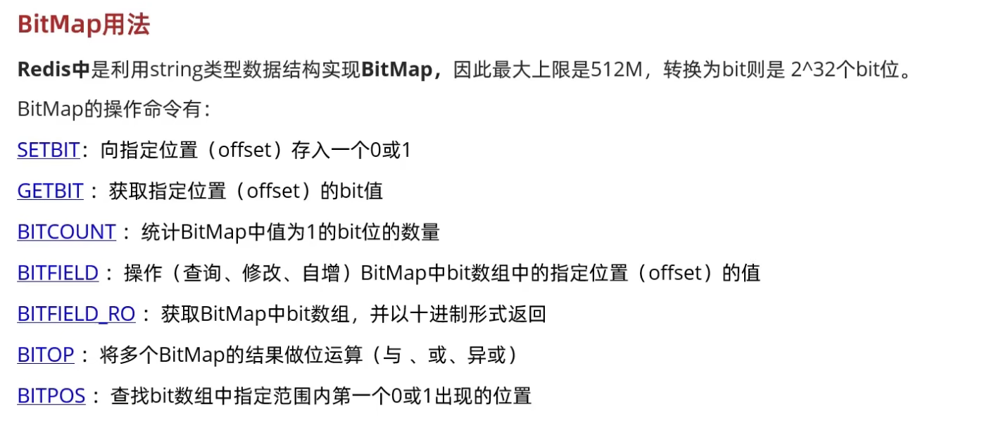
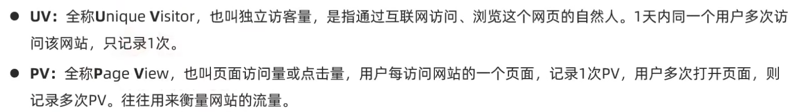
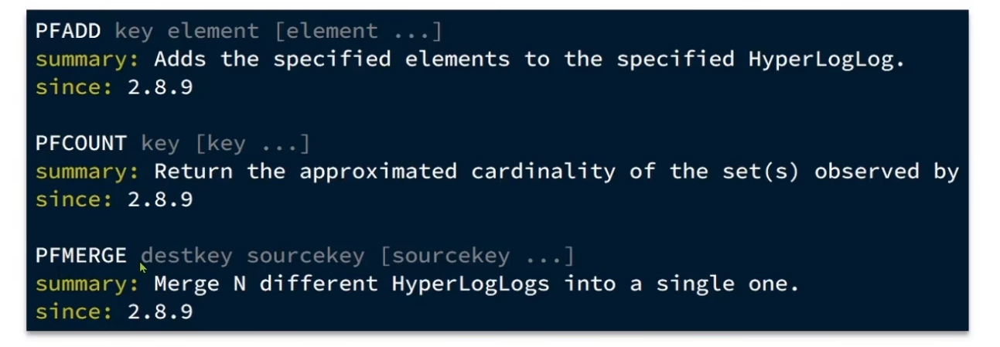

- [一、用户签到](#一用户签到)
  - [1.1 bitMap基本概念](#11-bitmap基本概念)
  - [1.2 优点](#12-优点)
  - [1.3 实现签到](#13-实现签到)
    - [1.3.1 思路](#131-思路)
    - [1.3.2 代码实现：](#132-代码实现)
  - [1.4、连续签到统计](#14连续签到统计)
    - [1.4.1 业务逻辑](#141-业务逻辑)
    - [1.4.2 代码实现](#142-代码实现)
- [二、UV统计](#二uv统计)
  - [2.1 PV跟UV概念](#21-pv跟uv概念)
  - [2.2 HyperLogLog(HLL)概念](#22-hyperlogloghll概念)
  - [2.3 特点](#23-特点)
  - [语法](#语法)
# 一、用户签到
## 1.1 bitMap基本概念

SETBIT key offset(从0开始) value 
GETBIT key offset 
BITFIELD key [GET type offset] [SET type offset value] [INCRBY type offset increment] [OVERFLOW WRAP|SAT|FAIL]
## 1.2 优点
使用数据库存储的话，会占用大量的内存，而这个只需要用**01**表示是否签到，占用的位数少，**内存少**

## 1.3 实现签到
### 1.3.1 思路
根据bitMap传入key，以及天数，跟01，这里key就是**前缀加用户id加年跟月组成的后缀**
### 1.3.2 代码实现：
Controller:
~~~java
 @PostMapping("/sign")
    public Result sign(){
        return userService.sign();
    }
~~~
Service:
~~~java
@Override
    public Result sign(){
        //获取用户id
        Long id = UserHolder.getUser().getId();
        LocalDateTime time = LocalDateTime.now();
        String keySuffix = time.format(DateTimeFormatter.ofPattern(":YYYYMM"));
        //key的形式为 sign:id:20233
        String key = USER_SIGN_KEY + id + keySuffix;
        //存入bitMap
        //当前日期号
        int day = time.getDayOfMonth();
        //这里的下标从一开始所以减一，注意也是opsForValue
        stringRedisTemplate.opsForValue().setBit(key,day-1,true);
        return Result.ok();
    }
~~~

## 1.4、连续签到统计
### 1.4.1 业务逻辑
查询从当前日期到0时的二进制，这里用到**BITFIELD**实现的，返回的是**十进制**，需要**位运算**计算有多少个连续的1.

### 1.4.2 代码实现
controller:
~~~java

    @GetMapping("/sign/count")
    public Result signCount(){
        return userService.signCount();
    }
~~~
Service：
~~~java
  @Override
    public Result signCount(){
        //获取用户id
        Long id = UserHolder.getUser().getId();
        LocalDateTime time = LocalDateTime.now();
        String keySuffix = time.format(DateTimeFormatter.ofPattern(":YYYYMM"));
        //key的形式为 sign:id:20233
        String key = USER_SIGN_KEY + id + keySuffix;
        //存入bitMap
        //当前日期号
        int day = time.getDayOfMonth();
        //获取截止到今天所有签到记录
        List<Long> longs = stringRedisTemplate.opsForValue().bitField(key,
                BitFieldSubCommands.create()
                        .get(BitFieldSubCommands.BitFieldType.unsigned(day)).valueAt(0)
        );
        if(longs == null || longs.isEmpty()){
            //没有结果
            return Result.fail("没有抽签结果");
        }
        Long num = longs.get(0);
        if(num == 0||num == null){
            return Result.ok(0);
        }
        int count = 0;
        while(true){
            //为0表示没签到
            if((num & 1) == 0){
                break;
            }else{
                count++;
            }
            num = num>>1;
        }
        return Result.ok(count);
    }
~~~

# 二、UV统计
## 2.1 PV跟UV概念

## 2.2 HyperLogLog(HLL)概念
是从LogLog算法衍生出的概率算法，用于确定非常大的集合的级数，而不需要存储其所有值。

## 2.3 特点
Redis中的HLL是基于string结构实现的，单个HLL的内存永远小于16kb，内存占用小。有一定的误差，0.81%。

## 语法

>[!TIP]
这里的**PFCOUNT**是统计的**UV**，不会重复统计