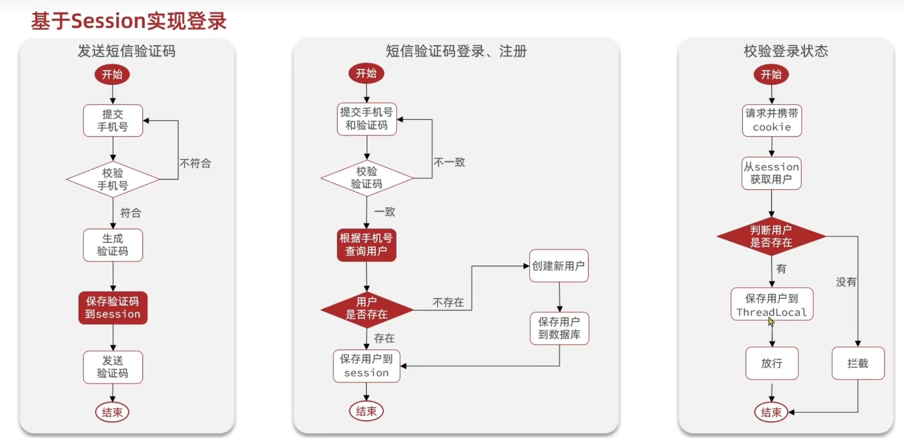
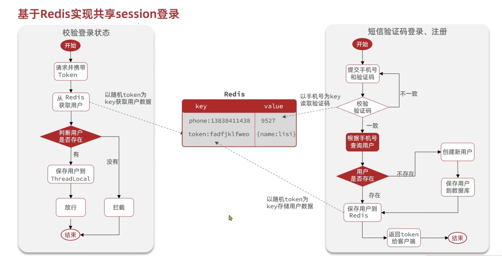

- [短信登陆](#短信登陆)
  - [基于session实现](#基于session实现)
    - [思路](#思路)
      - [1.生成验证码](#1生成验证码)
      - [2.登录](#2登录)
      - [3.检验登录状态](#3检验登录状态)
  - [基于session的弊端](#基于session的弊端)
  - [基于redis解决](#基于redis解决)
    - [思路](#思路-1)
    - [方法实现](#方法实现)

# 短信登陆

## 基于session实现

### 思路

#### 1.生成验证码
大致思路： 首先要**检验手机号**是否正确，然后在生成验证码，这个验证码就是一定位数的**随机数字组合**而成，这里用hutool包里的随机数生成更方便
~~~java
//Controller层：
  @PostMapping("code")//接口
    public Result sendCode(@RequestParam("phone") String phone, HttpSession session) {
        return userService.sendcode(phone, session);
    }
//Service层
//这里使用的是mp所以实现了ISercice接口
    public interface IUserService extends IService<User> {

    Result sendcode(String phone, HttpSession session);
}

@Service
@Slf4j
public class UserServiceImpl extends ServiceImpl<UserMapper, User> implements IUserService {

    @Override
    public Result sendcode(String phone, HttpSession session) {
        if (RegexUtils.isPhoneInvalid(phone)) {
            return Result.fail("手机号不正确");
        }

        String code = RandomUtil.randomNumbers(6);
        session.setAttribute("code", code);//存入code，便于后续检验是否正确
        log.debug("成功发送验证码{}", code);
        return Result.ok();
    }

}
~~~

#### 2.登录
~~~java
//Controller层：
    @PostMapping("/login")//接口，传入的参数就是自定义类，里面包含了基本信息，session负责存入一些重要信息
    public Result login(@RequestBody LoginFormDTO loginForm, HttpSession session) {
        return userService.login(loginForm, session);
    }

//Service层：
    public interface IUserService extends IService<User> {

    Result login(LoginFormDTO loginFormDTO,HttpSession session);
}
    @Service
@Slf4j
public class UserServiceImpl extends ServiceImpl<UserMapper, User> implements IUserService {

    @Override
    public Result login(LoginFormDTO loginFormDTO,HttpSession session){
        String phone = loginFormDTO.getPhone();
        if (RegexUtils.isPhoneInvalid(phone)) {
            return Result.fail("手机号不正确");
        }//这里采用的是hutool包里的判断手机号是否合法

        Object cachecode = session.getAttribute("code");
        if(cachecode == null || !loginFormDTO.getCode().equals(cachecode)){
            return Result.fail("验证码不对");
        }

        User user=query().eq("phone",phone).one();//mp的基本用法查询数据库书否含有电话号

        if(user == null){
            user =creatUser(phone);
            save(user);
        }//用户不存在就新建一个，并存入数据库中

        UserDTO userDTO = BeanUtil.copyProperties(user, UserDTO.class);//这里之所以要在new一个userDTO就是为了后续登陆成功返回信息不涉及私人信息
        session.setAttribute("user", userDTO);//放入session中，存储登陆信息，便于后续的拦截检验
        return Result.ok(userDTO);
    }

    private User creatUser(String phone) {
        User user = new User();
        user.setPhone(phone);
        user.setNickName(USER_NICK_NAME_PREFIX+RandomUtil.randomString(10));//这里前面的USER_NICK_NAME_PERIX是定义的一个常量就代表一个字符串
        return user;
    }
}
~~~
#### 3.检验登录状态
如何检验登录状态呢，思路很简单，就是我在每次调用接口的时候，如果有必要进行检验，那么就会被定义的拦截器拦截，然后通过**session获取当前用户**，如果是空代表没登陆，那么就会返回错误状态给前端，如果不为空则代表登录了。
~~~java
public class LoginInterceptor implements HandlerInterceptor {

    //这里定义了一个全局拦截器，拦截了所有的Controller接口，要实现HandlerIntercepter接口、
    //重写了两个方法，分别表示完成后，跟执行前
    @Override
    public void afterCompletion(HttpServletRequest request, HttpServletResponse response, Object handler, @Nullable Exception ex) throws Exception {
        UserHolder.removeUser();//UserHolder就是一个自定义类，里面是ThreadLocal，removerUser就是将线程里的用户移除，因为业务代码执行完毕了，就释放了。
    }

    @Override
    public boolean preHandle(HttpServletRequest request, HttpServletResponse response, Object handler) throws Exception {
        //获取session
        //去获取本次请求绑定的会话对象，不存在就返回 null，绝不自动创建 Session。
        HttpSession session = request.getSession(false);
        if (session == null) {
            response.setStatus(401);
            return false;
        }

        //获取session用户
        Object user = session.getAttribute("user");

        //3.判断用户是否存在
        if(user == null){
            //4不存在拦截
            response.setStatus(401);
            return false;

        }
        UserHolder.saveUser((UserDTO)user);//验证成功就存入ThreadLocal中，每个线程彼此也不影响
        return true;
    }
}
//还要定义一个配置类，才能应用这个拦截器
@Configuration
public class MvcConfig implements WebMvcConfigurer {

    //下面重写的放法就是加入拦截器，排除了部分不需要拦截的接口比如登录，比如商店浏览等等这些不需要检验登录状态
    @Override
    public void addInterceptors(InterceptorRegistry registry) {
        registry.addInterceptor(new LoginInterceptor())
                .excludePathPatterns(
                        "/user/code",
                        "/user/login",
                        "/shop/**",
                        "/shop-type/**",
                        "/voucher/**",
                        "/blog/hot",
                        "/upload/**"
                );
    }
}
~~~

## 基于session的弊端
我们发现，session是tomcat每个服务器独有的，也就是说多个服务器之前并不是互通的，如果后续采用多个服务器的话，会出现同一个用户登陆完之后，下一次访问出现仍需登录情况，原因就是session数据不共享。

## 基于redis解决
而redis首先存入以及读取速度快，并且不同服务器存入redis的话，数据共享，而且是关系型数据库，键值对的存储的形式。

### 思路

>[!TIP]
>1.采用redis之后，就不再使用session了，所以我们生成验证码，就需要存入redis中，但需要通过**键值对**的方法，那么我们可以用**电话作为key**存储，这样也不会重复也好查找。
>
>2.在登录以及登录状态验证时，都是将用户存到**ThreadLocal**里，同时登录时存入数据库，以及redis中，但是服务器并不会像session那样可以携带**sessionid登陆标识**，所以我们需要手动**生成token**作为标识给前端，前端在存入浏览器中存储地方，这样每次都会有，我们在检验登录时就可以**通过请求头名字获取标识**，在**redis中通过key**的名字也就是标识，来获取值了。
### 方法实现
~~~java
    @Service
@Slf4j
public class UserServiceImpl extends ServiceImpl<UserMapper, User> implements IUserService {

    @Resource
    private StringRedisTemplate stringRedisTemplate;

    @Override
    public Result sendcode(String phone) {
        if (RegexUtils.isPhoneInvalid(phone)) {
            return Result.fail("手机号格式错误");
        }

        String code = RandomUtil.randomNumbers(6);
        // 验证码直接写入 Redis，避免依赖 Session。
        stringRedisTemplate.opsForValue().set(
                LOGIN_CODE_KEY + phone,
                code,
                LOGIN_CODE_TTL,
                TimeUnit.MINUTES
        );
        log.debug("发送短信验证码成功，验证码：{}", code);
        return Result.ok();
    }

    @Override
    public Result login(LoginFormDTO loginFormDTO) {
        String phone = loginFormDTO.getPhone();
        if (RegexUtils.isPhoneInvalid(phone)) {
            return Result.fail("手机号格式错误");
        }

        String cacheCode = stringRedisTemplate.opsForValue().get(LOGIN_CODE_KEY + phone);
        if (cacheCode == null || !cacheCode.equals(loginFormDTO.getCode())) {
            return Result.fail("验证码错误");
        }

        User user = query().eq("phone", phone).one();
        if (user == null) {
            user = createUser(phone);
            save(user);
        }

        UserDTO userDTO = BeanUtil.copyProperties(user, UserDTO.class);
        String token = UUID.randomUUID().toString(true);

        // 将登录用户信息转成字符串 Hash，便于后续从 Redis 直接恢复登录态。
        Map<String, Object> userMap = BeanUtil.beanToMap(
                userDTO,
                new HashMap<>(),
                CopyOptions.create()
                        .setIgnoreNullValue(true)
                        .setFieldValueEditor((fieldName, fieldValue) -> fieldValue == null ? null : fieldValue.toString())
        );//这里后面的简写方式是为了将Long类型转化为string，否则会报错误无法转化

        String tokenKey = LOGIN_USER_KEY + token;
        stringRedisTemplate.opsForHash().putAll(tokenKey, userMap);
        stringRedisTemplate.expire(tokenKey, LOGIN_USER_TTL, TimeUnit.MINUTES);

        return Result.ok(token);
    }

    private User createUser(String phone) {
        User user = new User();
        user.setPhone(phone);
        user.setNickName(USER_NICK_NAME_PREFIX + RandomUtil.randomString(10));
        return user;
    }
}
~~~
>[!WARNING]
>上面以经做到了以redis为基础存储数据了，并且还设置了时间，但是问题在于这个有效时间是一旦创立就会进行，而我们想要的是用户不进行任何操作时才开始计时的，所以我们应该通过拦截器，每次有一次活动一定会被拦截（登录除外）那么我么可以覆盖之前的redis，从而达到更新时间的效果
~~~java
//这里定义了两个拦截器相比于之前，因为现在需要更新时间，所以我们单独定义一个RefashLoginIntercepter拦截器去刷新有效时间。先刷新 Token 再校验登录，避免刚过期的 Token 访问时直接拦截
public class LoginInterceptor implements HandlerInterceptor {

    @Override
    public boolean preHandle(HttpServletRequest request, HttpServletResponse response, Object handler) throws Exception {
        // 这里只负责拦截未登录请求，用户信息的刷新由 RefreshTokenInterceptor 处理。
        if (UserHolder.getUser() == null) {
            response.setStatus(401);
            return false;
        }
        return true;
    }
}

public class RefreshTokenInterceptor implements HandlerInterceptor {

    private final StringRedisTemplate stringRedisTemplate;

    public RefreshTokenInterceptor(StringRedisTemplate stringRedisTemplate) {
        this.stringRedisTemplate = stringRedisTemplate;
    }

    @Override
    public boolean preHandle(HttpServletRequest request, HttpServletResponse response, Object handler) throws Exception {
        String token = request.getHeader("authorization");
        if (StrUtil.isBlank(token)) {
            return true;
        }

        String tokenKey = LOGIN_USER_KEY + token;
        Map<Object, Object> userMap = stringRedisTemplate.opsForHash().entries(tokenKey);
        if (userMap.isEmpty()) {
            return true;
        }

        // 先把 Redis 中的用户信息放到 ThreadLocal，后续接口可直接读取。
        UserDTO userDTO = BeanUtil.fillBeanWithMap(userMap, new UserDTO(), false);
        UserHolder.saveUser(userDTO);

        // 刷新登录态，做到用户活跃时 token 自动续期。
        stringRedisTemplate.expire(tokenKey, LOGIN_USER_TTL, TimeUnit.MINUTES);
        return true;
    }

    @Override
    public void afterCompletion(HttpServletRequest request, HttpServletResponse response, Object handler, Exception ex) throws Exception {
        UserHolder.removeUser();
    }
}

~~~
~~~java
由于这里的拦截器是自定义的，所以不能交给spring管理，也不能注入stringRedisTemplate所以我们只能通过构造方法的方式给stringRedisTemplate赋值。

@Configuration
public class MvcConfig implements WebMvcConfigurer {

    @Resource
    private StringRedisTemplate stringRedisTemplate;

    @Override
    public void addInterceptors(InterceptorRegistry registry) {
        // 先尝试从 token 恢复用户，并刷新 Redis 中的有效期。
        registry.addInterceptor(new RefreshTokenInterceptor(stringRedisTemplate))
                .addPathPatterns("/**")
                .excludePathPatterns(
                        "/user/code",
                        "/user/login"
                )
                .order(0);

        // 再拦截必须登录才能访问的接口。
        registry.addInterceptor(new LoginInterceptor())
                .excludePathPatterns(
                        "/user/code",
                        "/user/login",
                        "/shop/**",
                        "/shop-type/**",
                        "/voucher/**",
                        "/blog/hot",
                        "/upload/**"
                )
                .order(1);
    }
}
~~~