- [一、原先业务的缺点](#一原先业务的缺点)
- [二、解决方法](#二解决方法)
  - [2.1 如何实现秒杀资格业务](#21-如何实现秒杀资格业务)
  - [2.2 代码实操](#22-代码实操)
- [三、阻塞队列的问题](#三阻塞队列的问题)
- [四、消息队列](#四消息队列)
  - [4.1 基础概念](#41-基础概念)
  - [4.2 基于Redis中的list实现](#42-基于redis中的list实现)
    - [4.2.1 优缺点](#421-优缺点)
  - [4.3 基于pubsub的消息队列](#43-基于pubsub的消息队列)
    - [4.3.1 什么是pubsub](#431-什么是pubsub)
    - [4.3.2 用法](#432-用法)
    - [4.3.3 优缺点](#433-优缺点)
  - [4.4 Stream](#44-stream)
    - [4.4.1 什么是stream](#441-什么是stream)
    - [4.4.2 用法](#442-用法)
    - [4.4.3 优缺点](#443-优缺点)
  - [4.5 基于stream的消费者组实现消息队列](#45-基于stream的消费者组实现消息队列)
    - [4.5.1 基本概念](#451-基本概念)
    - [4.5.2 用法](#452-用法)
    - [4.5.3 优点](#453-优点)
    - [4.5.4 核心代码实现](#454-核心代码实现)
  - [4.6 三者对比](#46-三者对比)

# 一、原先业务的缺点
是单线程顺序执行的，只有**前面的业务执行完，后面才会执行**，而且要**查库**，这都会损耗业务时长，当并发时**效率更低**

# 二、解决方法
1.采取**异步，**在判断优惠券是否有库存时，在开另一个线程执行减库存跟下单操作
2.在判断是否有秒杀资格可以把库存数据，订单信息放在**redis**中，减少查询速率，如果有资格将查询的**订单id，用户id等信息放入**阻塞队列，以便于后续的另一个线程的处理
3.这样就分成了两块，一个是秒杀资格的判断，并记录优惠券id，用户id，订单id，二个就是将以上的信息存入阻塞队列。

## 2.1 如何实现秒杀资格业务
1.采取set集合存储订单,订单id作为key，用户id作为值，这样不重复，也可以存储多个用户，实现一人一单
2.采取string存储库存
>[!TIP]
全部是lua脚本实现的，这样确保了原子性

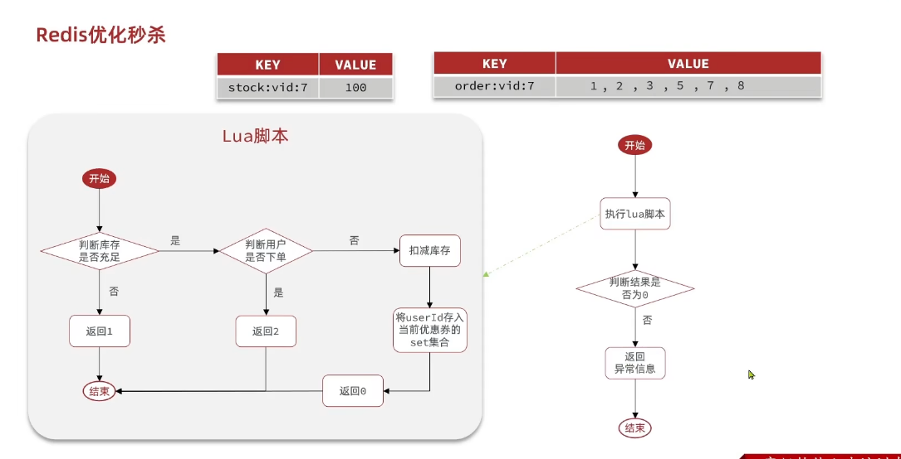

## 2.2 代码实操
1.添加优惠券时存入redis
~~~java
@Service
public class VoucherServiceImpl extends ServiceImpl<VoucherMapper, Voucher> implements IVoucherService {

    @Resource
    private StringRedisTemplate stringRedisTemplate;

    @Override
    public Result queryVoucherOfShop(Long shopId) {
        // 查询优惠券信息
        List<Voucher> vouchers = getBaseMapper().queryVoucherOfShop(shopId);
        // 返回结果
        return Result.ok(vouchers);
    }

    @Override
    @Transactional
    public void addSeckillVoucher(Voucher voucher) {
        // 保存优惠券
        save(voucher);
        // 保存秒杀信息
        SeckillVoucher seckillVoucher = new SeckillVoucher();
        seckillVoucher.setVoucherId(voucher.getId());
        seckillVoucher.setStock(voucher.getStock());
        seckillVoucher.setBeginTime(voucher.getBeginTime());
        seckillVoucher.setEndTime(voucher.getEndTime());
//        seckillVoucherService.save(seckillVoucher);
        //这里采用redis存储而不是数据库
        stringRedisTemplate.opsForValue().set(SECKILL_STOCK_KEY+seckillVoucher.getVoucherId(),seckillVoucher.getStock().toString());
    }

}
~~~
2.编写lua实现上述逻辑
~~~lua

---秒杀券id
local voucherId = ARGV[1]

---用户id
local userId = ARGV[2]

---库存key
local stockkey = "seckill:stock:" .. voucherId

---订单key
local orderkey = "seckill:order" .. voucherId

---判断库存是否充足
if(tonumber(redis.call('get',stockkey))<=0)then
    return 1
end

---判断是否重复下单
if(redis.call('sismember',orderkey,userId) == 1)then
    return 2
end

---满足条件，库存减一
redis.call('incrby',stockkey,-1)
---满足条件，保存用户id
redis.call('sadd',orderkey,userId)

return 0
~~~
3.下单秒杀券业务
~~~java
@Service
@Slf4j
public class VoucherOrderServiceImpl extends ServiceImpl<VoucherOrderMapper, VoucherOrder> implements IVoucherOrderService {

    @Resource
    private ISeckillVoucherService seckillVoucherService;

    @Resource
    private RedisIDWorker redisIDWorker;

    @Resource
    private StringRedisTemplate stringRedisTemplate;

    @Resource
    private RedissonClient redissonClient;

    private static final DefaultRedisScript<Long> SECKILL_SCRIPT;

    static {
        SECKILL_SCRIPT = new DefaultRedisScript<>();
        SECKILL_SCRIPT.setLocation(new ClassPathResource("Seckill.lua"));
        SECKILL_SCRIPT.setResultType(Long.class);
    }

    /**
     * Save successful seckill requests and let a background thread create orders.
     */
    private final BlockingQueue<VoucherOrder> orderTasks = new ArrayBlockingQueue<>(1024 * 1024);

    /**
     * Process queued order tasks in a single thread to reduce write contention.
     */
    private static final ExecutorService SECKILL_ORDER_EXECUTOR = Executors.newSingleThreadExecutor();

    private IVoucherOrderService proxy;

    //保证在类加载完后，执行下面代码进行初始化，生成线程池
    @PostConstruct
    private void init() {
        SECKILL_ORDER_EXECUTOR.submit(new VoucherOrderHandler());
    }

    //在类加载完毕后执行init后，就会一直调用死循环不断地从阻塞队列中获取信息，并调用创建订单的方法
    private class VoucherOrderHandler implements Runnable {
        @Override
        public void run() {
            while (true) {
                try {
                    VoucherOrder voucherOrder = orderTasks.take();
                    handleVoucherOrder(voucherOrder);
                } catch (Exception e) {
                    log.error("handle voucher order failed", e);
                }
            }
        }
    }

    private void handleVoucherOrder(VoucherOrder voucherOrder) {
        Long userId = voucherOrder.getUserId();
        RLock lock = redissonClient.getLock("Order:" + userId);
        boolean isLock = lock.tryLock();
        if (!isLock) {
            log.error("不能重复下单");
            return;
        }
        try {
            proxy.createVoucherOrder(voucherOrder);
        } finally {
            lock.unlock();
        }
    }

    @Override
    public Result seckillVoucher(Long id) {
        Long userId = UserHolder.getUser().getId();
        Long result = stringRedisTemplate.execute(
                SECKILL_SCRIPT,
                Collections.emptyList(),
                id.toString(), userId.toString()
        );
        int r = result.intValue();
        if (r != 0) {
            return Result.fail(r == 1 ? "库存不足" : "不能重复下单");
        }

        // Build the order first, then let the background thread persist it.
        //创建订单
        long orderId = redisIDWorker.nextId("order");
        VoucherOrder voucherOrder = new VoucherOrder();
        voucherOrder.setId(orderId);
        voucherOrder.setUserId(userId);
        voucherOrder.setVoucherId(id);

        //给代理对象赋值
        proxy = (IVoucherOrderService) AopContext.currentProxy();
        orderTasks.add(voucherOrder);
        return Result.ok(orderId);
    }

    //老版本的保存订单到库
    @Transactional
    @Override
    public Result createVoucherOrder(Long id) {
        boolean success = seckillVoucherService
                .update().setSql("stock = stock - 1")
                .eq("voucher_id", id)
                .gt("stock", 0)
                .update();
        if (!success) {
            return Result.fail("修改失败");
        }

        VoucherOrder voucherOrder = new VoucherOrder();
        Long userId = UserHolder.getUser().getId();
        voucherOrder.setUserId(userId);
        voucherOrder.setVoucherId(id);
        Long orderId = redisIDWorker.nextId("order");
        voucherOrder.setId(orderId);
        save(voucherOrder);
        return Result.ok(orderId);
    }

    //当下适配的做法
    @Transactional
    @Override
    public void createVoucherOrder(VoucherOrder voucherOrder) {
        boolean success = seckillVoucherService
                .update().setSql("stock = stock - 1")
                .eq("voucher_id", voucherOrder.getVoucherId())
                .gt("stock", 0)
                .update();
        if (!success) {
            log.error("stock not enough, create order failed, voucherId={}", voucherOrder.getVoucherId());
            return;
        }
        save(voucherOrder);
    }
}
~~~
>[!NOTE]
代码执行顺序是：当前类加载完毕后会由于**PostConstruct**加载内容，线程池就会创建一个子线程，子线程就会进入while循环，不断获取阻塞队列里的信息，有就调用创建订单的方法，没有就会等待。并且这是异步，同时主线程会继续执行下面的代码，判断新的请求是否具有下单资格。

>[!WARNING]
这里的分布式锁在这里**单机器下是多余的**，因为不是集群，只有一台服务，**lua原子性**已经解决不会出现超卖问题了

# 三、阻塞队列的问题
1.会出现内存溢出问题,受到jvm影响 
2.数据安全问题，当出现异常，订单就无法被处理就会出现遗漏

# 四、消息队列
## 4.1 基础概念
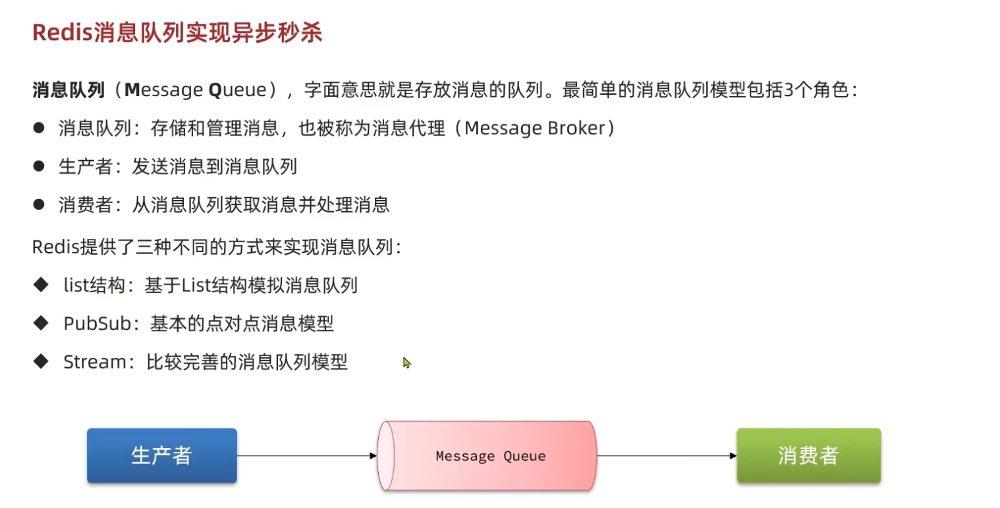
## 4.2 基于Redis中的list实现
原理就是通过LPUSH和RPOP或者LPOP和RPUSH，但是这样无法实现阻塞，在没有接受到信息时直接返回null，所以最好是**BLPUSH**和**BPOP**等，会**阻塞等待**接受消失

### 4.2.1 优缺点
优点：**不受jvm内存影响**，redis保证了数据的**可持久化**，消息**有序性** 
缺点：取出后发生异常，消费者接收不到信息，而且**仅支持单消费者**
## 4.3 基于pubsub的消息队列
### 4.3.1 什么是pubsub
是redis推出的消息传递模型，消费者可以订阅多个channel，生产者发送后会被订阅这个频道的消费者收到

### 4.3.2 用法
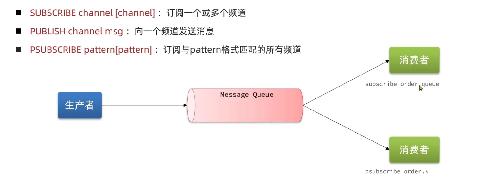
第三个指的是占位符，？ * []指定个别的字符，跟java里的类似

### 4.3.3 优缺点
优点：支持多生产多消费 
缺点：不会存入内存中，所以数据的**持久性不高**；**数据容易丢失**，没人接受就会消失； 消息堆积有上限，消费者**接受信息会堆积**，达到上限就会无法接受

## 4.4 Stream
### 4.4.1 什么是stream
是redis5.0推出的新的数据类型，可以实现一个比较完善的消息队列
### 4.4.2 用法
写
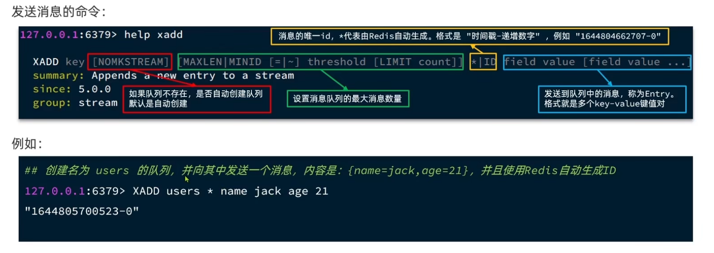

读
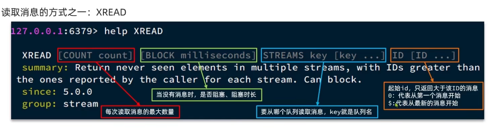
读的化也可以把后面的id写成$表示最新，这样我们再配合前面BLOCK 0表示一直堵塞直到接收到最新的消息。 id写成0表示第一条 

### 4.4.3 优缺点
优点：可以无限次的读消息，不会一次就消失,可以**阻塞读取**，消息**可回溯读取**，**可以被多个消费者接受** 
缺点：读取最新消息时，要是一次性发送多条，会出现**消息遗漏**，只读最新的

## 4.5 基于stream的消费者组实现消息队列
### 4.5.1 基本概念
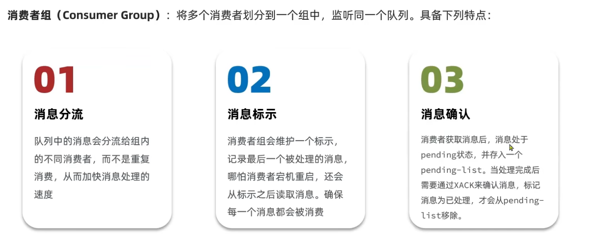

### 4.5.2 用法
创建
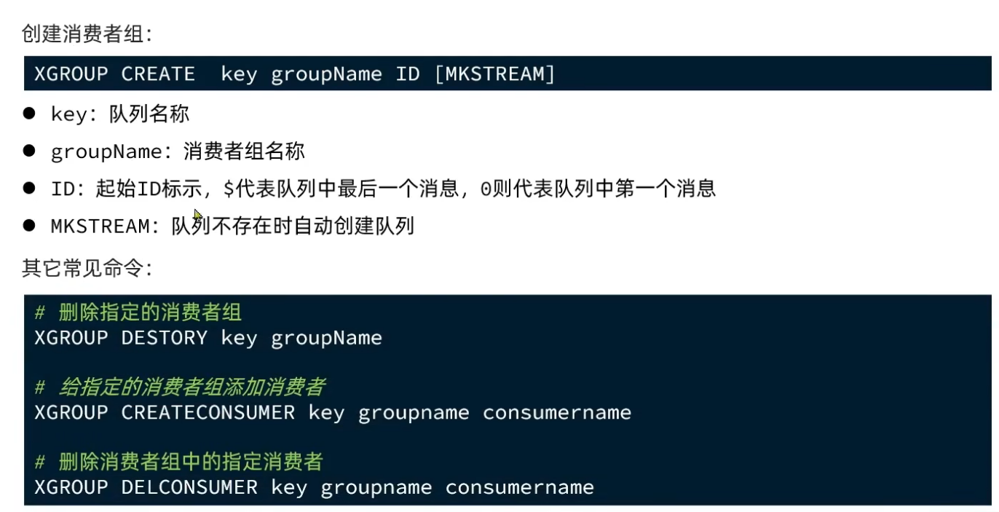

读取
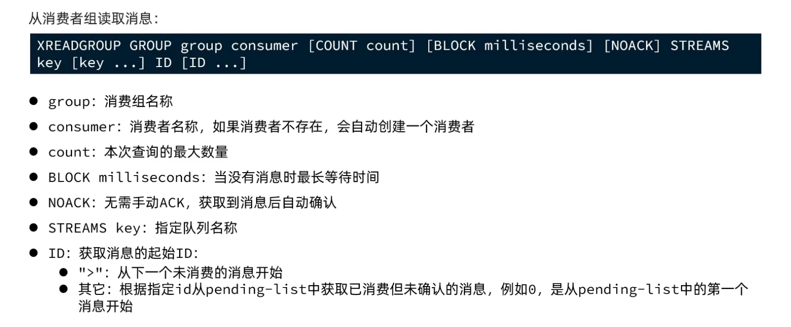

### 4.5.3 优点
消息可回溯，多个消费者增加消费速度，可以堵塞读取，没有漏读的风险，保证消息至少被消费一次

### 4.5.4 核心代码实现
lua内部脚本还需要传入orderId
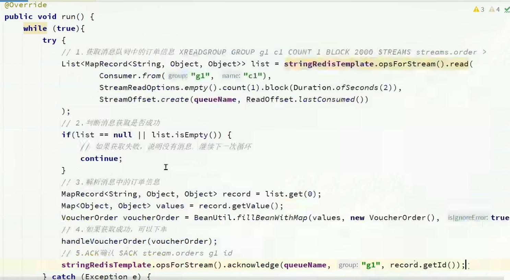
>[!NOTE]
这里要先在redis里创建一个**stream消费者组**，注意java提供的stream方法. 在处理异常时，我们可以在定义一个处理异常时的方法，逻辑跟此一致，处理消息,这里的休眠是为了**防止不那么频繁的尝试**，因为是一个死循环，当处理完时就break
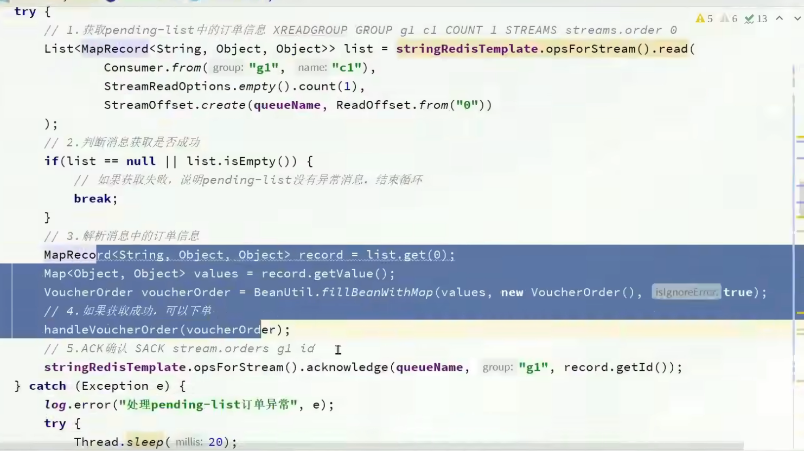

## 4.6 三者对比
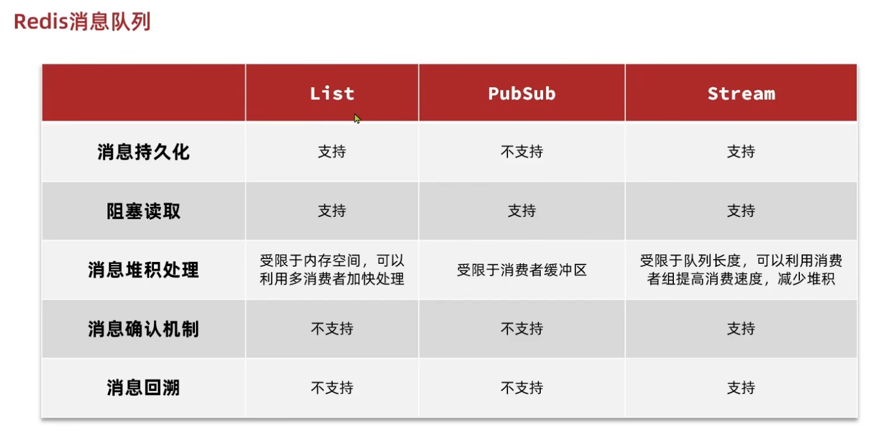

