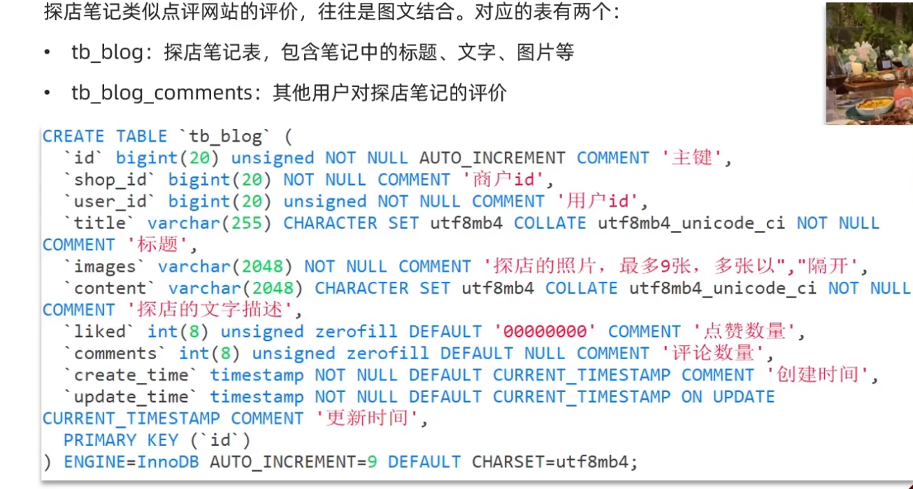
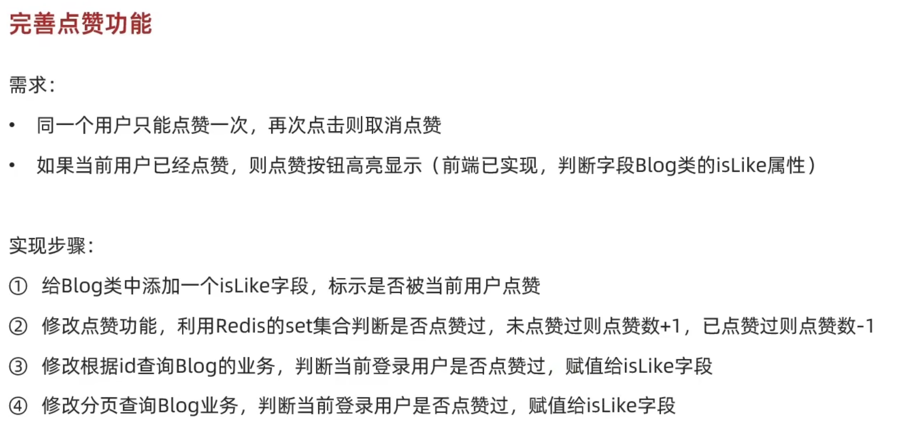

- [一、发布笔记](#一发布笔记)
  - [1.1 数据库表结构](#11-数据库表结构)
  - [1.2 接口设计](#12-接口设计)
  - [1.3 代码实现](#13-代码实现)
- [二、查看笔记](#二查看笔记)
  - [2.1 逻辑](#21-逻辑)
  - [2.2 代码实现](#22-代码实现)
- [三、笔记点赞](#三笔记点赞)
  - [3.1 思路](#31-思路)
  - [3.2 代码实现](#32-代码实现)
- [四、点赞排行榜](#四点赞排行榜)
  - [4.1 功能实现逻辑](#41-功能实现逻辑)
  - [4.2 代码实现](#42-代码实现)

# 一、发布笔记
## 1.1 数据库表结构

## 1.2 接口设计
>[!TIP]
这里我们的接口分成上传整篇文章，跟上传图片两个，这样可以实现上传图片功能的复用，一般都是上传的oss等专门存储图片数据的地方，本文则传到了本地路径

## 1.3 代码实现
图片上传
~~~java
@Slf4j
@RestController
@RequestMapping("upload")
public class UploadController {

    @PostMapping("blog")
    public Result uploadImage(@RequestParam("file") MultipartFile image) {
        try {
            // 获取原始文件名称
            String originalFilename = image.getOriginalFilename();
            // 生成新文件名
            String fileName = createNewFileName(originalFilename);
            // 保存文件
            image.transferTo(new File(SystemConstants.IMAGE_UPLOAD_DIR, fileName));
            //此处常量是自己定义的一个本地路径
            // 返回结果
            log.debug("文件上传成功，{}", fileName);
            return Result.ok(fileName);
        } catch (IOException e) {
            throw new RuntimeException("文件上传失败", e);
        }
    }
}
~~~
博客上传接口实体类：
~~~java
@Data
@EqualsAndHashCode(callSuper = false)
@Accessors(chain = true)
@TableName("tb_blog")
public class Blog implements Serializable {

    private static final long serialVersionUID = 1L;

    /**
     * 主键
     */
    @TableId(value = "id", type = IdType.AUTO)
    private Long id;
    /**
     * 商户id
     */
    private Long shopId;
    /**
     * 用户id
     */
    private Long userId;
    /**
     * 用户图标
     */
    @TableField(exist = false)
    private String icon;
    /**
     * 用户姓名
     */
    @TableField(exist = false)
    private String name;
    /**
     * 是否点赞过了
     */
    @TableField(exist = false)
    private Boolean isLike;

    /**
     * 标题
     */
    private String title;

    /**
     * 探店的照片，最多9张，多张以","隔开
     */
    private String images;

    /**
     * 探店的文字描述
     */
    private String content;

    /**
     * 点赞数量
     */
    private Integer liked;

    /**
     * 评论数量
     */
    private Integer comments;

    /**
     * 创建时间
     */
    private LocalDateTime createTime;

    /**
     * 更新时间
     */
    private LocalDateTime updateTime;

}
~~~
>[!NOTE]
这里的TableField指的是数据库里没有的字段

~~~java
 @PostMapping
    public Result saveBlog(@RequestBody Blog blog) {
        // 获取登录用户
        UserDTO user = UserHolder.getUser();
        blog.setUserId(user.getId());
        // 保存探店博文
        blogService.save(blog);
        // 返回id
        return Result.ok(blog.getId());
    }
~~~

# 二、查看笔记
## 2.1 逻辑
除了实现一个根据博客id查询博客内容外，还需要根据该博客下的用户id查询用户，返回用户的名字跟图像给前端，便于前端展示用户，以便于浏览者关注
## 2.2 代码实现
我们可以把查询用户抽离成一个方法，也方便后面查询hot笔记时的复用
~~~java
//controller层
  @GetMapping("/{id}")
    public Result queryBlogById(@PathVariable("id") Long id){
        return blogService.queryBlogById(id);
    }
//Service层
@Service
public class BlogServiceImpl extends ServiceImpl<BlogMapper, Blog> implements IBlogService {

    @Resource
    private IUserService userService;

    @Override
    public Result queryBlogById(Long id){
        //查询blog
        Blog blog = getById(id);
        if(blog == null){
            return Result.fail("笔记不存在");
        }
        //封装用户
        queryBlogUser(blog);
        return Result.ok(blog);
    }
}
  //抽离出的私有方法用来查询该博客下的用户
    private void queryBlogUser(Blog blog){
    //这里要先判断以下是否为空更严谨，防止空指针
        Long userId = blog.getUserId();
        User user = userService.getById(userId);
        if (user != null) {
            blog.setName(user.getNickName());
            blog.setIcon(user.getIcon());
        }
    }
~~~

# 三、笔记点赞
## 3.1 思路

## 3.2 代码实现
~~~java
//Controller
  @PutMapping("/like/{id}")
    public Result likeBlog(@PathVariable("id") Long id) {
        return blogService.likeBlog(id);
    }
//Service
@Override
    public Result likeBlog(Long id){
        //获取用户
        Long userId = UserHolder.getUser().getId();
        //判断是否点赞
        String key = BLOG_LIKED_KEY + id;

        //如果没有点赞
        Long added = stringRedisTemplate.opsForSet().add(key, userId.toString());
        if (added != null && added > 0) {
            //数据库更新
            boolean isSuccess = update().setSql("liked = liked + 1").eq("id",id).update();
            //成功后加入缓存，如果加入数据库失败删除缓存，防止出现不一致
            if (!isSuccess) {
                stringRedisTemplate.opsForSet().remove(key, userId.toString());
                return Result.fail("笔记不存在");
            }
        }//点赞了
        else {
            //先移除缓存
            Long removed = stringRedisTemplate.opsForSet().remove(key, userId.toString());
            if (removed == null || removed == 0) {
                return Result.ok();
            }
            //数据库更新减一
            boolean isSuccess = update().setSql("liked = liked - 1").eq("id", id).gt("liked", 0).update();
            //成功后移除缓存，数据库失败在重新手动撤销操作
            if (!isSuccess) {
                stringRedisTemplate.opsForSet().add(key, userId.toString());
                return Result.fail("笔记不存在");
            }
        }
        return Result.ok();
    }
~~~

在查询blog中加入查询是否被点赞，逻辑一致，所以抽离出一个方法,这加入这个方法即可
~~~java
 private void isBlogLiked(Blog blog){
        UserDTO user = UserHolder.getUser();
        if (user == null) {
            blog.setIsLike(false);
            return;
        }
        Long userId = user.getId();
        //判断是否点赞
        String key = BLOG_LIKED_KEY + blog.getId();
        Boolean isMember=stringRedisTemplate.opsForSet().isMember(key,userId.toString());
        //如果点赞了就设置isLike为true
        blog.setIsLike(BooleanUtil.isTrue(isMember));
    }
~~~
# 四、点赞排行榜
## 4.1 功能实现逻辑
排行榜就是，根据**点赞的先后时间**，显示出最新点赞的五人，这是**需要排序**，原先的set就无法实现了，在保留原来的set加上排序，我们可以用**Sortedset**，把**时间戳作为score作为排序依据**
## 4.2 代码实现
controller:
~~~java
 @GetMapping("/likes/{id}")
    public Result queryBlogLikes(@PathVariable("id") Long id) {
        return blogService.queryBlogLikes(id);
    }
~~~

Service:
修改原先点赞记录的set为Zset
~~~java
 @Override
    public Result likeBlog(Long id){
        //获取用户
        Long userId = UserHolder.getUser().getId();
        //判断是否点赞
        String key = BLOG_LIKED_KEY + id;

        //如果没有点赞
        Double score = stringRedisTemplate.opsForZSet().score(key, userId.toString());
        if (score == null) {
            //数据库更新
            boolean isSuccess = update().setSql("liked = liked + 1").eq("id",id).update();
            //成功后加入缓存
            if (!isSuccess) {
                return Result.fail("笔记不存在");
            }
            stringRedisTemplate.opsForZSet().add(key, userId.toString(), System.currentTimeMillis());
        }//点赞了
        else {
            //数据库更新减一
            boolean isSuccess = update().setSql("liked = liked - 1").eq("id", id).gt("liked", 0).update();
            //成功后移除缓存
            if (!isSuccess) {
                return Result.fail("笔记不存在");
            }
            stringRedisTemplate.opsForZSet().remove(key, userId.toString());
        }
        return Result.ok();
    }
~~~
查询点赞前五逻辑
~~~java
  @Override
    public Result queryBlogLikes(Long id) {
        String key = BLOG_LIKED_KEY + id;
        Set<String> top5 = stringRedisTemplate.opsForZSet().range(key, 0, 4);
        if (top5 == null || top5.isEmpty()) {
            return Result.ok(Collections.emptyList());
        }
        List<Long> userIds = top5.stream().map(Long::valueOf).collect(Collectors.toList());
        Map<Long, User> users = userService.listByIds(userIds).stream()
                .collect(Collectors.toMap(User::getId, Function.identity()));
        List<UserDTO> userDTOs = userIds.stream()
                .map(users::get)
                .filter(user -> user != null)
                .map(user -> BeanUtil.copyProperties(user, UserDTO.class))
                .collect(Collectors.toList());
        return Result.ok(userDTOs);
    }
~~~
>[!NOTE]
这里注意sortedset的使用方法，以及**stream跟方法引用**的代码化简，由于listByIds查**询数据库的数据顺序跟传入的id顺序不一致**，所以这里先存到**map里确保顺序**是对的，在**存入dto里返回给前端**
