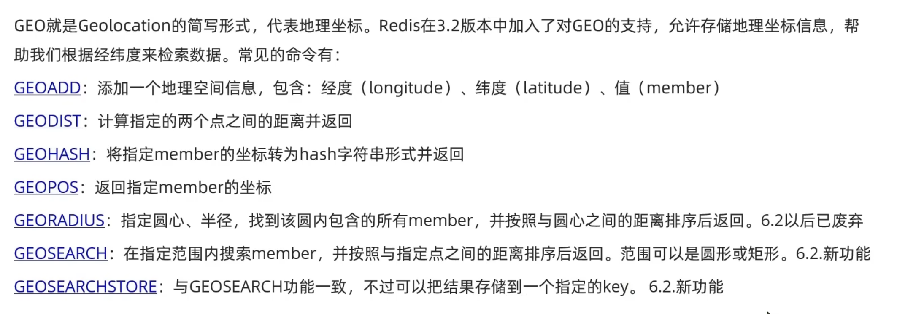
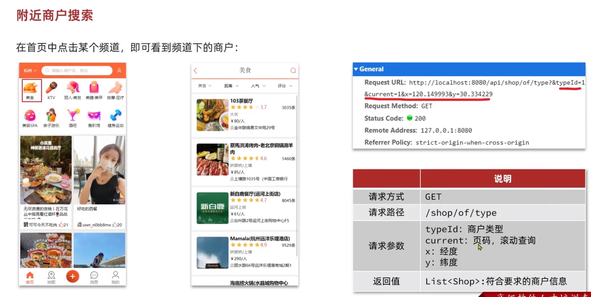

# 一、GEO
## 1.1 基本概念
;

## 1.2 常见的语法

1. GEOADD key 经度 纬度 成员名 [经度 纬度 成员名 ...] 
2. GEODIST key A B km 
3. GEORADIUS key 我的经度 我的纬度 1 km WITHDIST [ASC]  查询我周边维度周边1km内，并排序
>[!TIP]
本质是sortedsort

# 二、附近商户功能实现

## 2.1 接口设计

我们将商店类型作为key,商户id作为hashkey，商户坐标作为value;

## 2.2 数据库商店信息导入redis
~~~java
@Test
void loadShopData() {
    // 1.查询店铺信息
    List<Shop> list = shopService.list();
    // 2.把店铺分组，按照typeId分组，typeId一致的放到一个集合
    Map<Long, List<Shop>> map = list.stream().collect(Collectors.groupingBy(Shop::getTypeId));
    // 3.分批完成写入Redis
    for (Map.Entry<Long, List<Shop>> entry : map.entrySet()) {
        // 3.1.获取类型id
        Long typeId = entry.getKey();
        String key = "shop:geo:" + typeId;
        // 3.2.获取同类型的店铺的集合
        List<Shop> value = entry.getValue();
        List<RedisGeoCommands.GeoLocation<String>> locations = new ArrayList<>(value.size());
        // 3.3.写入redis GEOADD key 经度 纬度 member
        for (Shop shop : value) {
            // stringRedisTemplate.opsForGeo().add(key, new Point(shop.getX(), shop.getY()), shop.getId().toString());
            locations.add(new RedisGeoCommands.GeoLocation<>(
                    shop.getId().toString(),
                    new Point(shop.getX(), shop.getY())
            ));
        }
    }
    // 批量GEOADD写入Redis
stringRedisTemplate.opsForGeo().add(key, locations);
}
~~~
## 2.3 代码实现
这里由于此项目 Spring Data Redis 版本低于2.5，所以只能采取**GEORADIUS**的方法查询周围商铺
controller：
~~~java

    @GetMapping("/of/type")
    public Result queryShopByType(
            @RequestParam("typeId") Integer typeId,
            @RequestParam(value = "current", defaultValue = "1") Integer current,
            @RequestParam(value = "x", required = false) Double x,
            @RequestParam(value = "y", required = false) Double y
    ) {
        return shopService.queryShopByType(typeId, current, x, y);
    }
~~~

Service
~~~java

    @Override
    public Result queryShopByType(Integer typeId, Integer current, Double x, Double y) {
        //没有坐标，正常分页查询
        if (x == null || y == null) {
            Page<Shop> page = query()
                    .eq("type_id", typeId)
                    .page(new Page<>(current, SystemConstants.DEFAULT_PAGE_SIZE));
            return Result.ok(page.getRecords());
        }

        //计算分页查询的起始跟结束
        int pageSize = SystemConstants.DEFAULT_PAGE_SIZE;
        int from = (current - 1) * pageSize;
        int end = current * pageSize;

        String key = SHOP_GEO_KEY + typeId;
        //根据坐标按照圆形范围查询,这里是旧写法
        GeoResults<RedisGeoCommands.GeoLocation<String>> results = stringRedisTemplate.opsForGeo().radius(
                key,
                new Circle(new Point(x, y), new Distance(5000)),
                RedisGeoCommands.GeoRadiusCommandArgs.newGeoRadiusArgs()
                        .includeDistance()
                        .sortAscending()
                        .limit(end)
        );

        //查不到返回空
        if (results == null) {
            return Result.ok(Collections.emptyList());
        }

        //获取点位封装对象 GeoLocation
        List<GeoResult<RedisGeoCommands.GeoLocation<String>>> content = results.getContent();
        //防止出现空，因为下面会跳过from，所以小于时如果跳过就会出现空指针
        if (content.size() <= from) {
            return Result.ok(Collections.emptyList());
        }

        List<Long> ids = new ArrayList<>(content.size() - from);
        Map<String, Distance> distanceMap = content.stream()
                .skip(from)
                .peek(result -> ids.add(Long.valueOf(result.getContent().getName())))//收集商铺id
                .collect(Collectors.toMap(
                        result -> result.getContent().getName(),
                        GeoResult::getDistance
                ));

        String idStr = ids.stream()
                .map(String::valueOf)//转成字符串
                .collect(Collectors.joining(","));//也可以用strutils工具包
        List<Shop> shops = query()
                .in("id", ids)
                .last("ORDER BY FIELD(id," + idStr + ")")
                .list();//这样的方法查询也可以解决数据库查询结果顺序跟传入id不一致的问题
        shops.forEach(shop -> {
            Distance distance = distanceMap.get(shop.getId().toString());
            if (distance != null) {
                shop.setDistance(distance.getValue());
            }
        });

        return Result.ok(shops);
    }
~~~