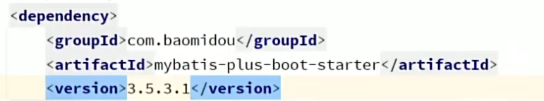
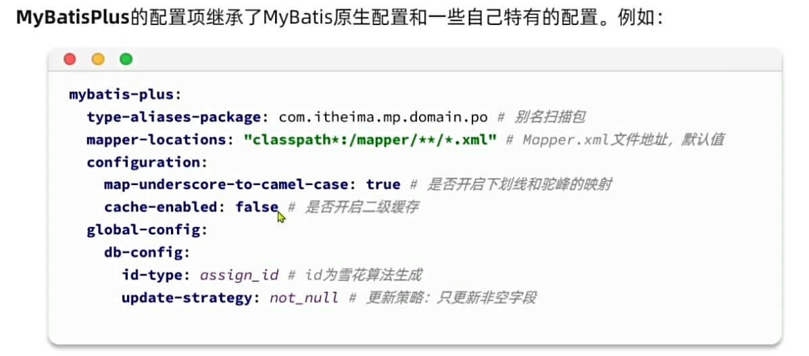
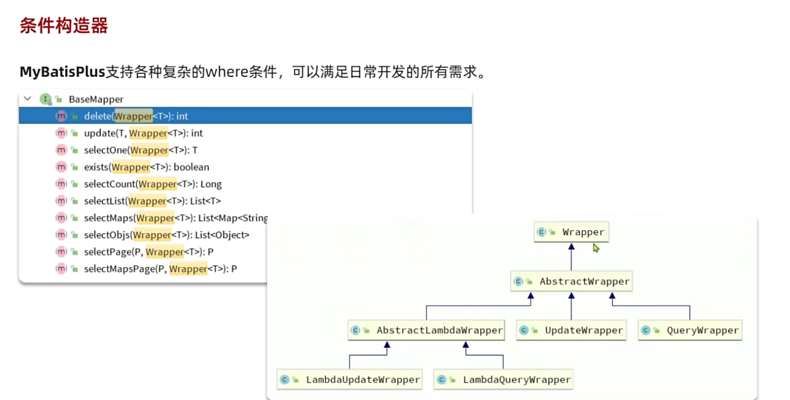
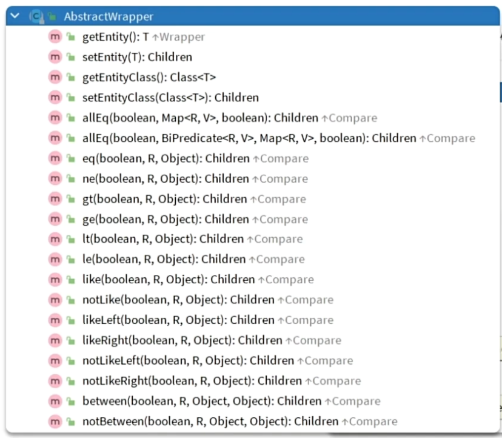
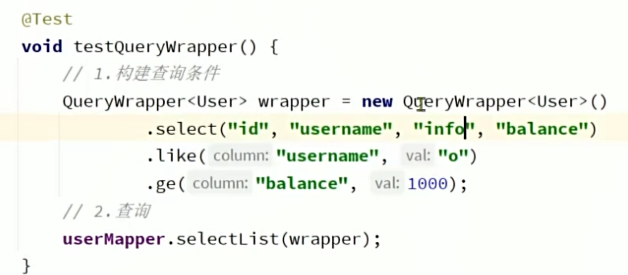
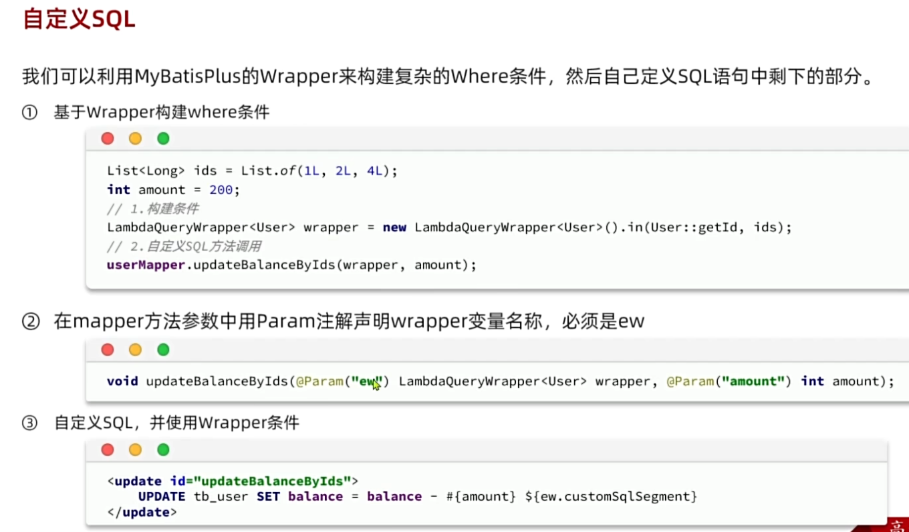
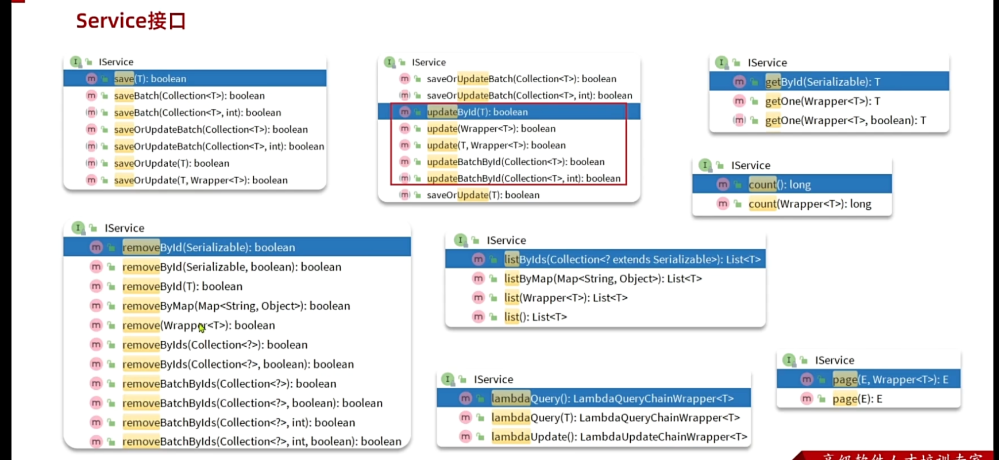
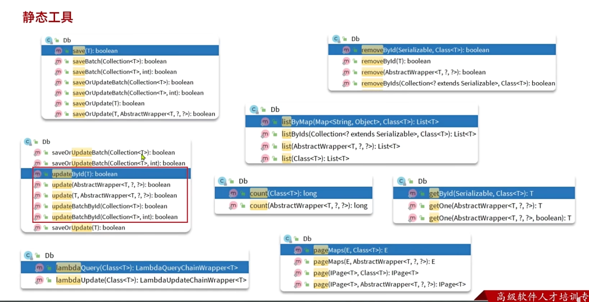
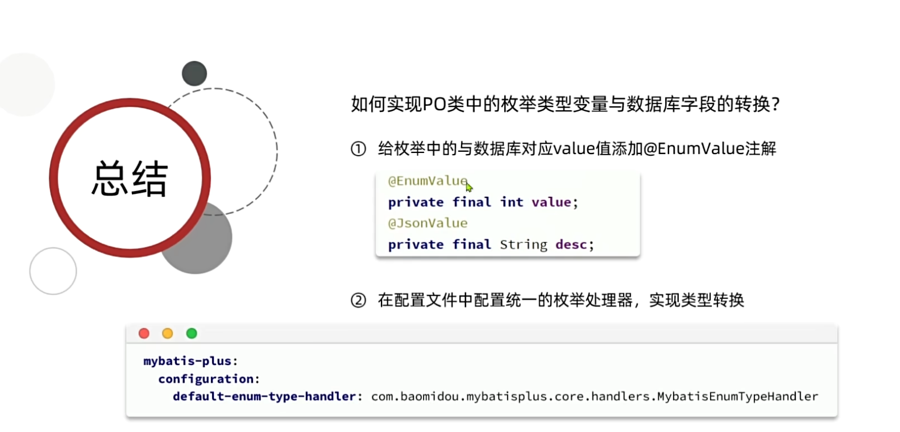
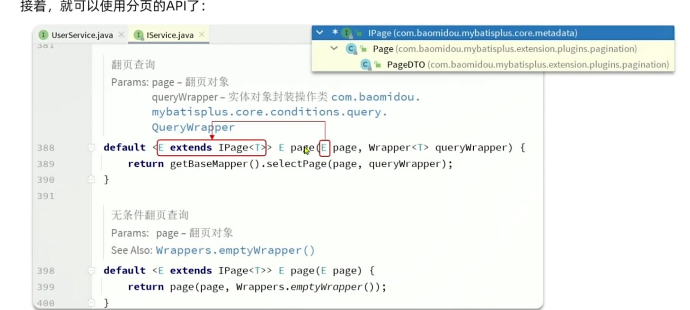

- [一、MyBites-plus(MP)介绍](#一mybites-plusmp介绍)
- [二、项目环境配置](#二项目环境配置)
- [三、常用注解](#三常用注解)
  - [3.1 mp的作用原理](#31-mp的作用原理)
  - [3.2 mp中对应数据库遵守的约定](#32-mp中对应数据库遵守的约定)
  - [3.3 注解的作用](#33-注解的作用)
- [四、条件构造器](#四条件构造器)
  - [4.1 什么是条件构造器](#41-什么是条件构造器)
  - [4.2 AbstractWrapper](#42-abstractwrapper)
  - [4.3 UpdateWrapper](#43-updatewrapper)
  - [4.4 QueryWrapper](#44-querywrapper)
- [五、自定义sql](#五自定义sql)
- [六、IService接口](#六iservice接口)
  - [6.1 简单的增删改查业务逻辑](#61-简单的增删改查业务逻辑)
  - [6.2 复杂的增删改查业务逻辑](#62-复杂的增删改查业务逻辑)
  - [6.3 LambdaQuery](#63-lambdaquery)
  - [6.4 LambdaUpdate](#64-lambdaupdate)
  - [IService批量查询](#iservice批量查询)
- [七、Db静态工具](#七db静态工具)
- [八、逻辑删除](#八逻辑删除)
  - [8.1 含义](#81-含义)
  - [8.2 如何使用](#82-如何使用)
  - [8.3 弊端](#83-弊端)
- [八、枚举处理器](#八枚举处理器)
  - [使用场景](#使用场景)
  - [如何使用](#如何使用)
- [九、Josn处理器](#九josn处理器)
  - [9.1 使用场景](#91-使用场景)
  - [9.2 操作步骤](#92-操作步骤)
- [十、插件功能 分页插件](#十插件功能-分页插件)
  - [10.1 mp内置的分页功能](#101-mp内置的分页功能)
  - [10.2 如何调用内置分页功能](#102-如何调用内置分页功能)

#  一、MyBites-plus(MP)介绍
是一个**MyBatis 的增强工具**，只做增强不做改变，简化 MyBatis 单表 **CRUD** 开发，完全**兼容原生 MyBatis**。
原生 MyBatis 每张表都要手写 insert、update、select、delete XML 语句，MP 内置通用方法，几乎不用写 SQL。

# 二、项目环境配置
1.依赖注入
 
2.**Mapper层继承BaseMapper<?>**,并且不需要写任何方法在Mapper接口里，因为BaseMapper里面已经写好了
3.yaml文件配置

# 三、常用注解
## 3.1 mp的作用原理
基于扫描实体类，通过**反射**获取反射类的信息作为数据库的信息

## 3.2 mp中对应数据库遵守的约定
1.名为id的作为数据库中的主键 
2.类名驼峰下划线转化为表名
3.变量名驼峰转化为表字段名

## 3.3 注解的作用
1.TableName:当**类名与数据库表名不一致**时采取此注解 
2.TableField: 当**变量名与数据库字段名不一致**，变量名与sql中的**关键字重复**，变量名**不是数据库字段名**(exist = false) 
3.TableId:主键设置(type = typeId)设置**id如何增长**
>[!TIP]
这里的typeId是一个枚举类型，如果不设置就是默认的采取雪花算法，作为id主键值存入数据库中

# 四、条件构造器
## 4.1 什么是条件构造器

除去正常的根据id增删改查，还剩下根据where条件，mp中就是传入wrapper类的方法。这一类对象就叫做条件构造器。
## 4.2 AbstractWrapper

这里面提供方法比如**eq表示相等**，**ne表示不等**，**gt表示大于**，**ge表示大于等于**，**lt表示小于**，**le表示小于等于**，**like模糊查询**等等，解决where部分

## 4.3 UpdateWrapper
解决的是set中可以自己手写sql语句，用于无法利用实体类的成员变量指定字段名更新时，或者利用**set指定字段名**，而不需要实体类了
~~~java
@Test
void testUpdateWrapper() {
    List<Long> ids = List.of(1L, 2L, 4L);
    UpdateWrapper<User> wrapper = new UpdateWrapper<User>()
            .setSql("balance = balance - 200")
            .in("id", ids);
    userMapper.update(null, wrapper);
}
~~~

>[!TIP]
这里的in方法就是内部写好了原本的 foreach collection="ids" separator="," item="id" open="(" close=")">
    #{id}
foreach  
查询的是**id在这个ids里的所有用户**

## 4.4 QueryWrapper
在继承顶级父类后解决的是select部分，可以自定义搜寻个别的字段名，而不是直接全部查出来

~~~java
@Test
void testUpdateByQueryWrapper() {
    // 1.要更新的数据
    User user = new User();
    user.setBalance(2000);
    // 2.更新的条件
    QueryWrapper<User> wrapper = new QueryWrapper<User>().eq("username", "jack");
    // 3.执行更新
    userMapper.update(user, wrapper);
}
~~~
>[!TIP]
这里更新某个字段名是采用的是传入一个**实体类**，当其内部的字段名**不为null时时就会更新**

# 五、自定义sql

# 六、IService接口

>[!NOTE]
1.查：getById(根据查单个)，getOne(根据自定义字段查单个),listByIds(根据多个id查),page(分页查询) 
2.增：save()单条新增、saveBatch()批量新增 
3.删：removeById()按主键删、remove()按条件删、removeByIds()批量主键删除,removeBatchByIds()也是批量删除，数据量大时更高效 
4.改：updateById()按主键修改、lambdaUpdate()条件修改

我们只需要使用自定义的**service继承Iservice**，就能拥有mp写好的这些增删改查的方法，由于是接口我们还需要创建一个实现类，我们可以将**自定义的实现类继承IServiceImpl**，这个mp已经帮我们写好了，我们可以直接调用，但是**需要传入Mapper类，以及实体类** 
## 6.1 简单的增删改查业务逻辑
~~~java
@ApiOperation("删除用户接口")
@DeleteMapping("{id}")
public void deleteUserById(@ApiParam("用户id") @PathVariable("id") Long id){
    userService.removeById(id);
}

@ApiOperation("根据id查询用户接口")
@GetMapping("{id}")
public UserVO queryUserById(@ApiParam("用户id") @PathVariable("id") Long id){
    // 1.查询用户PO
    User user = userService.getById(id);
    // 2.把PO拷贝到VO
    return BeanUtil.copyProperties(user, UserVO.class);
}
~~~
## 6.2 复杂的增删改查业务逻辑
这里就需要自己在service跟其实现类里**自定义一个方法**，然后需要自己写sql语句，这是就需要在**mapper**里面写，或者在xml里书写sql语句
~~~java
@Service
public class UserServiceImpl extends ServiceImpl<UserMapper, User> implements IUserService {
    @Override
    public void deductBalance(Long id, Integer money) {
        // 1.查询用户
        User user = getById(id);
        // 2.校验用户状态
        if (user == null || user.getStatus() == 2) {
            throw new RuntimeException("用户状态异常！");
        }
        // 3.校验余额是否充足
        if (user.getBalance() < money) {
            throw new RuntimeException("用户余额不足！");
        }
        // 4.扣减余额 update tb_user set balance = balance - ?
        baseMapper.deductBalance(id, money);
    }
}
~~~

## 6.3 LambdaQuery
~~~java
public List<User> queryUsers(String name, Integer status, Integer minBalance, Integer maxBalance) {
    return lambdaQuery()
            .like(name != null, User::getUsername, name)
            .eq(status != null, User::getStatus, status)
            .ge(minBalance != null, User::getBalance, minBalance)
            .le(maxBalance != null, User::getBalance, maxBalance)
            .list();
}
~~~
>[!TIP]
这里的**lambdaQuery返回的就是Wrapper**所以拥有与QueryWrapper一样的方法，**前面的一个参数表示成立才能往后面的参数执行**，否则就会跳过

## 6.4 LambdaUpdate
跟查询一样
~~~java
public class UserServiceImpl extends ServiceImpl<UserMapper, User> implements IUserService {
    @Override
    @Transactional
    public void deductBalance(Long id, Integer money) {
        // 1.查询用户
        User user = getById(id);
        // 2.校验用户状态
        if (user == null || user.getStatus() == 2) {
            throw new RuntimeException("用户状态异常！");
        }
        // 3.校验余额是否充足
        if (user.getBalance() < money) {
            throw new RuntimeException("用户余额不足！");
        }
        // 4.扣减余额 update tb_user set balance = balance - ?
        int remainBalance = user.getBalance() - money;
        lambdaUpdate()
                .set(User::getBalance, remainBalance)
                .set(remainBalance == 0, User::getStatus, 2)
                .eq(User::getId, id)
                .eq(User::getBalance, user.getBalance()) // 乐观锁
                .update();
    }
}
~~~

## IService批量查询 
批处理方案： 
普通 for 循环逐条插入速度极差，不推荐 
MP 的批量新增，基于预编译的批处理，性能不错 
配置 jdbc 参数，开 rewriteBatchedStatements，性能最好  

# 七、Db静态工具
当出现多个**service间循环依赖时**，在这个里需要注入那个service，反过来也是如此这是就可以采取Db静态工具了
>[!TIP]
mp3.5.0之后的版本才有

# 八、逻辑删除
## 8.1 含义
MybatisPlus 提供了逻辑删除功能，无需改变方法调用的方式，而是在底层帮我们自动修改 CRUD 的语句。我们要做的就是在 application.yaml 文件中配置逻辑删除的字段名称和值即可

## 8.2 如何使用
~~~java
mybatis-plus:
  global-config:
    db-config:
      logic-delete-field: flag # 全局逻辑删除的实体字段名，字段类型可以是boolean、integer
      logic-delete-value: 1 # 逻辑已删除值(默认为 1)
      logic-not-delete-value: 0 # 逻辑未删除值(默认为 0)
~~~
删除时将**flag字段设置为1**也就是update，查询时**查询该字段为0**的即可

## 8.3 弊端
数据并没有真正的删除，所以**数据会越来越多**，影响数据的**查询效率**。
我们可以采取数据迁移其它表的方式，将原来的数据备份再删除

# 八、枚举处理器
## 使用场景
当我们定义了枚举，但是数据库的字段名类型不是枚举类时使用

## 如何使用
① 给枚举中的与数据库对应 value 值添加 @EnumValue 注解
~~~java
@EnumValue
private final int value;
@JsonValue
private final String desc;
~~~
② 在配置文件中配置统一的枚举处理器，实现类型转换
~~~java
mybatis-plus:
  configuration:
    default-enum-type-handler: com.baomidou.mybatisplus.core.handlers.MybatisEnumTypeHandler
~~~
>[!TIP]
注意返回默认是定义的**枚举常量名**，想要指定返回是value还是desc就把 **@JsonValue** 注解放在那个上面，如上

# 九、Josn处理器
## 9.1 使用场景
当数据库中的某个字段名是json时，我们可以定义一个实体类，然后利用Json处理器，这样就可以与数据库中的字段名映射转化了
## 9.2 操作步骤

# 十、插件功能 分页插件
## 10.1 mp内置的分页功能
| 序号 | 拦截器 | 描述 |
| ---- | ---- | ---- |
| 1 | TenantLineInnerInterceptor | 多租户插件 |
| 2 | DynamicTableNameInnerInterceptor | 动态表名插件 |
| 3 | PaginationInnerInterceptor | 分页插件 |
| 4 | OptimisticLockerInnerInterceptor | 乐观锁插件 |
| 5 | IllegalSQLInnerInterceptor | SQL 性能规范插件，检测并拦截垃圾 SQL |
| 6 | BlockAttackInnerInterceptor | 防止全表更新和删除的插件 |

## 10.2 如何调用内置分页功能
1.首先，要在配置类中注册 MyBatisPlus 的核心插件，同时添加分页插件：
~~~java
@Configuration
public class MybatisConfig {

    @Bean
    public MybatisPlusInterceptor mybatisPlusInterceptor() {
        // 1.初始化核心插件
        MybatisPlusInterceptor interceptor = new MybatisPlusInterceptor();
        // 2.添加分页插件
        PaginationInnerInterceptor pageInterceptor = new PaginationInnerInterceptor(DbType.MYSQL);
        pageInterceptor.setMaxLimit(1000L); // 设置分页上限
        interceptor.addInnerInterceptor(pageInterceptor);
        return interceptor;
    }
}
~~~
2.调用API

>[!TIP]
调用的方法传入的是**Page类**或者**PageDTO**但是前者居多，然后返回的也是这两个，Page中有**页码**跟**每页查询个数**，**总页数**，**总查询数**这些数据
~~~java
@Test
void testPageQuery() {
    // 1.查询
    int pageNo = 1, pageSize = 5;
    // 1.1.分页参数
    Page<User> page = Page.of(pageNo, pageSize);//类似于@AllArgsConstructor(staticName = "of")静态构造
    // 1.2.排序参数，通过OrderItem来指定，可以多个字段名排序，多写几个语句即可
    page.addOrder(new OrderItem("balance", false));//false表示降序
    // 1.3.分页查询
    Page<User> p = userService.page(page);//还可以传入wrapper
    // 2.总条数
    System.out.println("total = " + p.getTotal());
    // 3.总页数
    System.out.println("pages = " + p.getPages());
    // 4.分页数据
    List<User> records = p.getRecords();
    records.forEach(System.out::println);
}
~~~
>[!TIP]
在项目里我们可以选择创建一个**PageQuery的实体类**里面包含了Page类自带的成员变量，**并让查询的用户实体类（比如UserDTO）继承**，这样就全在一个类里了，还可以复用），起到一个封装查询结果的作用，并返回