# SpringDataRedis
- [SpringDataRedis](#springdataredis)
  - [是什么](#是什么)
  - [优点](#优点)
  - [如何使用](#如何使用)
  - [使用步骤](#使用步骤)
  - [SpringDataRedis中的序列化](#springdataredis中的序列化)
  - [其它的序列化器](#其它的序列化器)
    - [序列化器种类](#序列化器种类)
    - [如何使用](#如何使用-1)

## 是什么
Spring Data Redis 是 Spring Data 子项目，封装 Redis 客户端操作，简化 Spring / SpringBoot 整合 Redis，屏蔽原生 Jedis、Lettuce API 底层细节，提供统一模板、注解式缓存、Redis Repository 序列化方案。

## 优点
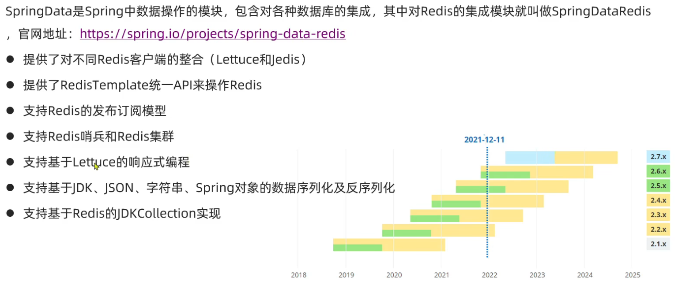
>[!TIP]
>1.它是线程安全的， 
2.底层支持两种客户端：
Lettuce（SpringBoot2.x 默认）：基于 Netty，异步、**线程安全**，**连接池高性能**，推荐使用 
>3.Jedis（SpringBoot1.x 默认）：同步阻塞，多线程需手动管理连接池，现在**很少用**

## 如何使用
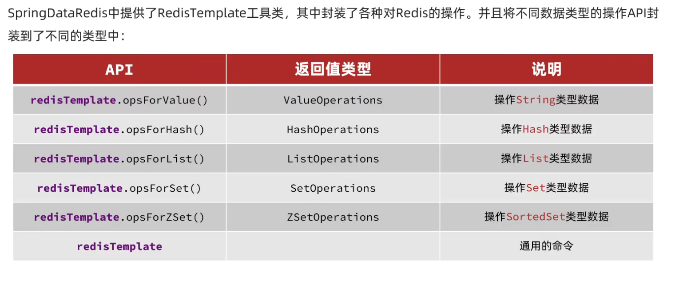

## 使用步骤
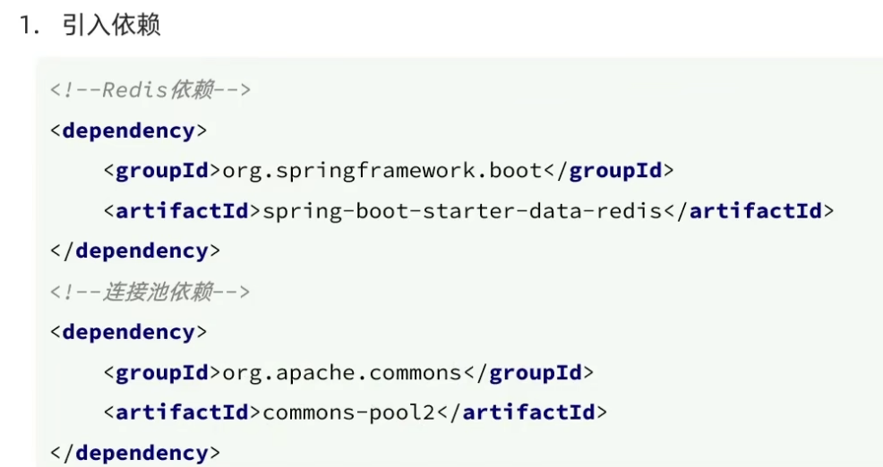
>[!TIP]
>1.这里采用springboot框架因为其支持，不代表只用用这个框架
>2.这里还需要连接池的依赖，因为底层还是需要连接池实现
>3.默认是lettuce实现的连接池，而不是jedis

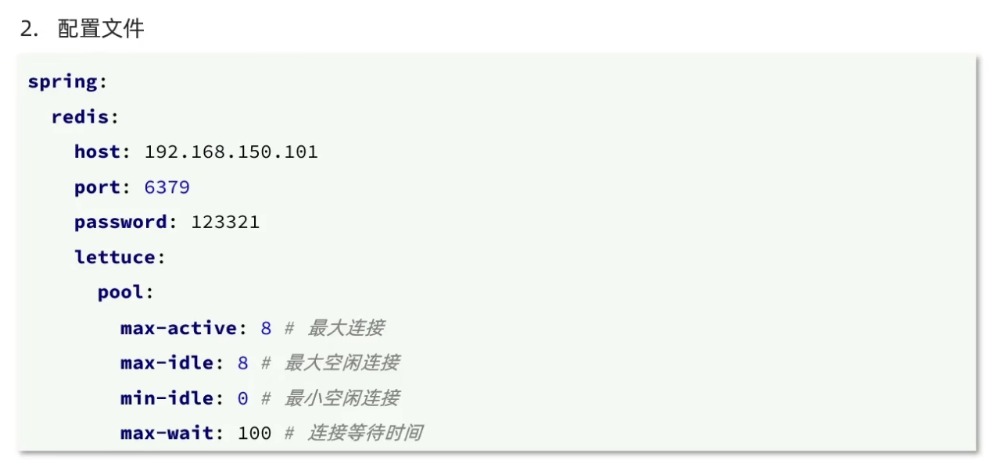

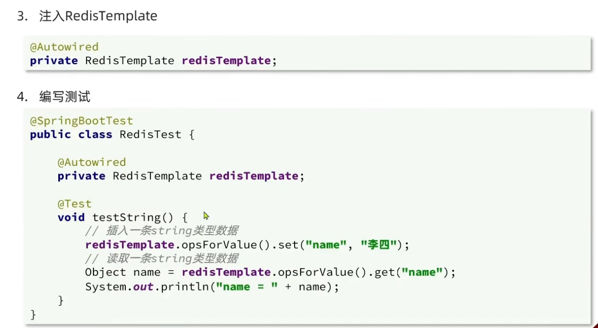

## SpringDataRedis中的序列化

我们发现如果直接使用的话，就会在redis里面出现序列化后的情况，这个原因是因为，RedisTemplate工具里的参数都是**Object**类型的，由于SpringDataRedis的特性，他会默认的把Object转换成**字节序列化**并存入redis里面。

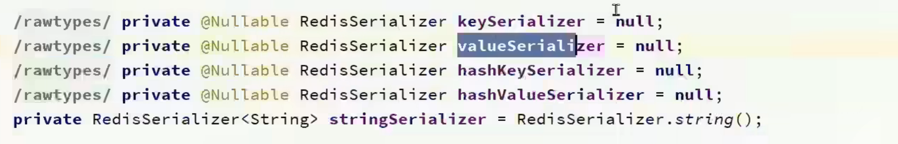
>[!TIP]
>这里面就是默认的对字符串跟hash类型的key跟value的序列化，刚开始是null，初始化在下面。

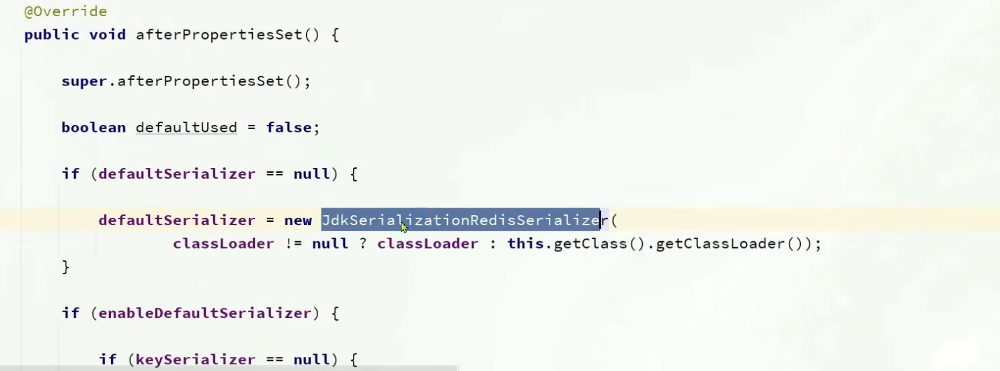
>[!TIP]
>这里我们发现对于默认的序列化对象，会自己创建一个JDK序列化对象，这也是Object类所采用的序列化方法。

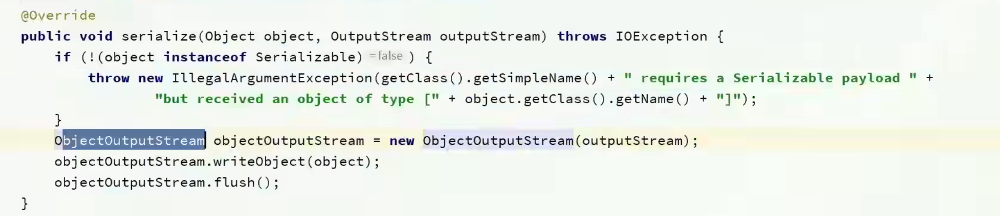
>[!NOTE]
>所以由于这个默认，所以写入缓存的数据会是乱码，占用内存，并且难以分辨

## 其它的序列化器

### 序列化器种类
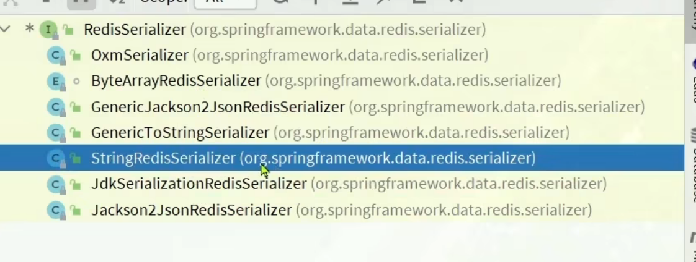
>[!NOTE]
>这里是java里面提供的序列化器,JDK就是默认使用的对于Object处理的一种

那么我们该怎么选择呢？

对于key以及value是**字符串**的情况，我们一般选择**StringRedis**,而且大多情况下Key都是字符串，当value为对象时，我们可以选择**Jackson2**这个，它提供了转**json字符串**这个功能，避免了直接对象序列化

### 如何使用
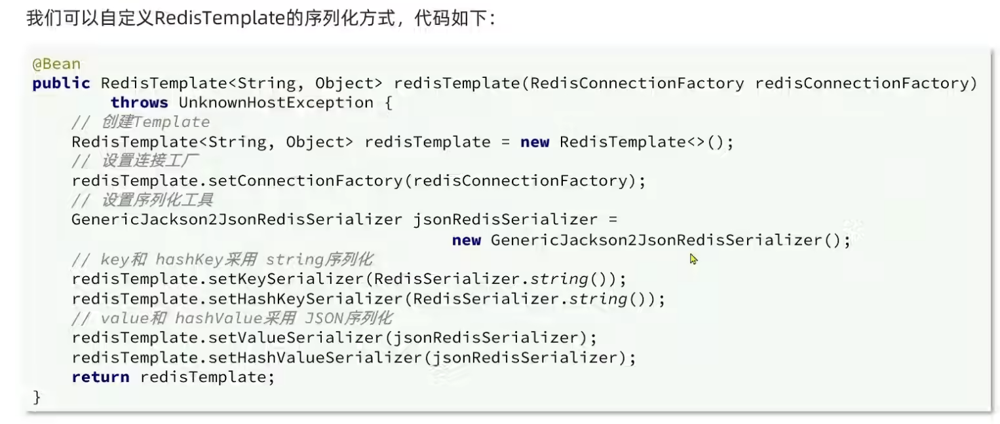
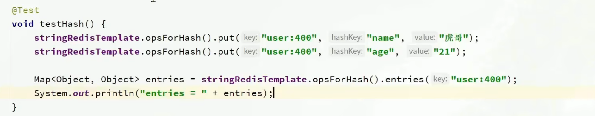
>[!IMPORTANT]
>这里我们可以看到，依然是一个配置类，并且跟之前大致一样，唯一多的是我们更换了序列化器，我们把key设置成专门处理字符串的序列化器，对于value我们设置了转成JSON的序列化器，注意这两个序列化器的构造，而且HashKey是hash类型里面的field

>[!WARNING]
>这里对于直接使用转JOSN有个问题在于，它会生成一串Class字码存入，但这会占用内存跟性能，所提我们应该手动的将对象转化成JOSN的字符串，然后在使用字符串的序列化器就行了。

