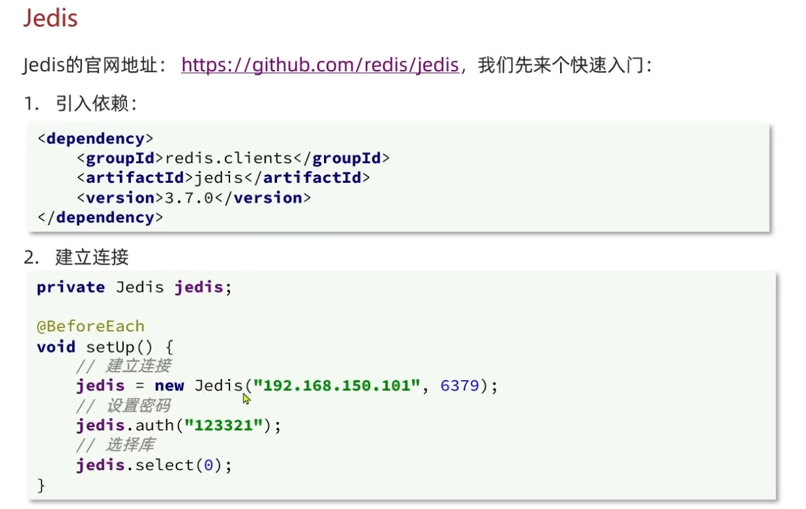
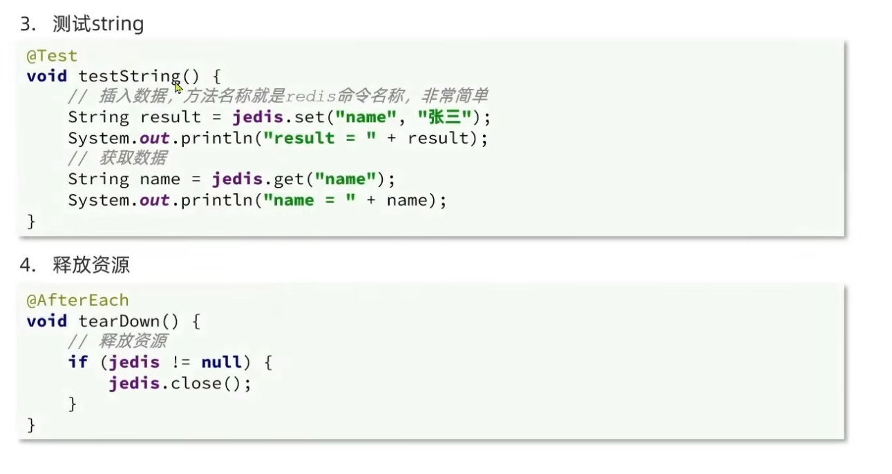
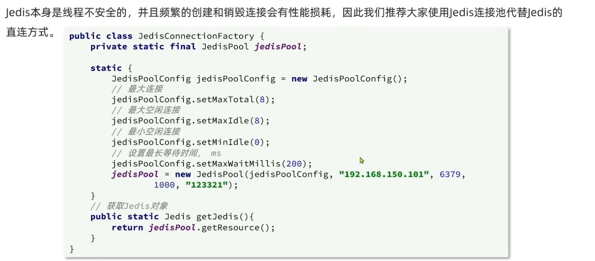

- [jedis](#jedis)
  - [1.什么是jedis](#1什么是jedis)
  - [2.如何使用](#2如何使用)
  - [3.jedis连接池](#3jedis连接池)

# jedis

## 1.什么是jedis
是java的redis的客户端,java中对于Redis的实现分成lettuce以及Jedis两种

## 2.如何使用

>[!TIP]
>1.引入依赖，Jedis要知道ip，这里是虚拟机的ip，以及后面的端口号，这是默认的端口号 

## 3.jedis连接池
由于jedis是线程不安全的，所以需要连接池连进行管理

>[!TIP]
> 1.这里JedisPool是java自己提供的,设置成static final是因为线程池唯一
> 2.然后JedisPoolCongfig也是java提供的类,用于构造JedisPool连接池
> 3.JedisPool的构造参数中1000是指最大等待时间,即超过这个时间将归还线程
> 4.JedisPoolConfig的配置最大空闲连接指的是当没有线程是保留这么多,最小同理,等待时间是setMaxMills
> 5.通过从线程池里获取线程,这样就不用像之前一样直接new一个jedis了

