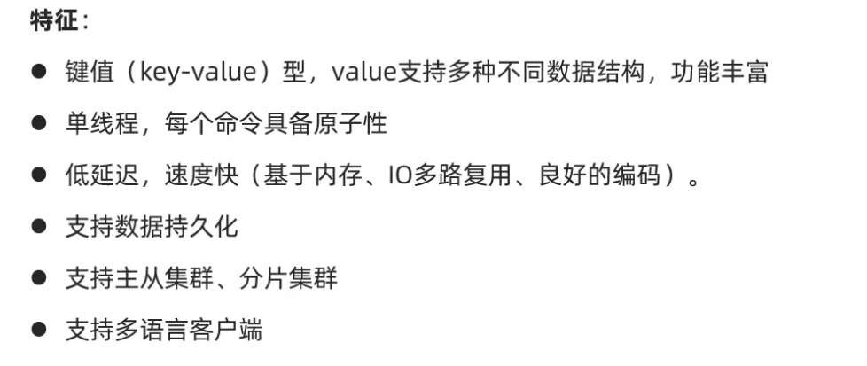
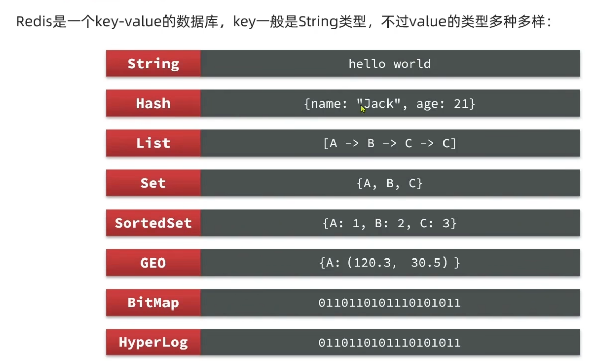
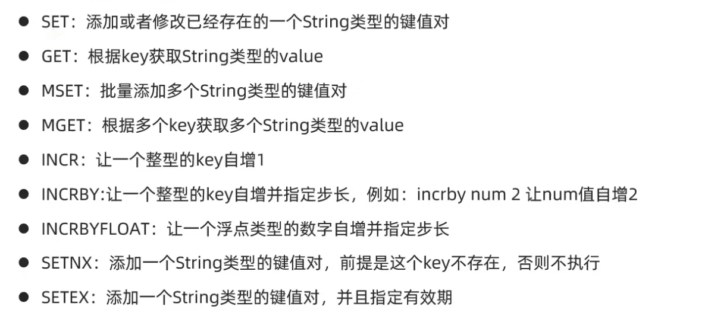
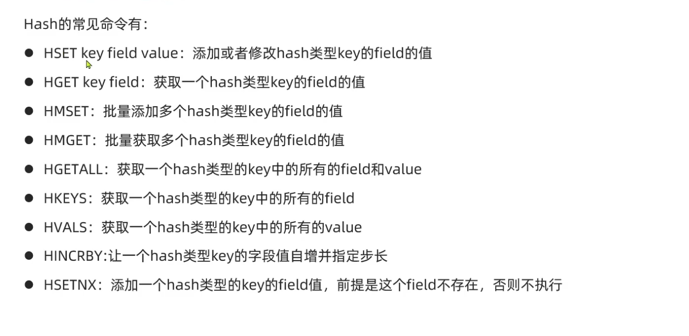
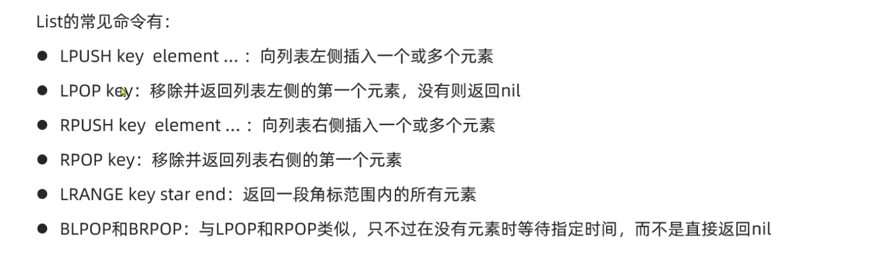
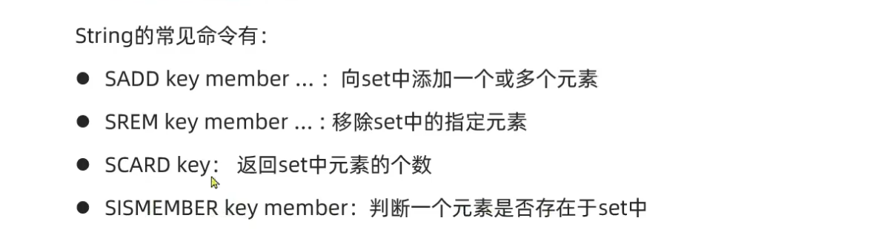
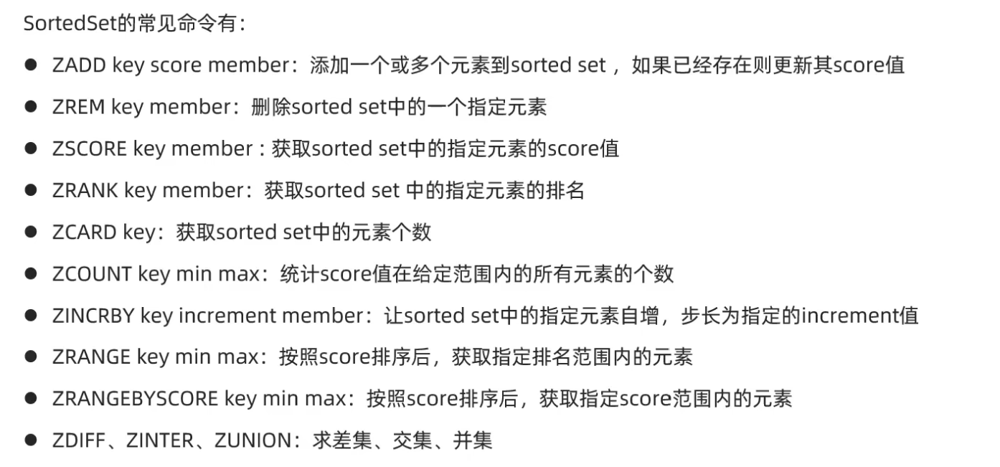

- [Redis](#redis)
  - [1.Redis的基本介绍](#1redis的基本介绍)
  - [2.Redis的基本特征](#2redis的基本特征)
  - [3.Redis的数据结构的基本介绍](#3redis的数据结构的基本介绍)
  - [4.redis的基本语句](#4redis的基本语句)
  - [5.redis语法](#5redis语法)
    - [1.String](#1string)
    - [2.Hash](#2hash)
    - [3.List](#3list)
    - [4.Set](#4set)
    - [5.SortedSet](#5sortedset)

# Redis

## 1.Redis的基本介绍
是一个基于键值型的NoSQL数据库

## 2.Redis的基本特征

## 3.Redis的数据结构的基本介绍

> [!TIP]
> 前面**五个**是基本的数据类型

## 4.redis的基本语句
---
    - KEY * ：表示查看所有的KEY
    - KEY a?: 表示查看含a的前缀的KEY，？表示一个占位符
    - DELETE :表示删除，可以删除一个，也可以删除多个KEY,删除成功
    - EXISTS :表示查找KEY是否存在
    - EXPIRE :表示创建一个键值对，并设置有效时间，结束了就消失，EXPIRE key seconds;
    - TTL KEY:表示查看一个KEY的剩余时间
---
>[!TIP]
> "*"表示全部，"?"只表示一个占位
## 5.redis语法
### 1.String

### 2.Hash

### 3.List

### 4.Set

### 5.SortedSet

>[!TIP]
>默认的是升序
